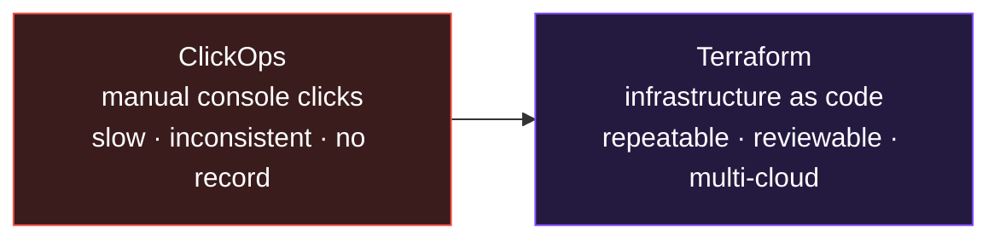

# Learn Terraform: Zero to Production

> **Module 2 of the DevOps Masterclass.** You can track code with Git. But who creates the *servers, networks, and databases* your code will run on? With Terraform, you build all of it with **code** - repeatable, reviewable, and version-controlled. (This module comes early because it assumes you already understand basic cloud computing.)

_A complete, hands-on Terraform course - from absolute beginner to production-ready._

---

## What problem does Terraform solve? (30-second version)

Setting up cloud infrastructure by **clicking buttons** in the AWS/Azure/GCP console is slow, error-prone, and impossible to reproduce exactly. Forget one setting and environments drift apart.

**Terraform lets you describe your entire infrastructure as code.** Run it once, get the same result every time - on any cloud. Need an identical copy for testing? One command. Need to tear it all down? One command.

> **Analogy:** ClickOps is building furniture from memory every time. Terraform is the **IKEA instruction sheet** - same steps, same result, every time, for anyone.

---

## Interactive Animation (open in any browser - no install)

| Animation | What it teaches |
|---|---|
| [**Terraform Workflow**](animations/terraform-workflow.html) | Step through Write → Init → Plan → Apply → Destroy and watch cloud resources appear |

---

## Course Objectives
By the end you'll be able to:
- Understand **why Terraform exists** and what problems it solves
- Write **clean, reusable** Terraform code
- Manage Terraform **state safely** in teams
- Design **modular, scalable** infrastructure
- Handle **multiple environments** (dev / prod)
- Apply **security best practices** and avoid anti-patterns
- Build and explain a **complete Terraform project**

## Format
- **Audience:** beginners (basic cloud awareness helps)
- **Approach:** Concept → Analogy → Hands-on → Real-world relevance

---

## Course Roadmap

```mermaid
flowchart LR
    D1["Day 1<br/>IaC Basics"] --> D2["Day 2<br/>Providers & State"]
    D2 --> D3["Day 3<br/>Deploy & Structure"] --> D4["Day 4<br/>Variables & Outputs"]
    D4 --> D5["Day 5<br/>State Management"] --> D6["Day 6<br/>Meta-Args & Lifecycle"]
    D6 --> D7["Day 7<br/>Modules"] --> D8["Day 8<br/>Environments & Security"]
    D8 --> D9["Day 9<br/>Capstone Project"]
    style D1 fill:#844fff,color:#fff
    style D9 fill:#2e7d32,color:#fff
```

| Day | Topic | What you'll learn |
|---|---|---|
| [Day 1](day1-iac-basics/notes.md) | **IaC & Terraform Basics** | What IaC is, install, first resource, Write→Plan→Apply |
| [Day 2](day2-providers-state/notes.md) | **Providers, Resources & State** | Providers, resources, the state file, variables intro |
| [Day 3](day3-deploy-structure/notes.md) | **Deploy & Pro Structure** | Resource references/dependencies, splitting into `provider/main/variables/outputs.tf` |
| [Day 4](day4-variables-outputs/notes.md) | **Variables & Outputs** | Input/output/local variables, types, validation, precedence, `.tfvars` |
| [Day 5](day5-state-management/notes.md) | **State Management** | Remote backends (S3 + DynamoDB lock), state commands |
| [Day 6](day6-meta-lifecycle/notes.md) | **Meta-Args & Lifecycle** | `count`, `for_each`, [`lifecycle` rules](day6-meta-lifecycle/lifecycle_rules.md) |
| [Day 7](day7-modules/notes.md) | **Modules** | Reusable infrastructure, root vs child, inputs/outputs |
| [Day 8](day8-environments-security/notes.md) | **Environments & Security** | dev/prod patterns, workspaces, secrets, anti-patterns |
| [Day 9](day9-capstone-project/notes.md) | **Capstone Project** | Build VPC + subnets + EC2 + RDS with modules end-to-end |

---

## The Terraform commands you'll use most

| Command | Meaning |
|---|---|
| `terraform init` | Set up the project, download providers |
| `terraform fmt` | Auto-format your code |
| `terraform validate` | Check the config is valid |
| `terraform plan` | Preview what will change (no changes made) |
| `terraform apply` | Create/update the real infrastructure |
| `terraform destroy` | Tear everything down |
| `terraform state list` | List tracked resources |
| `terraform output` | Show output values |

---

## Prerequisites
- A cloud account (AWS used in examples) - **watch costs; always `destroy` after labs**
- [Install Terraform](https://developer.hashicorp.com/terraform/downloads)
- Basic command-line comfort

> **Cost warning:** these labs create real cloud resources that may cost money. Run `terraform destroy` when you're done with each lab.

---

**Start with** → [Day 1: IaC & Terraform Basics](day1-iac-basics/notes.md)
Next module → [**learn-docker**](../learn-docker)
