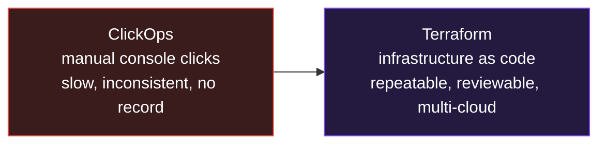
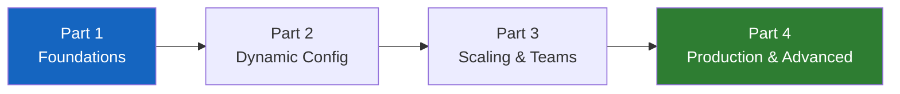

# Learn Terraform: Zero to Job-Ready

> **Module 2 of the DevOps Masterclass.** You can track code with Git. But who creates the servers, networks, and databases your code runs on? With Terraform you build all of it as code - repeatable, reviewable, and version-controlled. (This module assumes you already understand basic cloud computing.)

A complete, hands-on Terraform course, redesigned for the 2026 job market - from absolute beginner to production and interview ready.

---

## What problem does Terraform solve? (30-second version)

Setting up cloud infrastructure by clicking buttons in the AWS/Azure/GCP console is slow, error-prone, and impossible to reproduce exactly. Forget one setting and environments drift apart.

**Terraform lets you describe your entire infrastructure as code.** Run it once, get the same result every time, on any cloud. Need an identical copy for testing? One command. Need to tear it all down? One command.

> **Analogy:** ClickOps is building furniture from memory every time. Terraform is the IKEA instruction sheet - same steps, same result, every time, for anyone.

---

## Interactive animation (open in any browser)

| Animation | What it teaches |
|---|---|
| [Terraform Workflow](https://siva9800.github.io/devops-animations/terraform/terraform-workflow.html) | Step through Write, Init, Plan, Apply, Destroy and watch cloud resources appear |

---

## What makes this course job-ready

It does not stop at the basics. It covers the advanced topics that 2026 interviews and real jobs actually require and that most courses skip: dynamic blocks, `for_each` vs `count` deeply, `moved`/`import` blocks, drift detection, native `terraform test`, CI/CD pipelines, HCP Terraform, and policy as code. Every lesson uses current, correct syntax (Terraform 1.10+ native state locking, AWS provider v5), a real-world analogy, diagrams, runnable AWS HCL, a hands-on lab, common mistakes, and a self-check.

---

## Course roadmap (17 lessons, 4 parts)

### Part 1 - Foundations
| Day | Topic | What you learn |
|---|---|---|
| [Day 1](day01-iac-basics/notes.md) | **IaC and Your First Server** | What IaC is, install, the workflow, first EC2 |
| [Day 2](day02-hcl-resources/notes.md) | **HCL, Resources, Dependencies** | Syntax, providers, data sources, the dependency graph |
| [Day 3](day03-variables-outputs-locals/notes.md) | **Variables, Outputs, Locals** | Types, validation, sensitive, tfvars, precedence |
| [Day 4](day04-state-fundamentals/notes.md) | **State Fundamentals** | What state is, inspecting and moving it (local) |
| [Day 5](day05-remote-state-backends/notes.md) | **Remote State and Backends** | S3 backend with native lockfile, sharing state |

### Part 2 - Writing dynamic configuration
| Day | Topic | What you learn |
|---|---|---|
| [Day 6](day06-expressions-functions/notes.md) | **Expressions and Functions** | Conditionals, for-expressions, key built-in functions |
| [Day 7](day07-loops-count-foreach/notes.md) | **Loops: count and for_each** | Creating many resources, and the count-index gotcha |
| [Day 8](day08-dynamic-blocks/notes.md) | **Dynamic Blocks** | Generating repeated nested blocks the right way |
| [Day 9](day09-meta-arguments-lifecycle/notes.md) | **Meta-Arguments and Lifecycle** | depends_on, create_before_destroy, prevent_destroy, ignore_changes |

### Part 3 - Scaling and teams
| Day | Topic | What you learn |
|---|---|---|
| [Day 10](day10-modules/notes.md) | **Modules** | Reusable packages, registry, composition, module for_each/providers |
| [Day 11](day11-environments/notes.md) | **Multiple Environments** | Workspaces vs directory-per-env, DRY patterns |

### Part 4 - Production and advanced (the job-ready part)
| Day | Topic | What you learn |
|---|---|---|
| [Day 12](day12-refactoring-drift/notes.md) | **Refactoring and Drift** | moved blocks, import blocks, drift detection |
| [Day 13](day13-testing-validation/notes.md) | **Testing and Validation** | terraform test, tflint, security scanning |
| [Day 14](day14-cicd/notes.md) | **CI/CD for Terraform** | Plan-on-PR, apply-on-merge, OIDC auth (GitHub Actions) |
| [Day 15](day15-hcp-policy/notes.md) | **HCP Terraform and Policy as Code** | Remote runs, Sentinel/OPA governance |
| [Day 16](day16-security-secrets/notes.md) | **Security and Secrets** | Auth, least privilege, secrets managers, state security |
| [Day 17](day17-capstone/notes.md) | **Capstone Project** | Full VPC + EC2 + RDS with modules and remote state |

---

## The Terraform commands you will use most

| Command | Meaning |
|---|---|
| `terraform init` | Set up the project, download providers and modules |
| `terraform fmt` | Auto-format your code |
| `terraform validate` | Check the config is valid |
| `terraform plan` | Preview what will change (no changes made) |
| `terraform apply` | Create or update the real infrastructure |
| `terraform destroy` | Tear everything down |
| `terraform state list` | List tracked resources |
| `terraform output` | Show output values |
| `terraform test` | Run native tests (`.tftest.hcl`) |

---

## Prerequisites
- A cloud account (AWS is used in examples) - watch costs; always `destroy` after labs.
- [Install Terraform](https://developer.hashicorp.com/terraform/downloads) (1.10+ recommended).
- Basic command-line comfort.

> **Cost warning:** these labs create real cloud resources that may cost money. Run `terraform destroy` when you are done with each lab.

---

## Learning outcomes

By the end you will be able to:
- Explain why Terraform exists and where it fits among IaC tools.
- Write clean, dynamic, reusable Terraform with functions, loops, and dynamic blocks.
- Manage state safely and refactor live infrastructure without downtime.
- Build modules and manage multiple environments.
- Test, secure, and ship Terraform through CI/CD and policy as code.
- Build and explain a complete production-style project - and answer 2026 interview questions.

---

**Start with** -> [Day 1: IaC and Your First Server](day01-iac-basics/notes.md)
Next module -> [learn-docker](../learn-docker)
