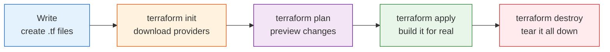

# Day 1 - Infrastructure as Code and Your First Server

> **Goal:** understand what Infrastructure as Code (IaC) is and why teams use it, install Terraform, and launch your first real cloud server by describing it in a file - no clicking around a web console.

> **Interactive demo:** [Terraform Workflow animation](https://siva9800.github.io/devops-animations/terraform/terraform-workflow.html) - step through Write, Init, Plan, Apply, Destroy.

---

## What problem does this solve?

Imagine setting up a server by hand in the AWS web console: you click through 30 screens, pick a region, choose a size, attach security rules. It works.

Now your manager says: *"Great - build me 10 more exactly like it, one for the test team, and recreate the whole thing in Europe."*

Doing that by hand is slow, error-prone, and impossible to reproduce exactly - nobody remembers every button they clicked. If the server breaks, no one knows how it was built.

**Infrastructure as Code (IaC)** fixes this. Instead of clicking, you write a text file that describes the infrastructure you want. A tool (Terraform) reads that file and builds it - the same way, every time. Need 10 copies? Change one number. Need to delete everything cleanly? One command.

---

## Learning Objectives

By the end of Day 1 you will be able to:
- Explain what Infrastructure as Code is and why teams adopt it.
- Describe the difference between the declarative and imperative approaches.
- Install Terraform and confirm it works.
- Write your first `.tf` file to define an AWS EC2 instance.
- Run the core workflow: `init`, `plan`, `apply`, `destroy`.
- Keep code clean with `terraform fmt` and `terraform validate`.

---

## Real-world analogy: an IKEA instruction sheet

Think about buying a bookshelf from IKEA.

- The instruction sheet is the same for everyone. Follow it and you always get the exact same bookshelf, whether you build it in New York or Tokyo.
- You do not memorise "insert screw, turn four times, repeat." The sheet describes the finished furniture and you follow it.
- Lost a shelf? Grab the sheet and rebuild it identically.

**Terraform is your IKEA instruction sheet for cloud infrastructure.** Your `.tf` files describe the finished result. Anyone (or any computer) following them builds identical infrastructure, anywhere, every time.

---

## Declarative vs imperative: ordering a pizza

This is the single most important idea in Terraform, so let us make it stick.

| Style | What you say | Example |
|---|---|---|
| **Imperative** (step by step) | You give every instruction, in order | "Get dough. Spread sauce. Add cheese. Bake 12 minutes at 220 C." |
| **Declarative** (describe the end result) | You describe what you want; the tool figures out the steps | "I want one large Margherita pizza." |

Terraform is **declarative**. You do not tell it how to build a server step by step. You write "I want one t2.micro EC2 instance" and Terraform works out every API call needed to make that true. Even better: if the server already exists exactly as described, Terraform does nothing - it only changes what differs from your description.

---

## Where Terraform fits among IaC tools

Terraform is not the only IaC tool, and interviewers like to hear that you know the landscape.

| Tool | Scope | Style | Note |
|---|---|---|---|
| **Terraform** | Any cloud (AWS, Azure, GCP, and 1000+ providers) | Declarative | The industry standard for provisioning; cloud-agnostic |
| CloudFormation | AWS only | Declarative | AWS-native; locked to one cloud |
| Pulumi | Any cloud | Declarative, in real languages (Python, TS) | Same idea, code instead of HCL |
| Ansible | Config management | Procedural | Great for configuring servers, weaker for provisioning |

> **One line for interviews:** Terraform *provisions* infrastructure (creates the servers/networks) declaratively and cloud-agnostically; tools like Ansible *configure* what runs on it.

---

## Installing Terraform

Terraform is a single program. Install it, then check the version.

**Windows (PowerShell, using Chocolatey):**
```powershell
choco install terraform
terraform -version
```

**macOS (Homebrew):**
```bash
brew tap hashicorp/tap
brew install hashicorp/tap/terraform
terraform -version
```

**Linux (Ubuntu/Debian):**
```bash
wget -O- https://apt.releases.hashicorp.com/gpg | sudo gpg --dearmor -o /usr/share/keyrings/hashicorp-archive-keyring.gpg
echo "deb [signed-by=/usr/share/keyrings/hashicorp-archive-keyring.gpg] https://apt.releases.hashicorp.com $(lsb_release -cs) main" | sudo tee /etc/apt/sources.list.d/hashicorp.list
sudo apt update && sudo apt install terraform
terraform -version
```

If `terraform -version` prints something like `Terraform v1.x.x`, you are ready.

You also need **AWS credentials** so Terraform can talk to your account. The cleanest way for local work is the AWS CLI:
```bash
aws configure
# It asks for: Access Key ID, Secret Access Key, default region, output format
```
> Never type AWS keys directly into a `.tf` file. More on this in Common Mistakes, and a full treatment on Day 16.

---

## The Terraform workflow (the heartbeat of everything)

Almost everything you do in Terraform follows the same rhythm. Memorise it.



| Command | Plain-English meaning |
|---|---|
| `terraform init` | "Get ready." Downloads the plugins (providers) your code needs, such as AWS. Run once per project, and again when you add a new provider or module. |
| `terraform plan` | "Show me what you are about to do." A dry-run preview. Nothing is created or deleted. Always read this before applying. |
| `terraform apply` | "Do it." Builds or changes real infrastructure. Shows the plan again and asks you to type `yes`. |
| `terraform destroy` | "Clean up." Deletes everything Terraform created so you stop paying for it. |

Two more tidiness commands you will use constantly:

| Command | Meaning |
|---|---|
| `terraform fmt` | Auto-formats your `.tf` files (consistent spacing and indentation), like a code beautifier. |
| `terraform validate` | Checks your code for syntax and internal errors before you run plan or apply. Fast sanity check. |

---

## Your first Terraform file

Create a folder, and inside it a file called `main.tf`:

```hcl
# Tell Terraform which cloud we are using
provider "aws" {
  region = "us-east-1"
}

# Look up the latest Amazon Linux image (never hardcode an AMI - see below)
data "aws_ami" "amazon_linux" {
  most_recent = true
  owners      = ["amazon"]

  filter {
    name   = "name"
    values = ["al2023-ami-*-x86_64"]
  }
}

# Describe the server we want
resource "aws_instance" "my_first_server" {
  ami           = data.aws_ami.amazon_linux.id
  instance_type = "t2.micro" # free-tier eligible size

  tags = {
    Name = "my-first-terraform-server"
  }
}
```

Reading it block by block, in plain English:

- `provider "aws" { ... }` - "I am using Amazon Web Services, in the us-east-1 region." The provider is the adapter that lets Terraform speak AWS's language.
- `data "aws_ami" "amazon_linux" { ... }` - "Look up an existing thing." A `data` block reads information from AWS; it does not create anything. Here it finds the newest Amazon Linux image.
- `resource "aws_instance" "my_first_server" { ... }` - "Create a virtual server." `aws_instance` is the resource type; `my_first_server` is your nickname for it, used only inside your own code (AWS never sees this name).
- `ami` - the Amazon Machine Image: the operating-system template the server boots from.
- `instance_type` - the size and power of the machine. `t2.micro` is small and free-tier friendly.
- `tags` - friendly labels. `Name` is what you see in the AWS console.

### Why you must not hardcode an AMI like `ami-0c55b159cbfafe1f0`

Older tutorials hardcode an AMI ID. Avoid it, because AMI IDs are:
- **Region-specific** - the same ID does not exist in another region, so your code breaks the moment you switch regions.
- **Time-sensitive** - Amazon retires and replaces images, so a hardcoded ID slowly goes stale and may stop working.

The `data "aws_ami"` block above always finds the newest matching image in your chosen region, so your code works anywhere, forever. (An alternative is to store the AMI in a variable - covered on Day 3.)

---

## Common Mistakes

1. **Committing `terraform.tfstate` or secrets to Git.** The state file can contain sensitive data, and credentials never belong in version control. Add a `.gitignore`:
   ```
   *.tfstate
   *.tfstate.*
   .terraform/
   *.tfvars
   ```
2. **Hardcoding AWS access keys in `.tf` files.** Anyone who sees your code (or your Git history) now controls your account. Use `aws configure`, environment variables, or IAM roles instead (Day 16).
3. **Forgetting `terraform init`.** Skipping it gives "provider not installed" errors. When in doubt, init.
4. **Running `apply` without reading `plan`.** The plan tells you what will be created, changed, or destroyed. Skipping it is how people accidentally delete production.
5. **Hardcoding a stale AMI ID.** Use a `data` lookup or a variable.

---

## Hands-On Lab: launch and destroy your first server

Make sure `aws configure` is done first.

```bash
# 1. Make a project folder
mkdir my-first-tf && cd my-first-tf

# 2. Create main.tf with the provider + data + resource blocks from this lesson

# 3. Tidy and sanity-check
terraform fmt
terraform validate

# 4. Download the AWS provider
terraform init

# 5. Preview what will happen (read it)
terraform plan

# 6. Build it for real - type yes when prompted
terraform apply

# 7. Open the EC2 dashboard in the AWS console. Your server is there.

# 8. Clean up so you are not billed - type yes when prompted
terraform destroy
```

**Success check:** after `apply` you see an instance named `my-first-terraform-server` in EC2. After `destroy` it is gone.

---

## Quick Self-Check

1. In one sentence, what is Infrastructure as Code?
2. Is Terraform declarative or imperative? Explain using the pizza analogy.
3. What does `terraform init` do, and how often do you run it?
4. Why should you never hardcode an AMI ID like `ami-0c55b159cbfafe1f0`?
5. Name one thing that must be kept out of Git, and why.

<details>
<summary>Answers</summary>

1. Defining and managing your infrastructure in text files that a tool turns into real resources, repeatably.
2. Declarative - you describe the end result ("one Margherita pizza" / "one t2.micro server") and Terraform figures out the steps.
3. It downloads the providers (and modules) your code needs; run it once per project and again whenever you add a new provider or module.
4. AMI IDs are region-specific and get retired over time, so hardcoding one makes your code fragile and non-portable. Use a `data "aws_ami"` lookup or a variable.
5. `*.tfstate` files (may contain secrets) and any credentials/`*.tfvars` - they are sensitive and must never be public.
</details>

---

## Summary

- IaC means describing your infrastructure in text; a tool builds it identically every time (your IKEA instruction sheet).
- Terraform is declarative - you order the pizza, you do not cook it - and cloud-agnostic.
- The core loop is Write, init, plan, apply, destroy, with `fmt` and `validate` to stay clean.
- A `resource` block creates things; a `data` block looks things up (use it to fetch a fresh AMI instead of hardcoding).
- Keep state files and secrets out of Git.

**Next up ->** [Day 2 - HCL, Resources, and Dependencies](../day02-hcl-resources/notes.md)
