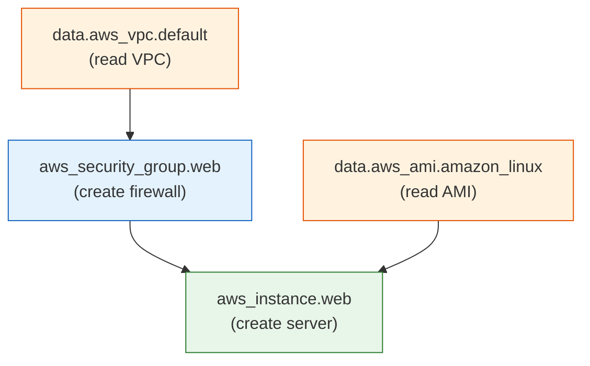
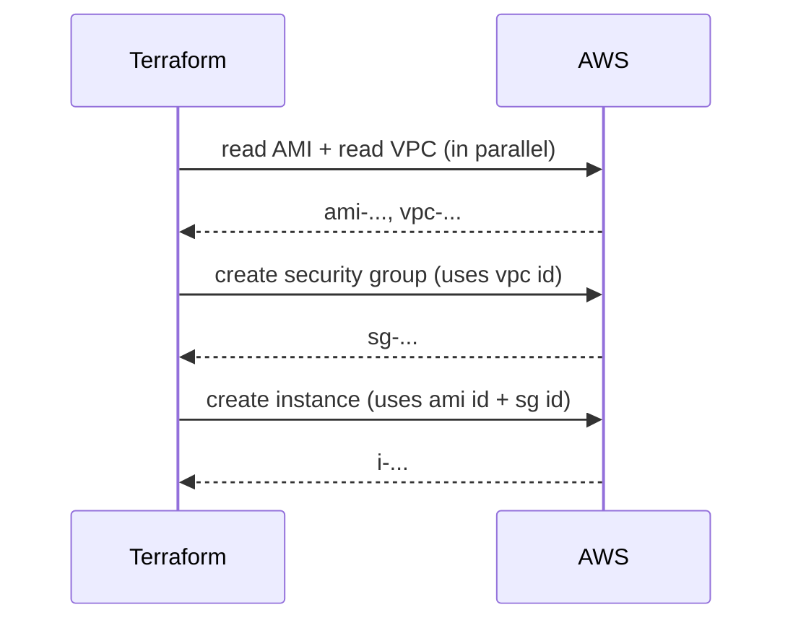

# Day 2 - HCL, Resources, and Dependencies

> **Goal:** learn HCL, the language you write Terraform in, understand the anatomy of a resource block, and see how Terraform figures out the correct order to build things by wiring resources together through references.

> **Interactive demo:** [Dependency Graph animation](https://siva9800.github.io/devops-animations/terraform/dependency-graph.html) - watch Terraform build independent resources in parallel and wait for dependencies.

---

## What problem does this solve?

On Day 1 you launched a single server. Real infrastructure is never one thing on its own - a server needs a firewall (security group), a network (VPC), a disk, maybe a database. These pieces depend on each other. A server cannot attach to a firewall that does not exist yet.

So two questions appear immediately:

1. **How do I describe all these pieces cleanly?** That is the job of **HCL** (HashiCorp Configuration Language) - the readable language your `.tf` files are written in.
2. **How does Terraform know what order to build them in?** You never write "build the firewall first, then the server." Instead you connect resources by *referencing* one from another, and Terraform works out the order automatically by building a **dependency graph**.

Today is about the language and the wiring. Get this right and everything else in Terraform clicks into place.

---

## Learning Objectives

By the end of Day 2 you will be able to:
- Read and write HCL: blocks, arguments, and expressions.
- Name the main block types and say what each one does.
- Break a resource block into its three parts: type, local name, body.
- Pin your Terraform and provider versions in a `terraform {}` block, and explain why pinning matters.
- Configure the AWS provider with a region and default tags.
- Use `data` sources to read existing infrastructure, and explain how they differ from resources.
- Wire resources together with implicit dependencies, and reach for `depends_on` only as a last resort.
- Reference another resource's attributes with `type.name.attribute`.
- Explore live values with `terraform console`.

---

## Real-world analogy: baking a layered cake

Think about baking and decorating a birthday cake.

- You must **bake the sponge before you can frost it**. Frosting depends on a baked cake existing. That is an **implicit dependency** - it comes from the nature of the task, not from someone writing "step 4 must follow step 3."
- Meanwhile, you can **whip the frosting** and **preheat the oven** at the same time - they do not depend on each other, so they happen in **parallel**.
- Only in a weird edge case ("let the pan cool for exactly 10 minutes before the next step even though nothing physically requires it") would you add an explicit "wait for this first" instruction. That is `depends_on`.

Terraform is the baker. You do not hand it an ordered recipe. You describe the pieces and how they connect ("the frosting goes *on the baked cake*"), and Terraform figures out what must wait and what can run in parallel. That map of "what needs what" is the **dependency graph**.

---

## HCL: the language of Terraform

Every `.tf` file is written in **HCL**. It has just three ideas you need.

**1. Blocks** - a labelled container with a body in `{ }`:
```hcl
resource "aws_instance" "web" {
  # arguments go here
}
```

**2. Arguments** - a `name = value` assignment inside a block:
```hcl
instance_type = "t3.micro"
```

**3. Expressions** - the value on the right of the `=`. It can be a literal (`"t3.micro"`), a reference to something else (`data.aws_ami.al.id`), or a function call (`upper("hi")`).

That is the whole language. Everything below is just different *block types* built from these three ideas.

### The main block types

| Block | What it is for |
|---|---|
| `terraform {}` | Settings for Terraform itself: required version, which providers to download and pin. |
| `provider {}` | Configures a provider (e.g. which AWS region, default tags). |
| `resource {}` | Creates and manages a real thing (a server, a firewall). The workhorse. |
| `data {}` | Reads existing infrastructure without creating anything. |
| `variable {}` | Declares an input to make your code reusable (Day 3). |
| `output {}` | Prints/exports a value after apply (Day 3). |
| `locals {}` | Named helper values to avoid repetition (Day 3). |
| `module {}` | Reuses a bundle of resources as one unit (Day 6). |

Today we focus on `terraform`, `provider`, `resource`, and `data`. The rest arrive on later days.

---

## Anatomy of a resource block

A resource block always has **three parts**. Learn to see them:

```hcl
resource "aws_instance" "web" {
  instance_type = "t3.micro"
}
```

| Part | In the example | Meaning |
|---|---|---|
| **Resource type** | `aws_instance` | *What kind of thing* to create. Defined by the provider. |
| **Local name** | `web` | *Your nickname* for this resource, used only inside your code. AWS never sees it. |
| **Body** | `{ instance_type = ... }` | The arguments that configure it. |

Together, `aws_instance.web` is a unique address you use to refer to this resource anywhere else in your configuration. That address is the key to dependencies - hold onto it.

---

## The `terraform {}` settings block

Before anything else, tell Terraform which version of itself and which providers your code expects. This is not optional polish - it is what makes your code reproducible next month and on a teammate's laptop.

```hcl
terraform {
  required_version = ">= 1.5.0"

  required_providers {
    aws = {
      source  = "hashicorp/aws"
      version = "~> 5.0"
    }
  }
}
```

- `required_version = ">= 1.5.0"` - refuse to run on an older Terraform CLI that might not understand your syntax.
- `required_providers` - which plugins to download. `source = "hashicorp/aws"` is the official AWS provider's address in the public registry.
- `version = "~> 5.0"` - a **pin**. This one means "any 5.x version, but not 6.0." (`~>` is called the pessimistic operator: allow patch and minor bumps, block the next major.)

### Why pinning matters

Providers release new versions constantly, and major versions (5.0 to 6.0) can *change or remove* arguments. Without a pin, `terraform init` might grab a brand-new provider that breaks your working code overnight - and it breaks for your whole team at once. Pinning to `~> 5.0` says "give me safe updates within version 5, but never silently jump to a version that could break me." The exact resolved version gets recorded in a `.terraform.lock.hcl` file that you *do* commit to Git, so everyone gets the identical provider.

| Constraint | Meaning |
|---|---|
| `= 5.31.0` | Exactly this version. Most rigid. |
| `~> 5.0` | Any `5.x` (>= 5.0, < 6.0). Common, safe default. |
| `~> 5.31` | Any `5.31.x` (>= 5.31, < 5.32). Tighter. |
| `>= 5.0` | 5.0 or newer, including 6.x. Risky - allows breaking majors. |

---

## Configuring the AWS provider

The `provider` block configures *how* Terraform talks to AWS.

```hcl
provider "aws" {
  region = "us-east-1"

  default_tags {
    tags = {
      Project     = "learn-terraform"
      Environment = "dev"
      ManagedBy   = "terraform"
    }
  }
}
```

- `region` - which AWS region to build in. Resources live in a region.
- `default_tags` - tags automatically applied to *every* resource this provider creates. Instead of copy-pasting `Project = "..."` onto each resource, you set it once here. Great for cost tracking and knowing what Terraform owns.

### A quick note on aliases (multi-region)

Sometimes you need to build in two regions at once. You can declare a second provider with an `alias`:

```hcl
provider "aws" {
  alias  = "europe"
  region = "eu-west-1"
}
```

Then a resource can opt in with `provider = aws.europe`. We only introduce this today - the full multi-region pattern comes in a later lesson. For now, know that aliases exist and solve the "more than one region" problem.

---

## Data sources: reading existing infrastructure

A `resource` block *creates* something. A `data` block *reads* something that already exists - it never creates, changes, or deletes. Think of `data` as a read-only lookup.

Why is this useful? Your account already has things Terraform did not make: a default VPC, the current list of availability zones, Amazon's official OS images. You often need those values to build new resources.

```hcl
# Find the newest Amazon Linux 2023 image (so you never hardcode an AMI)
data "aws_ami" "amazon_linux" {
  most_recent = true
  owners      = ["amazon"]

  filter {
    name   = "name"
    values = ["al2023-ami-*-x86_64"]
  }
}

# List the availability zones available in this region
data "aws_availability_zones" "available" {
  state = "available"
}

# Read the account's default VPC
data "aws_vpc" "default" {
  default = true
}
```

You then reference these the same way as any resource: `data.aws_ami.amazon_linux.id`, `data.aws_vpc.default.id`. Note the extra `data.` prefix.

| | `resource` | `data` |
|---|---|---|
| Creates infrastructure? | Yes | No, read-only |
| Shows in `plan` as "to add"? | Yes | No (just "read") |
| Removed by `destroy`? | Yes | No |
| Referenced as | `type.name.attr` | `data.type.name.attr` |

---

## Referencing attributes: how resources connect

To use one resource's value in another, you reference its address plus the attribute you want:

```
<resource_type>.<local_name>.<attribute>
```

So `aws_security_group.web.id` means "the `id` attribute of the security group I nicknamed `web`." When you write that reference inside another resource, you have created a **dependency**.

---

## Dependencies: implicit is the way

There are two kinds of dependency in Terraform. You want the first one almost always.

### Implicit dependencies (the main way)

When resource A *references* resource B, Terraform automatically knows B must be created first. You did not tell it the order - the reference itself is the signal.

```hcl
resource "aws_security_group" "web" {
  name = "web-sg"
  # ...
}

resource "aws_instance" "web" {
  # This reference makes the instance depend on the security group.
  vpc_security_group_ids = [aws_security_group.web.id]
  # ...
}
```

Because the instance references `aws_security_group.web.id`, Terraform builds the security group first, then the instance. No `depends_on` needed. This is clean, self-documenting, and the pattern you should reach for by default.

### Explicit dependencies with `depends_on` (last resort)

Occasionally two resources depend on each other in a way that is *not* visible through a reference - for example, an app that needs an IAM policy to exist before it starts, even though it never references that policy's ID. For those rare cases, state it explicitly:

```hcl
resource "aws_instance" "app" {
  # ...
  depends_on = [aws_iam_role_policy.app_permissions]
}
```

Reach for `depends_on` **only** when there is no natural reference to express the ordering. If you can rewrite it as an implicit reference, do that instead - it is easier to read and less error-prone.

---

## The dependency graph

Before doing anything, Terraform reads all your blocks and builds a **dependency graph**: a map of which resource needs which. Then it walks the graph, creating resources whose dependencies are already satisfied, and - crucially - **building independent resources in parallel** to go fast.



Read it as "the arrow points to what comes next." The AMI lookup and VPC lookup have no dependency on each other, so Terraform reads them **at the same time**. The security group needs the VPC, so it waits. The instance needs both the AMI *and* the security group, so it waits for the last of them to finish. This ordering is computed for you - you only wrote references.



---

## `terraform console`: explore values live

`terraform console` opens an interactive prompt where you can type expressions and see their real values. It is the fastest way to answer "what does this reference actually evaluate to?" and to try out functions.

```bash
terraform console
```
```hcl
> data.aws_ami.amazon_linux.id
"ami-0abcd1234example"

> aws_security_group.web.id
"sg-0123456789example"

> upper("hello")
"HELLO"

> length(data.aws_availability_zones.available.names)
6
```

Type `exit` to leave. Console reads your current state, so run it after an `apply` to see live IDs. It is a scratchpad - nothing you type there changes infrastructure.

---

## A realistic multi-resource example

Here is everything wired together: version pinning, a provider with default tags, an AMI lookup, a security group, and an EC2 instance that references that security group. This is correct, modern AWS provider v5 HCL.

```hcl
terraform {
  required_version = ">= 1.5.0"

  required_providers {
    aws = {
      source  = "hashicorp/aws"
      version = "~> 5.0"
    }
  }
}

provider "aws" {
  region = "us-east-1"

  default_tags {
    tags = {
      Project   = "learn-terraform"
      ManagedBy = "terraform"
    }
  }
}

# Look up the newest Amazon Linux 2023 image - never hardcode an AMI.
data "aws_ami" "amazon_linux" {
  most_recent = true
  owners      = ["amazon"]

  filter {
    name   = "name"
    values = ["al2023-ami-*-x86_64"]
  }
}

# A firewall allowing inbound HTTP and all outbound traffic.
resource "aws_security_group" "web" {
  name        = "web-sg"
  description = "Allow HTTP inbound"

  ingress {
    description = "HTTP from anywhere"
    from_port   = 80
    to_port     = 80
    protocol    = "tcp"
    cidr_blocks = ["0.0.0.0/0"]
  }

  egress {
    from_port   = 0
    to_port     = 0
    protocol    = "-1"
    cidr_blocks = ["0.0.0.0/0"]
  }

  tags = {
    Name = "web-sg"
  }
}

# A server that attaches the security group above.
resource "aws_instance" "web" {
  ami           = data.aws_ami.amazon_linux.id
  instance_type = "t3.micro"

  # Implicit dependency: this reference makes the SG build first.
  vpc_security_group_ids = [aws_security_group.web.id]

  tags = {
    Name = "web-server"
  }
}
```

Notice: no ordering instructions anywhere. The two references (`data.aws_ami.amazon_linux.id` and `aws_security_group.web.id`) tell Terraform the whole story. We use `vpc_security_group_ids` (the modern argument) rather than the old, deprecated `security_groups`.

---

## Common Mistakes

1. **Skipping the `terraform {}` block / not pinning providers.** Without a pin, `terraform init` can pull a breaking provider version and wreck a previously working config. Always pin with `~> 5.0` and commit `.terraform.lock.hcl`.
2. **Using `depends_on` when a reference would do.** If you can express the ordering by referencing an attribute, do that. `depends_on` is a last resort, not a default.
3. **Confusing `data` and `resource`.** A `data` block reads; it never creates. If you meant to *build* something, use `resource`.
4. **Forgetting the `data.` prefix.** It is `data.aws_ami.amazon_linux.id`, not `aws_ami.amazon_linux.id`. Data references start with `data.`.
5. **Hardcoding an AMI ID.** Still wrong (Day 1). Use `data "aws_ami"` so your code stays portable and current.
6. **Creating fake ordering with a wrong reference.** Only reference an attribute you genuinely use; a reference exists to pass a value, and the dependency is a side effect of that real need.

---

## Hands-On Lab: wire a server to a firewall

Make sure `aws configure` is done first.

```bash
# 1. Make a project folder
mkdir day02-lab && cd day02-lab

# 2. Create main.tf with the full multi-resource example above.

# 3. Tidy and sanity-check
terraform fmt
terraform validate

# 4. Download the pinned AWS provider (writes .terraform.lock.hcl)
terraform init

# 5. Preview. Read it: the data sources show as "read", the SG and
#    instance show as "to add". Confirm the instance depends on the SG.
terraform plan

# 6. Build it for real - type yes when prompted
terraform apply

# 7. Explore the live values you just created
terraform console
#   > aws_security_group.web.id
#   > aws_instance.web.vpc_security_group_ids
#   type exit to leave

# 8. Clean up so you are not billed - type yes when prompted
terraform destroy
```

**Success check:** in the EC2 console your `web-server` instance shows the `web-sg` security group attached, and it also carries the `Project` and `ManagedBy` default tags you never wrote on the instance itself.

---

## Quick Self-Check

1. What are the three parts of a resource block, using `aws_instance.web` as your example?
2. What does `version = "~> 5.0"` allow and forbid, and why does pinning matter?
3. What is the difference between a `data` block and a `resource` block?
4. How do you create an implicit dependency, and why is it preferred over `depends_on`?
5. What does Terraform do with independent resources in the dependency graph?

<details>
<summary>Answers</summary>

1. Resource type (`aws_instance` - what kind of thing), local name (`web` - your private nickname), and body (the `{ ... }` arguments). Together `aws_instance.web` is its address.
2. It allows any `5.x` version (>= 5.0, < 6.0) and forbids the 6.0 major, which could contain breaking changes. Pinning keeps your code reproducible and stops `init` from silently pulling a version that breaks the whole team.
3. `data` reads existing infrastructure and creates nothing; `resource` creates and manages real infrastructure. Reference data with the `data.` prefix.
4. Reference another resource's attribute (e.g. `vpc_security_group_ids = [aws_security_group.web.id]`); the reference itself tells Terraform the order. It is preferred because it is self-documenting and Terraform derives the order automatically - `depends_on` is only for ordering that no reference can express.
5. It builds them in parallel, since nothing forces them to wait on each other.
</details>

---

## Summary

- HCL is built from three things: blocks, arguments, and expressions.
- A resource block has three parts: type, local name, and body; `type.name` is its address.
- The `terraform {}` block pins your Terraform and provider versions - `~> 5.0` gives safe 5.x updates while blocking breaking majors.
- The `provider {}` block sets the region and `default_tags`; aliases handle multi-region (more later).
- `data` blocks read existing infrastructure (AMIs, AZs, VPCs); `resource` blocks create it.
- Wire resources with implicit dependencies via references (`aws_security_group.web.id`); use `depends_on` only as a last resort.
- Terraform builds a dependency graph, orders resources for you, and runs independent ones in parallel. Explore it all with `terraform console`.

**Next up ->** [Day 3 - Variables, Outputs, and Locals](../day03-variables-outputs-locals/notes.md)
