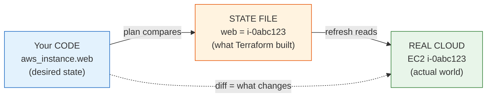

# Day 4 - State Fundamentals

> **Goal:** understand what Terraform state is, why it is the single most important file in your project, how `plan` uses it to compute changes, and how to inspect and safely reshape it with local state - before you ever touch a team backend.

> **Interactive demo:** [Terraform State animation](https://siva9800.github.io/devops-animations/terraform/terraform-state.html) - watch code, state, and real infrastructure line up as plan computes the diff.

---

## What problem does this solve?

You wrote a `.tf` file that says "I want one server." You ran `apply`. AWS built the server and gave it an ID like `i-0abc123def456`.

Now you run `apply` again. How does Terraform know it already built that server? Your code just says "I want one server" - it never mentions `i-0abc123def456`. Without some kind of memory, Terraform would build a **second** identical server every time you apply. And a third. And a fourth.

Terraform needs a notebook where it writes down: *"The thing the user calls `aws_instance.web` is really the AWS server `i-0abc123def456`."* That notebook is **state**, stored in a file called `terraform.tfstate`.

State is what turns Terraform from a "create stuff" tool into a "make reality match my code" tool.

---

## Learning Objectives

By the end of Day 4 you will be able to:
- Explain what the `terraform.tfstate` file is and why it must exist.
- Describe how `plan` compares desired state, current state, and the real world.
- Understand that state can contain secrets in plain text, and treat it accordingly.
- Explain why state must never be committed to Git or hand-edited.
- Inspect state safely with read-only commands (`state list`, `state show`, `show`, `output`).
- Perform careful state surgery with `state mv`, `state rm`, and `import`.
- Use `refresh` / `plan -refresh-only` to reconcile state with reality.

---

## Real-world analogy: the building manager's logbook

Picture a building manager who rents out rooms.

- The **blueprint** on the wall says what the building *should* look like: "Room 101 is a meeting room, Room 102 is an office." This is your **code** - what you want.
- The manager's **logbook** records what is *actually* rented right now and to whom: "Room 101 -> tenant Acme, key #4471." This is your **state file** - Terraform's memory of what it built.
- The **actual rooms** down the hall are the **real infrastructure** in the cloud.

When someone hands the manager a *new* blueprint, the manager does not bulldoze the building. They compare the new blueprint against the logbook, spot the differences ("the new plan adds Room 103"), and change only what differs.

**That comparison is exactly what `terraform plan` does.** It reads your code (the new blueprint), reads the state file (the logbook), and works out the smallest set of changes to make reality match your code. State is the logbook that makes this possible.

---

## What is in the state file?

`terraform.tfstate` is a plain **JSON** file. After you apply the server from Day 1, a trimmed version looks like this:

```json
{
  "version": 4,
  "terraform_version": "1.9.0",
  "resources": [
    {
      "type": "aws_instance",
      "name": "web",
      "instances": [
        {
          "attributes": {
            "id": "i-0abc123def456",
            "instance_type": "t2.micro",
            "ami": "ami-0c101f26f147fa7fd",
            "private_ip": "10.0.1.23",
            "tags": { "Name": "my-first-terraform-server" }
          }
        }
      ]
    }
  ]
}
```

Notice the key line: `"name": "web"` (your code's nickname, `aws_instance.web`) is paired with `"id": "i-0abc123def456"` (the real AWS resource). **That mapping is the whole point of state.** It is the bridge between the name you type and the thing that actually exists in the cloud.



### How plan uses the three views

Every `terraform plan` juggles three pictures of the world:

| View | Where it comes from | Plain meaning |
|---|---|---|
| **Desired state** | Your `.tf` code | What you want to exist |
| **Current state** | `terraform.tfstate` | What Terraform last recorded |
| **Real world** | The cloud provider's API | What is actually running now |

Plan lines these up and prints the **diff**: `+` create, `~` change in place, `-` destroy, `-/+` replace. If all three already agree, plan says "No changes" and does nothing. That "do nothing when it matches" behaviour is impossible without state.

---

## State contains secrets - treat it like a password file

This is the most under-appreciated fact about state, and a favourite interview question.

Terraform records the **full attributes** of every resource, including sensitive ones, in **plain text**. If a resource has a password, a private key, or a generated token, it is sitting readable inside `terraform.tfstate`:

```json
"attributes": {
  "username": "admin",
  "password": "SuperSecret123!",
  "endpoint": "mydb.abc123.us-east-1.rds.amazonaws.com"
}
```

That database password is not hashed, not encrypted, not hidden - it is right there. Consequences:

- **Anyone who can read the file can read your secrets.** Lock down file permissions.
- **Never commit it to Git** (more below). A public repo with a state file is a public repo with your passwords.
- Marking a variable `sensitive = true` hides it from *console output*, but it is **still stored in state as plain text**. `sensitive` is about screens, not storage.

> **One line for interviews:** the state file can hold secrets in plain text, so treat `terraform.tfstate` like a password file - restrict access and keep it out of version control.

### The backup file

Every time Terraform writes state, it first copies the previous version to `terraform.tfstate.backup`. If a write goes wrong, that backup is your one-step undo. It is the same JSON, one version older - and just as sensitive, so it gets the same care.

---

## Two rules you must never break

**1. Never commit state to Git.** Beyond the secrets problem, state committed to Git creates merge conflicts nobody can resolve safely, and it goes stale the moment a teammate applies from their machine. Add a `.gitignore` on day one:

```
*.tfstate
*.tfstate.*
.terraform/
*.tfvars
```

**2. Never hand-edit the state file.** It is JSON, so it is *tempting* to open it and "just fix" a value. Do not. One misplaced comma or a wrong ID silently corrupts Terraform's memory, and the next `apply` may destroy or duplicate real infrastructure. There is a proper command for every change you might want to make - use those, never a text editor.

---

## Inspecting state safely (read-only)

These commands only *read* state. They cannot damage anything, so reach for them freely.

```bash
# List every resource Terraform is tracking (their addresses)
terraform state list

# Show all recorded attributes of one resource
terraform state show aws_instance.web

# Human-readable dump of the entire state
terraform show

# Print the values you exposed via output blocks
terraform output
```

- `terraform state list` gives you the **addresses** - the `aws_instance.web` style names you use in every other command. Start here.
- `terraform state show <address>` prints one resource's full attributes (IDs, IPs, tags) straight from state, without hitting the cloud.
- `terraform show` dumps the whole state in a readable form - handy for a quick overview.
- `terraform output` prints only the values you deliberately exposed in `output` blocks (covered on Day 3), a clean way to grab an IP or endpoint.

---

## State surgery (write commands - use with care)

Sometimes state and your intentions drift apart: you renamed a resource in your code, or an old resource should no longer be managed, or a resource that already exists in the cloud needs to come under Terraform's control. These are **write** operations. They change the logbook, not the building.

The key reassurance: **none of these destroy your real cloud resources.** They only edit Terraform's memory.

| Command | What it does | Destroys real resource? |
|---|---|---|
| `terraform state mv <old> <new>` | Renames a resource's address in state (e.g. after refactoring your code) | No |
| `terraform state rm <address>` | Makes Terraform *forget* a resource - it stops tracking it, but the resource keeps running in the cloud | No |
| `terraform import <address> <id>` | Brings an *existing* cloud resource under Terraform management by writing it into state | No |

### state mv - rename without destroy-and-recreate

Say you rename `aws_instance.web` to `aws_instance.frontend` in your code. Terraform sees the old name gone and the new name arrived, and by default plans to **destroy the old server and create a new one** - a wasteful, disruptive replacement for what is really just a rename.

`state mv` fixes this by renaming the entry in state to match:

```bash
terraform state mv aws_instance.web aws_instance.frontend
```

Now state says `frontend = i-0abc123`, plan sees no change, and the same server keeps running. You refactored your code with zero downtime.

### state rm - stop managing without deleting

`state rm` tells Terraform "forget this exists." The resource is **not** deleted from the cloud - it keeps running and billing - Terraform simply stops tracking it.

```bash
terraform state rm aws_instance.legacy
```

Use it when a resource should be handed off to another team or another Terraform project. (Warning: if you `state rm` something that is still in your `.tf` code, the next plan will try to *create it again*, because Terraform now thinks it does not exist.)

### import - adopt something that already exists

Someone built a server by hand in the console and now you want Terraform to manage it. `import` writes that existing resource into state so Terraform knows about it:

```bash
# 1. Write a matching resource block in your code first (empty is fine to start)
# 2. Then import the real ID into that address
terraform import aws_instance.web i-0abc123def456
```

After import, `state show` reveals the imported attributes, which you copy into your `.tf` to make code and state agree.

> The modern, code-first `import { }` block (declaring imports in HCL rather than on the command line) is covered in the **refactoring lesson**. Here you just need to know that `import` exists and adopts real resources without recreating them.

---

## refresh - reconciling state with reality

State is a *snapshot* from the last apply. If someone changes a resource outside Terraform - resizes the server in the console, adds a tag by hand - your state file is now out of date. That gap between state and reality is called **drift**.

`terraform refresh` (and the safer, preferred `terraform plan -refresh-only`) queries the cloud and updates state to match what is actually running:

```bash
# Preview how reality differs from state, without changing your infrastructure
terraform plan -refresh-only

# Older command that updates state in place (plan/apply also refresh automatically)
terraform refresh
```

`plan -refresh-only` is the modern, safe choice because it *shows* you the drift before you accept it. Regular `plan` and `apply` also refresh automatically before computing their diff, so you rarely call refresh alone.

> This is just a first look. **Day 12** is entirely about detecting and correcting drift - come back to it there.

---

## Hands-On Lab: apply locally, open the state, do surgery

Use the Day 1 project (a single `aws_instance`). Rename its resource label to `web` in `main.tf` so the commands below match. Make sure `aws configure` is done.

```bash
# 1. Build the server and create local state
terraform init
terraform apply        # type yes

# 2. Look at the state file that just appeared
ls                      # you now see terraform.tfstate

# 3. Inspect state the safe, read-only way
terraform state list                 # e.g. aws_instance.web (and a data source)
terraform state show aws_instance.web  # full attributes: id, private_ip, tags...

# 4. Open terraform.tfstate in a viewer (read only!) and find the "id"
#    line - confirm it matches the instance ID in the AWS console.
#    DO NOT edit this file.

# 5. Practice a safe rename with state mv
terraform state mv aws_instance.web aws_instance.frontend
terraform state list                 # now shows aws_instance.frontend

#    IMPORTANT: also rename the block to "frontend" in main.tf, then:
terraform plan                       # should say "No changes" - proving the
                                     # server was renamed, not recreated

# 6. Clean up so you are not billed
terraform destroy      # type yes
```

**Success check:** after `state mv`, `terraform plan` reports **No changes** even though you renamed the resource - the same real server, a new name in state. That is the whole power of state surgery.

---

## Common Mistakes

1. **Committing `terraform.tfstate` to Git.** It can contain secrets in plain text and it goes stale instantly. Add the `.gitignore` block from this lesson before your first commit.
2. **Hand-editing the state file.** JSON looks editable, but one wrong value corrupts Terraform's memory and can lead to destroyed or duplicated resources. Use `state mv` / `state rm` / `import` instead.
3. **Assuming `sensitive = true` encrypts state.** It only hides values from console output; they are still stored as plain text. Protect the file itself.
4. **Running `state rm` on a resource still in your code.** Terraform then thinks it does not exist and plans to create a fresh one. Only `rm` things you have also removed from (or never had in) your `.tf`.
5. **Deleting `terraform.tfstate` to "start clean."** You have not deleted the cloud resources - you have only made Terraform forget them, orphaning real infrastructure you now have to clean up by hand.

---

## Quick Self-Check

1. In one sentence, what does the state file store and why does Terraform need it?
2. Which three "views" does `terraform plan` compare to compute its diff?
3. Why should you treat `terraform.tfstate` like a password file?
4. What does `terraform state rm` do to the real cloud resource?
5. You renamed a resource in your code and plan wants to destroy-and-recreate it. Which command avoids that, and how?

<details>
<summary>Answers</summary>

1. It maps your code's resource names (like `aws_instance.web`) to the real cloud resource IDs (like `i-0abc123`), so Terraform remembers what it already built and does not create duplicates.
2. Desired state (your `.tf` code), current state (the `terraform.tfstate` file), and the real world (the provider's live API).
3. It can store secrets - passwords, keys, tokens - in plain text, so anyone who reads the file reads your secrets. Restrict access and keep it out of Git.
4. Nothing - the real resource keeps running and billing. `state rm` only makes Terraform *forget* it (stop tracking it in state).
5. `terraform state mv <old-address> <new-address>` renames the entry in state to match the new code, so plan sees no change and the same resource is kept.
</details>

---

## Summary

- State (`terraform.tfstate`) is Terraform's memory: a JSON file mapping your code names to real cloud resource IDs, so it never builds duplicates.
- `plan` compares three views - your code (desired), the state file (current), and the live cloud (real) - and prints the diff.
- State can contain secrets in plain text; treat it like a password file, never commit it to Git, and never hand-edit it. `terraform.tfstate.backup` is the auto-saved previous version.
- Inspect safely with `state list`, `state show`, `show`, and `output`; reshape carefully with `state mv`, `state rm`, and `import` - none of which touch your real resources.
- `plan -refresh-only` reconciles state with reality (a first taste of drift, revisited on Day 12).
- Local state works for one person on one machine. The moment a teammate also needs to apply, that single local file becomes a bottleneck and a hazard - local state breaks teams, and Day 5 fixes it with remote backends.

**Next up ->** [Day 5 - Remote State and Backends](../day05-remote-state-backends/notes.md)
