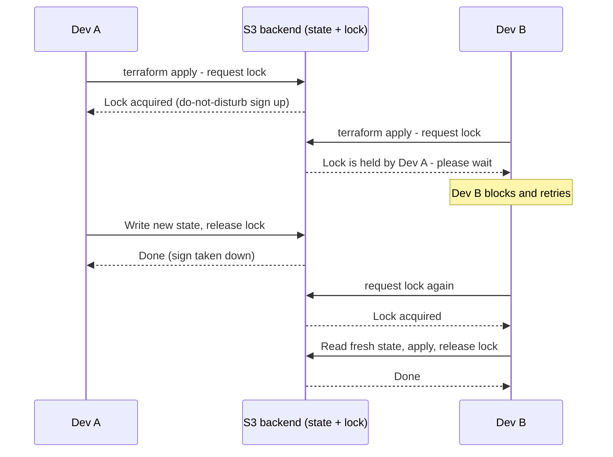

# Day 5 - Remote State and Backends

> **Goal:** understand why keeping Terraform state on your laptop breaks the moment a second person joins, learn what a backend is, and set up the modern production standard - an S3 backend with native state locking (`use_lockfile = true`) so a whole team can safely share one source of truth.

> **Interactive demo:** [State Locking animation](https://siva9800.github.io/devops-animations/terraform/state-locking.html) - watch two developers race for the lock and one wait its turn.

---

## What problem does this solve?

On Day 4 you learned that Terraform keeps a **state file** (`terraform.tfstate`) - its memory of what it built and how that maps to real cloud resources. So far that file has lived on your laptop, in the project folder. That is fine for one person learning alone. It falls apart the instant a real team touches it.

Here is exactly how it breaks:

- **Only one person has the file.** Your teammate clones the repo, runs `terraform plan`, and Terraform sees an empty state - it thinks nothing exists and wants to recreate everything. Now you have duplicate servers, or worse.
- **Two applies at once corrupt each other.** You and a colleague both run `apply` at 2pm. Both read the old state, both write a new one, and the second write silently overwrites the first. The state file no longer matches reality. This is the single scariest failure mode in Terraform.
- **Laptop dies, memory is gone.** The state file is not in Git (it holds secrets - see Day 1). If it only lives on one machine and that machine dies, Terraform has amnesia. It no longer knows what it owns, and cleaning up becomes a manual nightmare.

The fix is to stop storing state on a laptop and put it somewhere shared, durable, and lockable. That "somewhere" is called a **backend**.

---

## Learning Objectives

By the end of Day 5 you will be able to:
- Explain why local state does not work for teams.
- Define what a backend is and tell local from remote backends.
- Configure an AWS S3 backend with modern native locking (`use_lockfile = true`).
- Bootstrap the S3 bucket with versioning and encryption before using it.
- Migrate existing local state into a remote backend with `terraform init`.
- Explain state locking and why it prevents corruption.
- Pass backend settings at init time with `-backend-config` for per-environment setups.
- Read another stack's outputs using the `terraform_remote_state` data source.
- Name the other common backends and know where HCP Terraform fits.

---

## Real-world analogy: the shared office filing cabinet

Picture your team's most important document - the master ledger of everything the company owns.

- **Local state** is that ledger locked in one person's desk drawer. Only they can read it. If they are on holiday, nobody can work. If their office burns down, the ledger is gone forever. And if two people somehow scribble in it at the same time, you get contradictory entries.
- **Remote state** is that same ledger kept in a **shared, fireproof filing room** everyone in the company can walk into. It is backed up nightly (versioning), locked in a vault (encryption), and always available.
- **State locking** is the **"do not disturb - in use" sign** you hang on the door while you are writing in the ledger. Anyone else who wants to write waits until you take the sign down. Nobody ever writes over your entry mid-sentence.

That is the whole idea. A backend gives you the shared fireproof room; locking gives you the do-not-disturb sign.

---

## What is a backend?

A **backend** in Terraform defines two things:

1. **Where your state is stored** (a file on disk, an S3 bucket, an Azure blob, and so on).
2. **How operations run** (locally on your machine, or remotely on a managed service).

If you never write a backend block, Terraform uses the default **local** backend: state sits in `terraform.tfstate` next to your code. Everything you have done so far used this.

| | Local backend | Remote backend |
|---|---|---|
| Where state lives | A file on your laptop | Shared cloud storage (S3, Azure Blob, GCS, HCP) |
| Who can use it | One person | The whole team |
| Locking | None (just you) | Yes - prevents simultaneous applies |
| Durability | Dies with the laptop | Versioned and backed up |
| Good for | Learning, quick experiments | Any real team or production |

The rule of thumb: **local for solo learning, remote for everything real.**

---

## The AWS S3 backend (the production standard)

By far the most common production setup on AWS is storing state in an **S3 bucket**. S3 is durable, cheap, versioned, and encrypted - exactly the fireproof filing room we want.

Here is the modern, correct backend block. Put it inside a `terraform { }` block, usually in a file called `backend.tf`:

```hcl
terraform {
  backend "s3" {
    bucket       = "acme-terraform-state-prod"   # the S3 bucket that holds state
    key          = "network/terraform.tfstate"   # path to the state file inside the bucket
    region       = "us-east-1"                    # region the BUCKET lives in
    encrypt      = true                           # encrypt state at rest
    use_lockfile = true                           # NATIVE state locking (Terraform 1.10+)
  }
}
```

Reading it line by line:

- `bucket` - the name of the S3 bucket where state is stored. It must already exist (we create it below).
- `key` - the path/filename of the state object inside that bucket. Give each stack its own key so they do not collide (`network/`, `app/`, `db/`, and so on).
- `region` - the AWS region the bucket lives in.
- `encrypt = true` - encrypts the state file at rest inside S3. Always on.
- `use_lockfile = true` - this is the important modern part. See below.

### Native locking with `use_lockfile` - the current standard

As of **Terraform 1.10 (released late 2024)**, the S3 backend can lock state **natively**, using a small lock file stored right in the same S3 bucket. You turn it on with a single line:

```hcl
use_lockfile = true
```

When someone runs `apply`, Terraform writes a temporary lock object into S3. Anyone else who tries to run at the same time sees that lock and waits. When the first person finishes, the lock is deleted. No extra services, no extra cost, no separate table to manage. **This is the recommended way to lock S3 state in 2026.**

### Legacy: DynamoDB locking (deprecated - shown only for awareness)

Before Terraform 1.10, S3 could not lock on its own, so people added a separate **DynamoDB table** purely to hold the lock:

```hcl
terraform {
  backend "s3" {
    bucket         = "acme-terraform-state-prod"
    key            = "network/terraform.tfstate"
    region         = "us-east-1"
    encrypt        = true
    dynamodb_table = "terraform-locks"   # LEGACY - do not use for new projects
  }
}
```

You will still see `dynamodb_table` in older codebases and tutorials, so recognise it. But it is now **deprecated and being phased out**: it means running and paying for an extra DynamoDB table just to do what `use_lockfile = true` now does for free. **Do not add DynamoDB locking to new work.** If you inherit it, plan to migrate to `use_lockfile`.

| Locking method | Status (2026) | Extra resource needed |
|---|---|---|
| `use_lockfile = true` | Recommended default | None - lock lives in the same S3 bucket |
| `dynamodb_table = "..."` | Legacy / deprecated | A separate DynamoDB table |

---

## Bootstrapping: the bucket must exist first

There is a chicken-and-egg problem. The backend needs an S3 bucket, but Terraform is what creates buckets. You cannot store state in a bucket that does not exist yet.

The standard solution is a small, separate **bootstrap** configuration that uses the default local backend to create the bucket, with versioning and encryption turned on. You run it once, up front.

```hcl
provider "aws" {
  region = "us-east-1"
}

# The bucket that will hold all our Terraform state.
# NOTE: aws_s3_bucket has NO region argument - region comes from the provider.
resource "aws_s3_bucket" "state" {
  bucket = "acme-terraform-state-prod"
}

# Versioning lets you recover an older state if an apply goes wrong.
resource "aws_s3_bucket_versioning" "state" {
  bucket = aws_s3_bucket.state.id

  versioning_configuration {
    status = "Enabled"
  }
}

# Encrypt everything stored in the bucket at rest.
resource "aws_s3_bucket_server_side_encryption_configuration" "state" {
  bucket = aws_s3_bucket.state.id

  rule {
    apply_server_side_encryption_by_default {
      sse_algorithm = "AES256"
    }
  }
}
```

Two things to burn into memory:

- **Turn on versioning.** If a bad apply writes garbage into state, versioning lets you roll back to a previous good copy. This has saved countless teams.
- **The `aws_s3_bucket` resource has no `region` argument.** The bucket's region comes from the **provider** block. A common beginner error is writing `region = "us-east-1"` inside `aws_s3_bucket` - that is invalid and Terraform will reject it. Region goes in the provider (and in the backend block), never inside `aws_s3_bucket`.

Run this bootstrap config once (`init`, `apply`), and the shared filing room now exists.

---

## Migrating local state into the backend

Once the bucket exists and you have added the `backend "s3"` block, you re-run init. Terraform notices you have local state and a new backend, and offers to copy your existing state up into S3:

```bash
terraform init
```

You will see a prompt like:

```
Initializing the backend...
Do you want to copy existing state to the new backend?
  Pre-existing state was found while migrating the previous "local" backend
  to the newly configured "s3" backend. ...
  Enter "yes" to copy and "no" to start with an empty state.
```

Type `yes`. Terraform uploads your current state to the S3 bucket. From now on, everyone who runs Terraform in this folder reads and writes that shared state. You can then delete the local `terraform.tfstate` - it is no longer the source of truth.

---

## State locking, step by step

Locking is what makes shared state safe. Here is what happens when two developers try to apply at the same moment.



The key insight: Dev B does **not** read stale state and overwrite Dev A's work. B waits until A is completely finished, then reads the fresh, updated state. No corruption is possible. That is the entire point of the do-not-disturb sign.

If a run crashes and leaves a lock stuck, you can force it off with `terraform force-unlock <LOCK_ID>` - but only when you are certain no one is actually running Terraform, or you reintroduce the very corruption locking prevents.

---

## Partial backend configuration (per-environment backends)

Hardcoding the bucket and key works, but real teams run multiple environments (dev, staging, prod) that share the same code but need **different** state locations. You do not want to edit the backend block every time you switch environments.

The answer is **partial configuration**: leave some values out of the block and pass them at init time. Leave the `backend "s3"` block mostly empty:

```hcl
terraform {
  backend "s3" {
    encrypt      = true
    use_lockfile = true
  }
}
```

Then supply the rest with a `-backend-config` file per environment:

```bash
# dev.s3.tfbackend
bucket = "acme-terraform-state-dev"
key    = "app/terraform.tfstate"
region = "us-east-1"
```

```bash
terraform init -backend-config=dev.s3.tfbackend
```

Switch to prod by pointing at `prod.s3.tfbackend` instead. Same code, different state per environment, no editing the backend block.

---

## Reading another stack's outputs: `terraform_remote_state`

Big infrastructure is split into separate stacks - a **network** stack (VPC, subnets), an **app** stack, a **database** stack. The app stack often needs values the network stack produced, like a VPC ID. It reads them straight from the network stack's state file using the `terraform_remote_state` data source:

```hcl
data "terraform_remote_state" "network" {
  backend = "s3"

  config = {
    bucket = "acme-terraform-state-prod"
    key    = "network/terraform.tfstate"
    region = "us-east-1"
  }
}

# Use an output the network stack exposed
resource "aws_instance" "app" {
  ami           = data.aws_ami.amazon_linux.id
  instance_type = "t2.micro"
  subnet_id     = data.terraform_remote_state.network.outputs.private_subnet_id
}
```

For this to work, the network stack must expose `private_subnet_id` as an `output` (Day 3). This is how one stack cleanly consumes another's results without copy-pasting IDs by hand.

---

## Other backends at a glance

S3 is the AWS default, but Terraform supports many backends. You do not need to memorise these - just know they exist and follow the same pattern.

| Backend | Cloud / platform | Native locking |
|---|---|---|
| `s3` | AWS | `use_lockfile = true` (1.10+) |
| `azurerm` | Azure (Blob Storage) | Built in via blob leases |
| `gcs` | Google Cloud (Cloud Storage) | Built in |
| `remote` / HCP Terraform | HashiCorp managed service | Built in, automatic |

**HCP Terraform** (formerly Terraform Cloud) deserves a special mention. Instead of you wiring up a bucket, encryption, and locking by hand, it is a **managed service that handles state storage, locking, and team access control (RBAC) automatically**, plus remote runs and a web UI. It is the easiest way to get safe shared state without owning any infrastructure. We give it full treatment on **Day 15** - for now, just know it is the managed alternative to rolling your own S3 backend.

---

## Common Mistakes

1. **Putting `region` inside `aws_s3_bucket`.** That argument does not exist on the resource. Region comes from the `provider` block (and the backend block). Terraform will error if you add it.
2. **Forgetting to enable versioning on the state bucket.** Without it, a corrupted apply has no undo. Always turn on `aws_s3_bucket_versioning`.
3. **Adding DynamoDB locking to a new project.** It is legacy. Use `use_lockfile = true` instead - same protection, no extra table to run and pay for.
4. **Committing the local `terraform.tfstate` to Git after migrating.** Once state is in S3, the local file is stale and may leak secrets. Delete it and keep `*.tfstate` in `.gitignore`.
5. **Running `force-unlock` while a real apply is in progress.** That defeats locking entirely and can corrupt state. Only force-unlock a genuinely stuck lock when nobody is running Terraform.
6. **Giving two stacks the same `key`.** They will overwrite each other's state. Every stack needs its own unique `key` in the bucket.

---

## Hands-On Lab: bootstrap a bucket, migrate state, test locking

You need `aws configure` done and Terraform 1.10 or newer (`terraform -version`).

```bash
# --- Part 1: bootstrap the state bucket (local backend) ---
mkdir tf-bootstrap && cd tf-bootstrap
# Create main.tf with: provider "aws", aws_s3_bucket,
# aws_s3_bucket_versioning, and the encryption resource from this lesson.
# Use a globally unique bucket name.
terraform init
terraform apply        # type yes - the shared bucket now exists

# --- Part 2: point a real project at the backend ---
cd ..
mkdir tf-app && cd tf-app
# Create your normal resources (e.g. the EC2 from Day 1) in main.tf.
terraform init
terraform apply        # builds resources, state is still LOCAL for now

# Now add backend.tf with the backend "s3" block:
#   bucket = <your bucket>, key = "app/terraform.tfstate",
#   region = ..., encrypt = true, use_lockfile = true
terraform init         # Terraform asks to migrate - type yes
# Your state is now in S3. Delete the local terraform.tfstate.

# --- Part 3: prove locking works ---
# Open TWO terminals in tf-app.
# Terminal 1:
terraform apply        # leave it sitting at the "yes?" prompt (lock is held)
# Terminal 2 (while terminal 1 waits):
terraform apply        # it reports the state is locked and waits

# Finish or cancel terminal 1; terminal 2 then proceeds. Locking confirmed.

# --- Clean up ---
terraform destroy      # in tf-app
# Then empty and destroy the bucket in tf-bootstrap when fully done.
```

**Success check:** after Part 2, opening your S3 bucket in the AWS console shows `app/terraform.tfstate`. In Part 3, the second `apply` clearly says the state is locked and waits its turn.

---

## Quick Self-Check

1. Give two concrete ways local state breaks the moment a second person joins the team.
2. What two things does a "backend" define?
3. What is the modern, recommended way to lock S3 state in 2026, and what one line turns it on?
4. Why must you not put a `region` argument inside an `aws_s3_bucket` resource?
5. What does the `terraform_remote_state` data source let you do?

<details>
<summary>Answers</summary>

1. Any two of: only one person has the file so teammates see empty state and try to recreate everything; two simultaneous applies overwrite each other and corrupt state; if the laptop dies the state (and Terraform's memory of what it owns) is lost.
2. Where state is stored (local file, S3, Azure Blob, GCS, HCP) and how operations run (locally or on a remote managed service).
3. Native locking via a lock file in the same S3 bucket, turned on with `use_lockfile = true` (Terraform 1.10+). DynamoDB locking is the legacy/deprecated approach.
4. `aws_s3_bucket` has no `region` argument - it is invalid and Terraform rejects it. The bucket's region comes from the `provider` block.
5. Read the outputs of another stack's state file (for example, an app stack reading the network stack's VPC or subnet ID) so stacks can consume each other's results cleanly.
</details>

---

## Summary

- Local state is a ledger locked in one desk drawer; it breaks teams through invisibility, simultaneous-apply corruption, and loss when a laptop dies.
- A backend defines where state lives and how operations run. Local is for solo learning; remote is for anything real.
- The AWS production standard is an S3 backend with `encrypt = true` and `use_lockfile = true` - native locking, no extra services.
- DynamoDB locking is legacy and deprecated; recognise it in old code, but do not add it to new projects.
- Bootstrap the bucket first with versioning and encryption; remember `aws_s3_bucket` has no `region` argument.
- `terraform init` migrates local state to the backend; locking is the do-not-disturb sign that stops two applies from clashing.
- Use `-backend-config` for per-environment state, `terraform_remote_state` to read another stack's outputs, and HCP Terraform when you want state, locking, and RBAC managed for you (Day 15).

**Next up ->** [Day 6 - Expressions and Functions](../day06-expressions-functions/notes.md)
