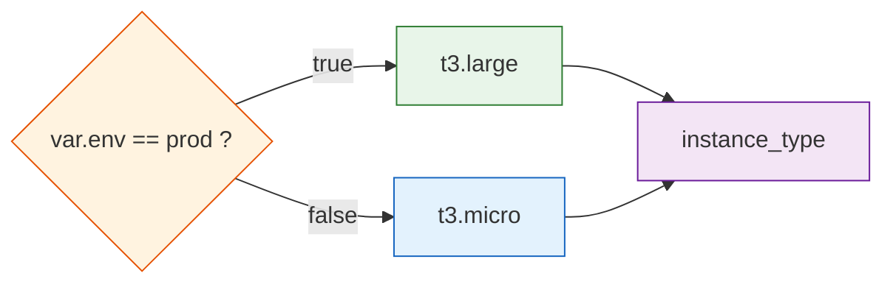
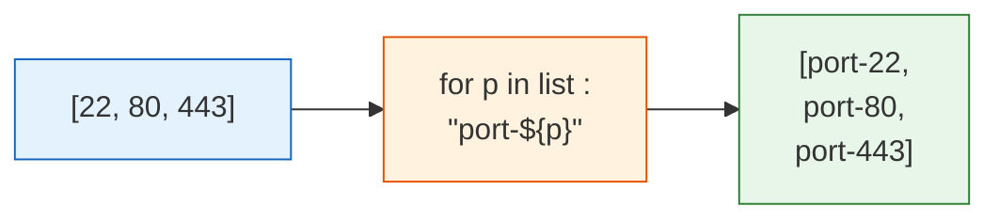

# Day 6 - Expressions and Functions

> **Goal:** stop hardcoding values and start computing them. Learn Terraform's expression language - references, operators, conditionals, for-expressions, splats - and the built-in functions that turn a static config into a smart, reusable one that adapts to whatever you throw at it.

> **Interactive demo:** [terraform console playground](https://siva9800.github.io/devops-animations/terraform/console-playground.html) - type expressions and watch them evaluate live.

---

## What problem does this solve?

On Day 3 you learned variables, so your config stopped being fully hardcoded. But variables alone are dumb - they just hand back exactly what you put in. Real infrastructure needs to *reason*:

- "If this is production, use a big instance; otherwise use a small one."
- "Take this list of usernames and uppercase every one of them."
- "Merge the team's common tags with this resource's own tags."
- "Read a shell script from disk, fill in the region and app name, and feed it to the server as boot instructions."

None of that is a plain value. Each one is a small *computation*. **Expressions and functions are how Terraform computes.** They are the difference between a config that only works for one exact situation and one that adapts - the single most job-relevant Terraform skill after variables, and something interviewers love to test.

---

## Learning Objectives

By the end of Day 6 you will be able to:
- Reference other values and build strings with interpolation and templates.
- Use arithmetic, comparison, and logical operators.
- Write conditional (ternary) expressions to pick values based on a condition.
- Transform lists and maps with `for` expressions.
- Grab a field from every item in a list with a splat expression.
- Reach for the right built-in function - string, collection, type, numeric, encoding, date/hash.
- Deep-dive the job-critical ones: `lookup`, `coalesce`, `try`, `merge`, `templatefile`.
- Test any expression instantly with `terraform console`.

---

## Real-world analogy: a spreadsheet

You already know expressions - from Excel or Google Sheets.

- A **cell reference** like `=A1` pulls a value from elsewhere. In Terraform, `var.region` or `aws_instance.web.id` does the same.
- A **formula** like `=SUM(B2:B10)` or `=UPPER(A1)` computes a result from inputs. Terraform's `length(...)` and `upper(...)` are exactly this.
- An **IF formula**, `=IF(A1="prod","large","small")`, picks a value based on a test. Terraform's ternary `condition ? a : b` is the same idea.
- **Fill-down** applies one formula to a whole column. Terraform's `for` expression applies one transform to every item in a list or map.

**Terraform's expression language is a spreadsheet for your infrastructure.** If you can write a formula in a cell, you can write one here.

---

## References and interpolation

An **expression** is anything that produces a value. The simplest is a reference to something else in your config.

```hcl
var.region                     # an input variable
local.common_tags              # a local value
aws_instance.web.id            # an attribute of a resource
data.aws_ami.al.id             # an attribute of a data source
module.network.vpc_id          # an output from a module
```

### Interpolation: the `${...}` wrapper

To drop a value *inside a string*, wrap it in `${ ... }`:

```hcl
name = "web-${var.environment}-server"   # -> "web-prod-server"
```

**Modern HCL usually does not need `${...}`.** If the whole value *is* the expression, write it bare - no quotes, no wrapper:

```hcl
# Old style (still works, but noisy)
instance_type = "${var.instance_type}"

# Modern style - just the expression
instance_type = var.instance_type
```

Rule of thumb: use `${...}` only when you are *mixing* an expression into surrounding text. If the expression stands alone, write it bare.

### String templates

For multi-line strings (like scripts) use a heredoc. Interpolation still works inside it:

```hcl
user_data = <<-EOT
  #!/bin/bash
  echo "Region is ${var.region}"
  echo "App is ${var.app_name}"
EOT
```

---

## Operators

Terraform has the operators you would expect from any language.

| Kind | Operators | Example | Result |
|---|---|---|---|
| Arithmetic | `+ - * / %` | `4 + 3` | `7` |
| Comparison | `== != < <= > >=` | `var.count > 3` | `true`/`false` |
| Logical | `&&` (and), `\|\|` (or), `!` (not) | `var.a && !var.b` | `true`/`false` |

```hcl
disk_size    = var.base_disk * 2            # arithmetic
is_big        = var.env == "prod"            # comparison -> bool
needs_backup = var.is_prod && !var.is_temp  # logical
```

---

## Conditional expressions (the ternary)

The single most-used expression in real Terraform. Format:

```
condition ? value_if_true : value_if_false
```

Read it as: "if condition, then this, otherwise that."

```hcl
# Big box in prod, cheap box everywhere else
instance_type = var.env == "prod" ? "t3.large" : "t3.micro"

# Turn deletion protection on only in prod
deletion_protection = var.env == "prod" ? true : false

# Fall back to a default when a variable is empty
bucket_name = var.bucket_name != "" ? var.bucket_name : "default-bucket"
```

Both branches must return the **same type**. `var.x ? "a" : 5` is an error (string vs number).



---

## for expressions: transform lists and maps

A `for` expression is fill-down: apply one transform to every item. The brackets decide the output shape.

**Square brackets `[ ]` produce a list:**

```hcl
# Uppercase every name in a list
[for name in var.usernames : upper(name)]
# ["alice","bob"] -> ["ALICE","BOB"]

# Filter, too - keep only long names
[for name in var.usernames : name if length(name) > 3]
```

**Curly braces `{ }` produce a map** (note the `key => value` arrow):

```hcl
# Build a map of name -> UPPERCASED name
{for name in var.usernames : name => upper(name)}
# {"alice"="ALICE", "bob"="BOB"}

# Transform an existing map's values
{for k, v in var.tags : k => lower(v)}
```

Real example - turn a list of ports into ingress-friendly strings:

```hcl
locals {
  ports        = [22, 80, 443]
  port_labels = [for p in local.ports : "port-${p}"]
  # ["port-22","port-80","port-443"]
}
```



---

## Splat expressions

When you have many resources or a list of objects, `[*]` grabs one field from every element - a shorthand for a `for` expression.

```hcl
# If you created several instances with count:
aws_instance.web[*].id
# -> ["i-aaa", "i-bbb", "i-ccc"]

aws_instance.web[*].private_ip
# -> all their private IPs, as a list
```

`aws_instance.web[*].id` is just a tidy way of writing `[for i in aws_instance.web : i.id]`.

---

## Built-in functions

Terraform ships with a large standard library. You never define your own - you compose these. Grouped by job:

### String

| Function | Purpose | Example -> result |
|---|---|---|
| `lower` | lowercase | `lower("HI")` -> `"hi"` |
| `upper` | uppercase | `upper("hi")` -> `"HI"` |
| `replace` | swap substring | `replace("a-b","-","_")` -> `"a_b"` |
| `format` | printf-style string | `format("web-%s",var.env)` -> `"web-prod"` |
| `join` | list -> string | `join(",",["a","b"])` -> `"a,b"` |
| `split` | string -> list | `split(",","a,b")` -> `["a","b"]` |
| `trimspace` | strip whitespace | `trimspace("  hi ")` -> `"hi"` |
| `substr` | slice a string | `substr("hello",0,3)` -> `"hel"` |

### Collection

| Function | Purpose | Example -> result |
|---|---|---|
| `length` | count items | `length(["a","b"])` -> `2` |
| `keys` | map keys | `keys({a=1,b=2})` -> `["a","b"]` |
| `values` | map values | `values({a=1,b=2})` -> `[1,2]` |
| `lookup` | map value with default | `lookup(m,"x","def")` |
| `contains` | is item in list | `contains(["a"],"a")` -> `true` |
| `merge` | combine maps | `merge({a=1},{b=2})` -> `{a=1,b=2}` |
| `concat` | join lists | `concat([1],[2])` -> `[1,2]` |
| `flatten` | un-nest lists | `flatten([[1],[2]])` -> `[1,2]` |
| `distinct` | dedupe list | `distinct([1,1,2])` -> `[1,2]` |
| `element` | item by index (wraps) | `element(["a","b"],0)` -> `"a"` |
| `coalesce` | first non-null/empty | `coalesce("","x")` -> `"x"` |
| `coalescelist` | first non-empty list | `coalescelist([],[1])` -> `[1]` |

### Type and safety

| Function | Purpose | Example -> result |
|---|---|---|
| `try` | first arg that does not error | `try(var.x, "fallback")` |
| `can` | did an expression succeed? | `can(tonumber("5"))` -> `true` |
| `tostring` | convert to string | `tostring(5)` -> `"5"` |
| `tonumber` | convert to number | `tonumber("5")` -> `5` |
| `tolist` | convert to list | `tolist(toset([1,2]))` |
| `tomap` | convert to map | `tomap({a="1"})` |

### Numeric

| Function | Purpose | Example -> result |
|---|---|---|
| `min` | smallest | `min(3,1,2)` -> `1` |
| `max` | largest | `max(3,1,2)` -> `3` |
| `abs` | absolute value | `abs(-4)` -> `4` |
| `ceil` | round up | `ceil(1.1)` -> `2` |
| `floor` | round down | `floor(1.9)` -> `1` |

### Encoding and IO

| Function | Purpose | Example -> result |
|---|---|---|
| `jsonencode` | value -> JSON string | `jsonencode({a=1})` -> `"{\"a\":1}"` |
| `jsondecode` | JSON string -> value | `jsondecode("[1,2]")` -> `[1,2]` |
| `templatefile` | render a file with variables | `templatefile("u.sh.tpl", {...})` |
| `file` | read a file's contents | `file("policy.json")` |
| `base64encode` | encode to base64 | `base64encode("hi")` -> `"aGk="` |

### Date and hash (brief)

| Function | Purpose | Example -> result |
|---|---|---|
| `timestamp` | current UTC time | `timestamp()` -> `"2026-07-05T..."` |
| `formatdate` | format a timestamp | `formatdate("YYYY", timestamp())` |
| `uuid` | random UUID | `uuid()` -> `"b5ee..."` |
| `sha256` | hash a string | `sha256("hi")` -> `"8f43..."` |

> `timestamp()` and `uuid()` change on every run, so they force resource updates. Use them sparingly (or with `ignore_changes`).

---

## Deep-dive: the functions that pay the bills

### lookup - map value with a safe default

`lookup(map, key, default)` returns the value for a key, or the default if the key is missing. Great for per-environment settings.

```hcl
variable "env" { default = "dev" }

locals {
  instance_sizes = {
    dev  = "t3.micro"
    prod = "t3.large"
  }
  # If env is missing from the map, fall back to t3.micro
  chosen_size = lookup(local.instance_sizes, var.env, "t3.micro")
}
```

### coalesce - first value that is not null or empty

Picks the first "real" argument. Perfect for optional inputs with fallbacks.

```hcl
# Use the passed name, else a computed one
name = coalesce(var.custom_name, "app-${var.env}")
```

### try - graceful fallback when something might error

`try(expr1, expr2, ...)` returns the first argument that evaluates without error. Ideal when a nested field might not exist.

```hcl
# If var.config.size is missing, do not crash - use "small"
size = try(var.config.size, "small")
```

### merge - combine tag maps (used everywhere)

`merge` layers maps left-to-right; later keys win. This is the standard tagging pattern.

```hcl
locals {
  common_tags = {
    ManagedBy = "terraform"
    Team      = "platform"
  }
}

resource "aws_instance" "web" {
  # ... ami, instance_type ...
  tags = merge(local.common_tags, {
    Name = "web-${var.env}"
    Role = "frontend"
  })
}
# Result: ManagedBy, Team, Name, Role all present
```

### templatefile - render a script with variables

`templatefile(path, vars)` reads a template file, fills in placeholders from `vars`, and returns the result as a string. The classic use is a boot script (user-data) for an EC2 instance.

Template file `userdata.sh.tpl`:

```bash
#!/bin/bash
echo "Starting ${app_name} in ${region}"
yum install -y httpd
systemctl enable --now httpd
echo "<h1>${app_name} - ${env}</h1>" > /var/www/html/index.html
```

Using it:

```hcl
user_data = templatefile("${path.module}/userdata.sh.tpl", {
  app_name = var.app_name
  region   = var.region
  env      = var.env
})
```

Note: inside a `.tpl` file the placeholders are bare (`${app_name}`) because they come from the `vars` map, not from Terraform variables directly.

---

## terraform console: your expression sandbox

Do not guess what a function does - test it. `terraform console` opens an interactive prompt where you type expressions and see results instantly. It reads your config, so `var.*` and `local.*` work too.

```bash
terraform console
```
```
> upper("hello")
"HELLO"
> length(["a","b","c"])
3
> merge({a=1}, {b=2})
{ "a" = 1, "b" = 2 }
> var.env == "prod" ? "big" : "small"
"small"
> [for p in [22,80,443] : "port-${p}"]
[ "port-22", "port-80", "port-443" ]
> lookup({dev="t3.micro"}, "prod", "fallback")
"fallback"
```

Type `exit` (or Ctrl-D) to leave. Get in the habit of proving an expression here before wiring it into a resource.

---

## Cohesive example: a smart EC2 instance

This ties it all together - a `data` AMI lookup (no hardcoded AMI), locals, a conditional, `merge`, and `templatefile`.

```hcl
variable "env"      { default = "dev" }
variable "app_name" { default = "myapp" }
variable "region"   { default = "us-east-1" }

provider "aws" {
  region = var.region
}

# Never hardcode an AMI - look up the latest Amazon Linux 2023 image
data "aws_ami" "al2023" {
  most_recent = true
  owners      = ["amazon"]
  filter {
    name   = "name"
    values = ["al2023-ami-*-x86_64"]
  }
}

locals {
  # Conditional: prod gets a bigger box
  instance_type = var.env == "prod" ? "t3.large" : "t3.micro"

  # Shared tags, merged per-resource below
  common_tags = {
    ManagedBy   = "terraform"
    Environment = var.env
    App         = var.app_name
  }
}

resource "aws_instance" "web" {
  ami           = data.aws_ami.al2023.id
  instance_type = local.instance_type

  # Render the boot script, injecting our values
  user_data = templatefile("${path.module}/userdata.sh.tpl", {
    app_name = var.app_name
    region   = var.region
    env      = var.env
  })

  # Combine common tags with instance-specific ones
  tags = merge(local.common_tags, {
    Name = "${var.app_name}-${var.env}-web"
    Role = "frontend"
  })
}

output "web_ip" {
  value = aws_instance.web.public_ip
}
```

And the template `userdata.sh.tpl` beside it:

```bash
#!/bin/bash
yum install -y httpd
systemctl enable --now httpd
echo "<h1>${app_name} running in ${env} (${region})</h1>" > /var/www/html/index.html
```

Change `env` to `prod` and the instance size, tags, and page content all adapt - no other edits. That is the payoff of expressions.

---

## Common Mistakes

1. **Mismatched ternary branches.** `var.x ? "a" : 1` errors - both sides must be the same type. Return two strings or two numbers, not one of each.
2. **Over-using `${...}`.** `instance_type = "${var.instance_type}"` is legacy noise. If the expression stands alone, drop the quotes and wrapper: `instance_type = var.instance_type`.
3. **Confusing `for` output shape.** `[ ... ]` gives a list, `{ ... => ... }` gives a map. Using the wrong brackets gives the wrong type.
4. **Reaching for `lookup` on an object.** `lookup` is for maps. For an object attribute that might be missing, use `try(var.obj.field, default)`.
5. **Overusing `timestamp()` / `uuid()`.** They change every apply and cause perpetual diffs. Avoid them in resource arguments unless you truly want that.
6. **Guessing instead of testing.** If you are unsure what a function returns, open `terraform console` - it takes ten seconds.

---

## Hands-On Lab: play with functions in the console

No AWS needed for most of this - just a folder and `terraform console`.

```bash
mkdir tf-expr-lab && cd tf-expr-lab

# Create a tiny main.tf so the console has some locals to read
cat > main.tf <<'EOF'
locals {
  names = ["alice", "bob", "carol"]
  sizes = { dev = "t3.micro", prod = "t3.large" }
}
EOF

terraform init
terraform console
```

Now, at the `>` prompt, try each of these and predict the result first:

```
> upper("devops")
> length(local.names)
> [for n in local.names : upper(n)]
> {for n in local.names : n => length(n)}
> lookup(local.sizes, "prod", "t3.micro")
> lookup(local.sizes, "staging", "t3.micro")
> merge({a=1}, {a=9, b=2})
> coalesce("", null, "winner")
> "prod" == "prod" ? "big" : "small"
> try(local.sizes.staging, "no-such-key")
> join("-", ["a","b","c"])
> contains(local.names, "bob")
```

**Success check:** you can predict each result before pressing Enter, and explain why `merge` gave `a=9`, why the second `lookup` returned the default, and why `coalesce` skipped the empty string and null.

---

## Quick Self-Check

1. When do you actually need the `${...}` wrapper, and when can you drop it?
2. Write a ternary that sets `monitoring` to `true` in prod and `false` otherwise.
3. What is the difference between `[for x in list : ...]` and `{for k, v in map : ...}`?
4. You have `merge({env="dev", team="a"}, {env="prod"})`. What is the result and why?
5. Name the function you would use to render a shell script with injected variables for EC2 user-data.

<details>
<summary>Answers</summary>

1. Use `${...}` only when embedding an expression inside surrounding string text, e.g. `"web-${var.env}"`. If the whole value is the expression, write it bare: `instance_type = var.instance_type`.
2. `monitoring = var.env == "prod" ? true : false` (or simply `monitoring = var.env == "prod"`).
3. Square brackets produce a **list**; curly braces with `key => value` produce a **map**. The brackets decide the output type.
4. `{env="prod", team="a"}` - `merge` layers left to right and later keys win, so the second map's `env="prod"` overrides `dev`, while `team` is kept.
5. `templatefile(path, vars)` - it reads the template file and fills in the placeholders from the vars map.
</details>

---

## Summary

- Expressions let Terraform *compute* values instead of hardcoding them - it is a spreadsheet for your infrastructure.
- Reference values bare; use `${...}` only to embed them inside strings.
- Operators (arithmetic, comparison, logical) and the ternary `cond ? a : b` drive per-environment decisions.
- `for` expressions transform lists (`[ ]`) and maps (`{ => }`); splat `[*]` grabs one field from every element.
- Built-in functions are grouped by job - string, collection, type/safety, numeric, encoding, date/hash - and you compose them, never write your own.
- The money functions: `lookup` (default-safe map access), `coalesce` (first real value), `try` (graceful fallback), `merge` (tag layering), `templatefile` (render scripts).
- Prove any expression in `terraform console` before wiring it in.

**Next up ->** [Day 7 - Loops: count and for_each](../day07-loops-count-foreach/notes.md)
