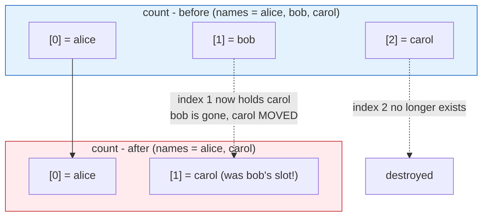

# Day 7 - Loops: count and for_each

> **Goal:** learn to create many similar resources from a single block - without copy-pasting - using `count` and `for_each`, and understand deeply why `for_each` is usually the safer choice.

> **Interactive demo:** [Loops in Terraform animation](https://siva9800.github.io/devops-animations/terraform/loops.html) - watch how removing a middle item behaves differently under `count` vs `for_each`.

---

## What problem does this solve?

Say you need five EC2 instances. The naive way is to copy the same `resource` block five times, changing only the name:

```hcl
resource "aws_instance" "web1" { ... }
resource "aws_instance" "web2" { ... }
resource "aws_instance" "web3" { ... }
# ...and so on
```

This is painful. Five blocks that are 95% identical. Change the instance type? Edit five places. Add a sixth server? Copy-paste again and hope you did not forget a field. This is exactly the copy-paste nightmare IaC was supposed to end.

Terraform gives you **loops**: write the block **once**, and tell Terraform "make N of these" (`count`) or "make one for each item in this collection" (`for_each`). One block, many resources, zero copy-paste.

---

## Learning Objectives

By the end of Day 7 you will be able to:
- Explain why loops matter and when to reach for one.
- Use `count` to create N resources and reference them with `count.index` and `[*]`.
- Use `count` for conditional creation (`count = var.create ? 1 : 0`).
- Use `for_each` over a **set** or a **map**, and use `each.key` / `each.value`.
- Explain the classic **index-shift gotcha** with `count` and why `for_each` avoids it.
- Choose correctly between `count` and `for_each` in an interview and in real code.
- Drive multiple per-instance settings from a **map of objects**.
- Put `count` / `for_each` on a **module** block.

---

## Real-world analogy: photocopies vs a wall of lockers

Two ways to make "many of something":

- **`count` is a stack of photocopies, numbered by position.** You ask for 5 copies and Terraform hands you copies 0, 1, 2, 3, 4. Each is identified only by its **position in the pile**. If you pull copy number 2 out of the middle, everything below it shifts up to fill the gap - what used to be copy 3 is now copy 2. The identity is the position, and positions renumber.

- **`for_each` is a wall of labelled lockers.** Each locker has a **name** painted on it - "alice", "bob", "carol". If you remove locker "bob", the other lockers do not renumber; "alice" and "carol" are untouched. The identity is the **name**, not the position.

That single difference - **numbered by position** vs **keyed by a stable name** - is the whole lesson, and the most common Terraform interview question on this topic.

---

## Part 1: `count` - N copies numbered by position

`count` is the simplest loop. Add `count = N` to a resource and Terraform creates N of it.

```hcl
provider "aws" {
  region = "us-east-1"
}

data "aws_ami" "amazon_linux" {
  most_recent = true
  owners      = ["amazon"]

  filter {
    name   = "name"
    values = ["al2023-ami-*-x86_64"]
  }
}

resource "aws_instance" "web" {
  count         = 3
  ami           = data.aws_ami.amazon_linux.id
  instance_type = "t2.micro"

  tags = {
    Name = "web-${count.index}"
  }
}
```

- `count = 3` - "make three of these."
- `count.index` - the **0-based** position of each copy: 0, 1, 2. Here it becomes part of the name, so you get `web-0`, `web-1`, `web-2`.

### Referencing the instances

Because there are many, `aws_instance.web` is now a **list**, not a single resource:

| Reference | Meaning |
|---|---|
| `aws_instance.web[0]` | the first instance |
| `aws_instance.web[1]` | the second instance |
| `aws_instance.web[*].id` | the IDs of **all** instances (a list) - the `[*]` is called the "splat" |
| `length(aws_instance.web)` | how many there are |

```hcl
output "all_ids" {
  value = aws_instance.web[*].id # list of all three IDs
}
```

### Conditional creation: the on/off switch

A neat trick: `count` can be 0. Zero copies means the resource is not created at all. Combined with a ternary, this becomes a feature flag:

```hcl
variable "create_bastion" {
  type    = bool
  default = false
}

resource "aws_instance" "bastion" {
  count         = var.create_bastion ? 1 : 0
  ami           = data.aws_ami.amazon_linux.id
  instance_type = "t2.micro"

  tags = {
    Name = "bastion"
  }
}
```

"If `create_bastion` is true, make 1; otherwise make 0." This is the idiomatic way to toggle a resource on and off. Note that even a single conditional resource is still accessed as `aws_instance.bastion[0]`, because `count` always produces a list.

---

## Part 2: `for_each` - one per named item

`for_each` loops over a **collection** and creates one resource per item. Unlike `count`, each instance is keyed by a **stable string**, not a position.

### Over a set (a list of names)

```hcl
resource "aws_instance" "web" {
  for_each = toset(["alice", "bob", "carol"])

  ami           = data.aws_ami.amazon_linux.id
  instance_type = "t2.micro"

  tags = {
    Name = each.key # "alice", "bob", "carol"
  }
}
```

- `for_each` needs a **set** or a **map**. A plain list will error, so we wrap it in `toset(...)` to turn the list into a set of unique strings.
- `each.key` - the current item's key. For a set, key and value are the same string.
- `each.value` - the current item's value (same as `each.key` for a set).

### Referencing the instances

Now `aws_instance.web` is a **map** keyed by name:

| Reference | Meaning |
|---|---|
| `aws_instance.web["alice"]` | the instance for alice |
| `aws_instance.web["bob"].id` | bob's instance ID |
| `values(aws_instance.web)[*].id` | all IDs |

Notice you address instances by **name**, not by number. That is the whole point.

### Over a map (different settings per item)

The real power shows up with a **map**, where each key carries its own configuration:

```hcl
resource "aws_instance" "web" {
  for_each = {
    api    = "t2.micro"
    worker = "t2.small"
    cache  = "t3.medium"
  }

  ami           = data.aws_ami.amazon_linux.id
  instance_type = each.value # the size for this key

  tags = {
    Name = each.key # "api", "worker", "cache"
  }
}
```

Here `each.key` is the role name and `each.value` is that role's instance type. Three instances, each different, from one block.

---

## Part 3: THE key lesson - `count` vs `for_each` and the index-shift gotcha

This is the part interviewers probe. Read it twice.

Suppose you build three instances with `count` from a list of names:

```hcl
variable "names" {
  default = ["alice", "bob", "carol"]
}

resource "aws_instance" "web" {
  count         = length(var.names)
  ami           = data.aws_ami.amazon_linux.id
  instance_type = "t2.micro"
  tags          = { Name = var.names[count.index] }
}
```

Terraform tracks them by **position**:

| Address | Name |
|---|---|
| `aws_instance.web[0]` | alice |
| `aws_instance.web[1]` | bob |
| `aws_instance.web[2]` | carol |

Now you remove **"bob"** from the middle of the list, leaving `["alice", "carol"]`. Watch what Terraform sees:



Because identity is the position, slot `[1]` used to be bob and is now carol. Terraform thinks: "the resource at index 1 changed from bob to carol, and index 2 disappeared." So it **destroys and recreates** the instance at index 1 and destroys index 2. You wanted to delete one server; you disrupted **two**. On real infrastructure that can mean recreating live servers by accident.

Now the same removal with `for_each` over a set:

```mermaid
flowchart TB
    subgraph BeforeF["for_each - before"]
        fb0['[alice]']
        fb1['[bob]']
        fb2['[carol]']
    end
    subgraph AfterF["for_each - after (remove bob)"]
        fa0['[alice]  untouched']
        fa2['[carol]  untouched']
    end
    fb0 --> fa0
    fb1 -.->|"only [bob] is destroyed"| XF["destroyed"]
    fb2 --> fa2
    style BeforeF fill:#e8f5e9,stroke:#2e7d32
    style AfterF fill:#e8f5e9,stroke:#2e7d32
```

Because identity is the **name**, `aws_instance.web["alice"]` and `aws_instance.web["carol"]` are untouched. Only `aws_instance.web["bob"]` is destroyed. Surgical. This is exactly what you wanted.

### Side-by-side

| Aspect | `count` | `for_each` |
|---|---|---|
| Loops over | a number | a set or a map |
| Instance identity | position/index (0, 1, 2...) | a stable string key |
| Reference | `aws_instance.web[0]` | `aws_instance.web["alice"]` |
| Per-item variable | `count.index` | `each.key`, `each.value` |
| Remove a middle item | shifts indexes; destroys/recreates everything after it | surgical; only that item is removed |
| Per-instance different settings | awkward (index into parallel lists) | natural (map value per key) |
| Best for | truly identical copies; on/off toggle | items with stable identities (the common case) |

> **Strong recommendation (memorise this):** prefer `for_each` whenever your items have a natural, stable identity (a name, an ID, a role). Use `count` only for (a) truly identical, order-independent copies, or (b) a simple on/off toggle with `count = condition ? 1 : 0`. When in doubt, `for_each`.

---

## Part 4: `for_each` with a map of objects - the most powerful pattern

The strongest pattern is a **map whose values are objects**. Each key names one instance; its object carries every per-instance setting. This is how real projects define fleets.

```hcl
provider "aws" {
  region = "us-east-1"
}

data "aws_ami" "amazon_linux" {
  most_recent = true
  owners      = ["amazon"]

  filter {
    name   = "name"
    values = ["al2023-ami-*-x86_64"]
  }
}

variable "servers" {
  description = "Per-instance settings, keyed by a stable name"
  type = map(object({
    instance_type = string
    az            = string
  }))
  default = {
    api    = { instance_type = "t2.micro", az = "us-east-1a" }
    worker = { instance_type = "t2.small", az = "us-east-1b" }
    cache  = { instance_type = "t3.medium", az = "us-east-1a" }
  }
}

resource "aws_instance" "fleet" {
  for_each = var.servers

  ami               = data.aws_ami.amazon_linux.id
  instance_type     = each.value.instance_type
  availability_zone = each.value.az

  tags = {
    Name = each.key # "api", "worker", "cache"
    Role = each.key
  }
}

output "fleet_ips" {
  value = { for name, inst in aws_instance.fleet : name => inst.private_ip }
}
```

Reading it:
- `for_each = var.servers` - one instance per map key.
- `each.key` is the role name; `each.value` is that role's object.
- `each.value.instance_type` and `each.value.az` pull the per-instance settings.
- Add a new server? Add one entry to the map. Remove one? Delete its entry - and only that instance is affected, thanks to `for_each`.

To add a fourth server, you add four lines to the variable. No new resource block, no copy-paste, and no risk of disturbing the existing three.

---

## Part 5: `for_each` with a for-expression - reshaping data

`for_each` demands a set or a map. Real input is often a **list of objects** instead. A **for-expression** transforms that list into the map `for_each` needs, keyed by a stable field.

```hcl
variable "users" {
  type = list(object({
    name = string
    role = string
  }))
  default = [
    { name = "alice", role = "admin" },
    { name = "bob", role = "dev" },
  ]
}

resource "aws_iam_user" "team" {
  # turn the list into a map keyed by the (stable, unique) name
  for_each = { for u in var.users : u.name => u }

  name = each.value.name
  tags = { Role = each.value.role }
}
```

`{ for u in var.users : u.name => u }` reads as "for each user `u` in the list, produce an entry `name => the whole object`." The result is a map, so `for_each` is happy, and each user is keyed by their stable name. The key you choose (here `u.name`) **must be unique** across the list, or Terraform errors on duplicate keys.

---

## Part 6: `count` and `for_each` on a module

You are not limited to resources - a **module** block accepts `count` and `for_each` too, so you can stamp out whole modules. (Modules get a full treatment on Day 10; this is just the loop syntax.)

```hcl
# One VPC module per environment, keyed by name
module "network" {
  source   = "./modules/vpc"
  for_each = toset(["dev", "staging", "prod"])

  vpc_name = each.key
}

# Reference a specific one:
# module.network["prod"].vpc_id
```

The same index-shift rules apply: prefer `for_each` on modules for the same reason - stable keys make add/remove surgical.

---

## Common Mistakes

1. **Using a list directly with `for_each`.** `for_each` accepts only a **set** or a **map**. Wrap lists with `toset([...])`, or convert to a map with a for-expression. A raw `list` gives `Invalid for_each argument`.
2. **"Invalid for_each argument ... value depends on resource attributes that cannot be determined until apply."** `for_each` **keys** must be known at **plan** time. If your keys come from another resource's not-yet-created attribute (like an ID Terraform will assign during apply), Terraform cannot plan. Fix: key on values known up front (names, fixed IDs, input variables), not on computed outputs.
3. **Putting both `count` and `for_each` on the same resource.** Illegal - a resource may use one or the other, never both. Pick the right loop for the data shape.
4. **Reaching for `count` when items have identity.** This is the index-shift trap. If you will ever add or remove items in the middle, `count` will churn unrelated resources. Use `for_each`.
5. **Forgetting `count` output is always a list.** Even `count = 1` gives you `aws_instance.x[0]`, not `aws_instance.x`. Index it.
6. **Duplicate keys in a for-expression.** `{ for u in var.users : u.name => u }` fails if two users share a name. Keys must be unique.

---

## Hands-On Lab: build a fleet, then remove one to see the difference

Make sure `aws configure` is done first.

```bash
# 1. Make a project folder
mkdir tf-loops && cd tf-loops

# 2. Create main.tf using the "map of objects" example from Part 4
#    (provider + data.aws_ami + variable "servers" + aws_instance.fleet)

# 3. Tidy and check
terraform fmt
terraform validate
terraform init

# 4. Preview - you should see 3 instances to add (api, worker, cache)
terraform plan

# 5. Build them
terraform apply

# 6. THE EXPERIMENT: remove the "worker" entry from the servers map,
#    save, then plan again.
terraform plan
#    Observe: ONLY worker is destroyed. api and cache are untouched.
#    That is for_each keying by name.

# 7. (Optional) Rewrite the same thing with count over a list of names,
#    apply, then delete the MIDDLE name and plan.
#    Observe: everything after the removed index is destroyed/recreated.
#    That is the index-shift gotcha, live.

# 8. Clean up
terraform destroy
```

**Success check:** with `for_each`, removing the middle server plans exactly **1 to destroy, 0 to change** for the others. With `count`, removing the middle name plans destroys/recreations for the items after it.

---

## Quick Self-Check

1. What two things can `for_each` loop over, and what happens if you give it a plain list?
2. In a `count` resource, what is `count.index` for the first instance, and how do you reference that instance?
3. Explain the index-shift gotcha in one or two sentences.
4. You need to create several EC2 instances, each with a different instance type and AZ. Which loop, and what data shape?
5. When is `count` still the right choice?

<details>
<summary>Answers</summary>

1. A **set** or a **map**. A plain list errors with "Invalid for_each argument" - wrap it with `toset([...])` or convert it to a map with a for-expression.
2. `count.index` is `0` for the first instance; you reference it as `aws_instance.web[0]` (count output is always a list).
3. With `count`, instances are identified by position. Removing an item from the middle shifts every later index down, so Terraform sees those slots as "changed" and destroys/recreates everything after the removed item. `for_each` keys by a stable string, so only the removed item is affected.
4. `for_each` over a **map of objects**, where each key is the role name and each value carries `instance_type` and `az` (e.g. `each.value.instance_type`).
5. For truly identical, order-independent copies, or a simple on/off toggle with `count = var.create ? 1 : 0`.
</details>

---

## Summary

- Loops let you write a resource block once and create many - no copy-paste.
- `count = N` makes N copies identified by **position**; use `count.index` (0-based), reference with `aws_instance.web[0]` and the splat `aws_instance.web[*]`. Great for a toggle: `count = var.create ? 1 : 0`.
- `for_each` loops over a **set** or **map**, identifies each instance by a **stable key**, and gives you `each.key` / `each.value`; reference with `aws_instance.web["alice"]`.
- The key lesson: removing a middle item under `count` shifts indexes and churns unrelated resources; `for_each` is surgical. **Prefer `for_each`** when items have identities; use `count` for identical copies or on/off toggles.
- A **map of objects** with `for_each` is the strongest pattern for per-instance settings; use a for-expression to reshape a list into the map you need.
- `count` and `for_each` also work on **module** blocks; they cannot be combined on the same resource; `for_each` keys must be known at plan time.

**Next up ->** [Day 8 - Dynamic Blocks](../day08-dynamic-blocks/notes.md)
