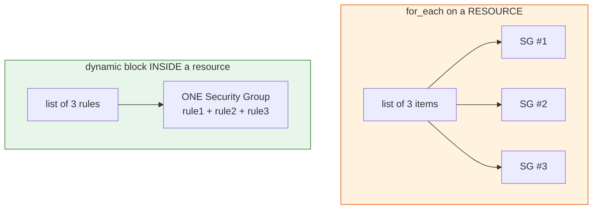
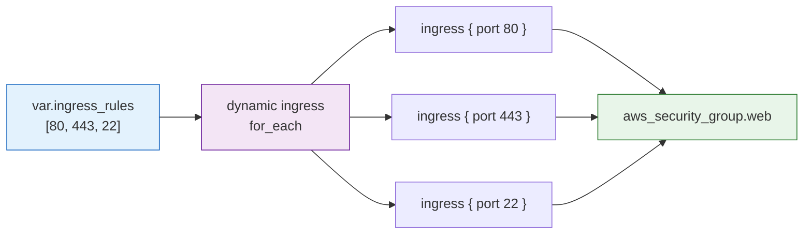

# Day 8 - Dynamic Blocks

> **Goal:** learn how to generate repeated *nested* blocks inside a single resource (like many ingress rules in one security group) without writing them by hand, using Terraform's `dynamic` block - and know exactly when NOT to reach for it.

> **Interactive demo:** [Dynamic Blocks animation](https://siva9800.github.io/devops-animations/terraform/dynamic-blocks.html) - watch a list of rules get stamped out into one security group.

---

## What problem does this solve?

By now you can create resources, loop whole resources with `count` and `for_each`, and read values from variables. But some AWS resources are unusual: they contain many *repeated nested blocks* inside a single resource.

The classic example is a security group. One security group can hold ten, twenty, or fifty ingress rules, and each rule is its own little `ingress { ... }` block:

```hcl
resource "aws_security_group" "web" {
  name = "web-sg"

  ingress {
    from_port   = 80
    to_port     = 80
    protocol    = "tcp"
    cidr_blocks = ["0.0.0.0/0"]
  }

  ingress {
    from_port   = 443
    to_port     = 443
    protocol    = "tcp"
    cidr_blocks = ["0.0.0.0/0"]
  }

  ingress {
    from_port   = 22
    to_port     = 22
    protocol    = "tcp"
    cidr_blocks = ["10.0.0.0/8"]
  }
  # ...imagine twenty more, each nearly identical
}
```

This is copy-paste hell. Every rule is 90 percent the same as the one above it. If your company standard changes ("every SG must also allow port 8080"), you edit dozens of near-identical blocks by hand, and you *will* miss one.

`count` and `for_each` cannot help here, because those repeat a *whole resource*. You do not want twenty security groups - you want *one* security group with twenty rules inside it.

That is exactly what a **dynamic block** does: it loops over a variable and stamps out one nested block per item, all inside the same resource.

---

## Learning Objectives

By the end of Day 8 you will be able to:
- Explain why some resources need many repeated nested blocks.
- State the crucial difference between `count`/`for_each` (repeat a whole resource) and `dynamic` (repeat a nested block inside one resource).
- Write a `dynamic` block: the block label, `for_each`, the iterator, and the `content {}` body.
- Access `.value` and `.key` from inside a dynamic block.
- Build a fully configurable `aws_security_group` whose ingress rules come from a variable.
- Rename the iterator for readability and understand nested dynamic blocks.
- Decide when a dynamic block is the wrong tool and plain static blocks are clearer.

---

## Real-world analogy: mail-merge inside one letter

Think about a word processor mail-merge.

- **`count` / `for_each`** is like printing a *separate letter* for each person in your spreadsheet. Ten rows, ten envelopes, ten whole documents.
- **A dynamic block** is like a table *inside one letter* that grows a new row for each line in your spreadsheet. One document, one envelope - but the middle section stamps out one paragraph per row.

The security group is the letter. The ingress rules are the mail-merged rows inside it. You write the row template once; Terraform fills it in for every entry in your list.

---

## The core distinction: repeat a resource vs repeat a block

This is the single idea to burn into memory. `count`/`for_each` and `dynamic` look similar (both loop), but they loop over completely different things.



| Feature | `count` / `for_each` | `dynamic` block |
|---|---|---|
| What it repeats | A whole **resource** (or module) | A **nested block** inside one resource |
| How many resources result | Many | Exactly **one** |
| Where you write it | At the top level of a `resource` | Inside a `resource`, wrapping a nested block |
| Typical use | Ten EC2 instances, one per name | One SG with ten ingress rules |
| Address of an item | `aws_instance.web[0]` | `ingress.value`, `ingress.key` (loop-local only) |
| Syntax keyword | `count =` / `for_each =` | `dynamic "label" { ... }` |

> **One line for interviews:** `for_each` makes more *resources*; a `dynamic` block makes more *blocks inside one resource*.

---

## Dynamic block syntax, piece by piece

A dynamic block has four parts. Here is the skeleton, then a translation.

```hcl
dynamic "ingress" {          # 1. block label = the nested block you want to generate
  for_each = var.ingress_rules   # 2. the collection to loop over (list or map)

  content {                  # 3. the body of ONE generated block
    from_port   = ingress.value.port      # 4. ingress.value = the current item
    to_port     = ingress.value.port
    protocol    = "tcp"
    cidr_blocks = [ingress.value.cidr]
    description = ingress.value.description
  }
}
```

- **The label** (`"ingress"`) must match the name of the nested block you are generating. To make many `ingress { }` blocks, the label is `ingress`. To make `ebs_block_device { }` blocks, it is `ebs_block_device`.
- **`for_each`** takes a list or a map. Terraform runs the `content` body once per element.
- **`content { }`** is the template for a single generated block. Whatever you put here becomes one `ingress { }` in the final resource.
- **The iterator** is a temporary object named after the label by default (here, `ingress`). Inside `content` you reach the current element with:
  - `ingress.value` - the current item (the whole object if it is a map/object, or the value if it is a list).
  - `ingress.key` - the index (`0, 1, 2...`) when looping a list, or the map key when looping a map.

> Note: `ingress.value` and `ingress.key` only exist *inside* the `content` block. They are loop-local, not real resource attributes.

---

## The canonical example: a configurable security group

This is *the* textbook use of dynamic blocks, and it is worth getting exactly right. We drive every ingress rule from a variable, so the security group is fully configurable without touching the resource.

**`variables.tf`**
```hcl
variable "vpc_id" {
  type        = string
  description = "VPC the security group lives in"
}

variable "ingress_rules" {
  description = "List of inbound rules to open"
  type = list(object({
    port        = number
    cidr        = string
    description = string
  }))
  default = [
    { port = 80, cidr = "0.0.0.0/0", description = "HTTP from anywhere" },
    { port = 443, cidr = "0.0.0.0/0", description = "HTTPS from anywhere" },
    { port = 22, cidr = "10.0.0.0/8", description = "SSH from internal network" }
  ]
}
```

**`main.tf`**
```hcl
provider "aws" {
  region = "us-east-1"
}

resource "aws_security_group" "web" {
  name        = "web-sg"
  description = "Web server security group"
  vpc_id      = var.vpc_id

  dynamic "ingress" {
    for_each = var.ingress_rules

    content {
      from_port   = ingress.value.port
      to_port     = ingress.value.port
      protocol    = "tcp"
      cidr_blocks = [ingress.value.cidr]
      description = ingress.value.description
    }
  }

  # A single static egress rule - allow all outbound. No dynamic needed here.
  egress {
    from_port   = 0
    to_port     = 0
    protocol    = "-1"
    cidr_blocks = ["0.0.0.0/0"]
  }

  tags = {
    Name = "web-sg"
  }
}
```

Reading it in plain English:

- `dynamic "ingress"` - "I am about to generate one or more `ingress` blocks."
- `for_each = var.ingress_rules` - "Loop over the list of rule objects in my variable."
- `content { ... }` - "For each rule, build an ingress block that looks like this."
- `ingress.value.port` - "The `port` field of the current rule object."

With the default variable, Terraform expands this into three real `ingress` blocks - exactly the copy-paste version from the top of this lesson, but generated. Want a fourth rule? Add one line to the variable. Want a different set per environment? Pass a different `ingress_rules` value. The resource never changes.



---

## Custom iterator name for readability

By default the iterator is named after the block label (`ingress`), so you write `ingress.value`. You can rename it with `iterator =`. This reads better, and it becomes essential when you nest dynamic blocks (an inner and outer loop cannot both be called the same thing).

```hcl
dynamic "ingress" {
  for_each = var.ingress_rules
  iterator = rule          # rename the loop variable to "rule"

  content {
    from_port   = rule.value.port
    to_port     = rule.value.port
    protocol    = "tcp"
    cidr_blocks = [rule.value.cidr]
    description = rule.value.description
  }
}
```

Functionally identical to the earlier version - `rule.value` now means what `ingress.value` meant. Use whichever name makes the code read like a sentence.

---

## Nested dynamic blocks (use sparingly)

Some resources have blocks *inside* blocks, and you can nest a `dynamic` inside another `dynamic`. Here each ingress rule can open to several CIDR ranges, each needing its own inner block:

```hcl
dynamic "ingress" {
  for_each = var.rules
  iterator = rule

  content {
    from_port = rule.value.port
    to_port   = rule.value.port
    protocol  = "tcp"

    dynamic "cidr_source" {          # inner loop - a made-up nested block
      for_each = rule.value.sources
      iterator = src
      content {
        cidr = src.value
      }
    }
  }
}
```

This works, but notice how quickly it gets hard to read. Two loops, two iterators, and you must track which `.value` belongs to which. **Warning:** nested dynamic blocks are where Terraform code becomes unreadable. If you find yourself nesting three levels deep, stop and ask whether a plain list of static blocks, or splitting into multiple resources, would be clearer for the next person (often future you).

---

## A second example: multiple EBS volumes on an instance

The same pattern reinforces on any resource with repeated nested blocks. An EC2 instance can attach several extra EBS disks, each an `ebs_block_device { }` block:

```hcl
variable "extra_disks" {
  type = list(object({
    device_name = string
    size        = number
  }))
  default = [
    { device_name = "/dev/sdf", size = 50 },
    { device_name = "/dev/sdg", size = 100 }
  ]
}

data "aws_ami" "al2023" {
  most_recent = true
  owners      = ["amazon"]
  filter {
    name   = "name"
    values = ["al2023-ami-*-x86_64"]
  }
}

resource "aws_instance" "app" {
  ami           = data.aws_ami.al2023.id
  instance_type = "t3.micro"

  dynamic "ebs_block_device" {
    for_each = var.extra_disks

    content {
      device_name = ebs_block_device.value.device_name
      volume_size = ebs_block_device.value.size
      volume_type = "gp3"
    }
  }

  tags = {
    Name = "app-server"
  }
}
```

Same four parts: label matches the nested block (`ebs_block_device`), `for_each` over a variable, `content` as the per-item template, and `.value` to reach each field. Learn the pattern once; it applies everywhere a resource repeats a block.

---

## When NOT to use dynamic blocks

Dynamic blocks are powerful, and beginners over-use them the moment they learn them. Resist.

- **If you have two or three fixed rules that never change, just write them out.** Static blocks are easier to read, easier to review in a pull request, and the plan output maps line-for-line to your code. A dynamic block for two static rules adds indirection for no benefit.
- **If the values come from data, or the count varies by environment, or the list is long - use dynamic.** That is where it pays off.

Rule of thumb: reach for a dynamic block when the *content is data* (comes from a variable, differs per environment, or is long enough that copy-paste risks a mistake). Keep it static when the blocks are few, fixed, and self-documenting. Readability beats cleverness.

---

## Common Mistakes

1. **Wrong block label.** The label after `dynamic` must exactly match the nested block name in the provider (`ingress`, `ebs_block_device`, `setting`). Misspell it and you get "Blocks of type X are not expected here."
2. **Forgetting `content { }`.** The generated block body must live inside `content`. Putting the fields directly under `dynamic "ingress"` is a syntax error.
3. **Using `.value` outside `content`.** `ingress.value` only exists inside the `content` block. It is not a real resource attribute you can reference elsewhere.
4. **Reaching for a list item wrong.** If `for_each` is a list of objects, use `ingress.value.port`. If it is a plain list of numbers, `ingress.value` *is* the number - do not add `.port`.
5. **Over-using dynamic blocks.** Two static rules do not need a loop. Do not turn readable code into a puzzle.
6. **Iterator name clash in nested dynamics.** Two nested loops both defaulting to their block name can still collide in your head - rename with `iterator =` for clarity.

---

## Hands-On Lab: a configurable security group

You will build one security group whose rules come entirely from a variable, then change the rules without touching the resource.

```bash
# 1. Make a project folder
mkdir dynamic-sg-lab && cd dynamic-sg-lab

# 2. Create variables.tf and main.tf from the canonical example above.
#    Provide a real vpc_id (find one in the AWS console, or use a data lookup).

# 3. Tidy and sanity-check
terraform fmt
terraform validate

# 4. Download the AWS provider
terraform init

# 5. Preview - count the ingress blocks in the plan (should be 3)
terraform plan

# 6. Build it - type yes when prompted
terraform apply

# 7. In the AWS console, open the security group. Confirm 3 inbound rules.

# 8. Now edit variables.tf: add a 4th rule, e.g.
#    { port = 8080, cidr = "0.0.0.0/0", description = "App port" }
#    Re-run plan. Terraform adds ONE ingress block, nothing else changes.
terraform plan

# 9. Clean up
terraform destroy
```

**Success check:** the plan shows exactly as many `ingress` blocks as items in your variable, and adding a rule to the variable adds exactly one block to the plan - you never edited the resource itself.

---

## Quick Self-Check

1. What is the difference between `for_each` on a resource and a `dynamic` block?
2. Name the four parts of a `dynamic` block.
3. Inside `dynamic "ingress"`, how do you access the current item's value and its index?
4. When would you rename the iterator with `iterator =`, and why?
5. You have exactly two fixed ingress rules that never change. Should you use a dynamic block? Why or why not?

<details>
<summary>Answers</summary>

1. `for_each` on a resource creates many separate resources; a `dynamic` block creates many nested blocks *inside a single resource*.
2. The label (matching the nested block name), `for_each` (the collection), `content { }` (the per-item template), and the iterator (`.value` / `.key`, named after the label by default).
3. `ingress.value` for the current item and `ingress.key` for the index or map key - both valid only inside the `content` block.
4. When the default iterator name is unclear, or when nesting dynamic blocks so inner and outer loops have distinct names; it improves readability.
5. No. Two fixed rules are clearer written as static `ingress` blocks. Use dynamic blocks when the content is data-driven, long, or varies by environment.
</details>

---

## Summary

- Some resources hold many repeated nested blocks (security group ingress rules, EBS devices, policy statements). Writing them by hand is copy-paste hell.
- `count`/`for_each` repeat a whole *resource*; a `dynamic` block repeats a *nested block* inside one resource. That distinction is the whole lesson.
- A dynamic block has four parts: the label (matching the block name), `for_each`, `content { }`, and the iterator (`.value` / `.key`).
- The canonical example is a security group whose ingress rules come from a variable - fully configurable, add a rule with one line.
- Rename the iterator with `iterator =` for readability, especially when nesting; but keep nesting shallow.
- Do not over-use them: if the blocks are few and fixed, static is clearer. Reach for dynamic when the content is data.

**Next up ->** [Day 9 - Meta-Arguments and Lifecycle](../day09-meta-arguments-lifecycle/notes.md)
