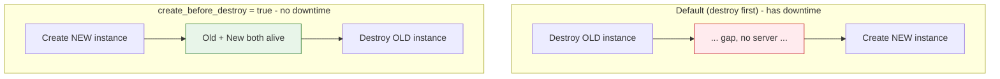

# Day 9 - Meta-Arguments and Lifecycle

> **Goal:** learn the special "meta-arguments" that work on any resource - `depends_on`, `provider`, and the powerful `lifecycle` block - so you can control exactly HOW Terraform creates, replaces, and protects your infrastructure. This is how you get zero-downtime swaps and how you stop a careless command from deleting your production database.

> **Interactive demo:** [Lifecycle animation](https://siva9800.github.io/devops-animations/terraform/lifecycle.html) - watch create_before_destroy build the new resource before removing the old one.

---

## What problem does this solve?

By default Terraform is smart but stubborn. It works out the order to build things, it insists your real infrastructure match your code exactly, and when it decides a resource must be replaced it destroys the old one first, then creates the new one. That default order means a moment of downtime.

Most of the time the defaults are fine. But sometimes you need to override them:

- "Build the replacement server *before* you kill the old one, so users never see an outage."
- "Whatever you do, do NOT delete this database."
- "Stop trying to reset this tag - a different team manages it, leave it alone."
- "This resource has no obvious link to that one, but it genuinely must be created after it."

**Meta-arguments** are the controls for exactly these situations. They are special arguments that Terraform understands on *any* resource, no matter the type.

---

## Learning Objectives

By the end of Day 9 you will be able to:
- List the meta-arguments that work on any resource and say what each is for.
- Use `depends_on` for explicit ordering - and know why it is a last resort.
- Use every argument in the `lifecycle` block: `create_before_destroy`, `prevent_destroy`, `ignore_changes`, `replace_triggered_by`, `precondition`, and `postcondition`.
- Explain why `prevent_destroy` (and other lifecycle settings) cannot come from a variable.
- Force one resource to be recreated with `terraform apply -replace=` (the modern replacement for the deprecated `taint`).
- Point a single resource at an aliased provider.

---

## The meta-arguments at a glance

These arguments are not specific to `aws_instance` or any one type. They are built into Terraform's resource grammar, so you can drop them onto any `resource` block.

| Meta-argument | What it controls | Covered |
|---|---|---|
| `count` | Make N copies of a resource by index | Day 7 (recap) |
| `for_each` | Make one copy per item in a map/set | Day 7 (recap) |
| `depends_on` | Force an explicit ordering Terraform cannot infer | Today (deeper) |
| `provider` | Pick which (aliased) provider builds this resource | Today |
| `lifecycle` | Control how the resource is created, replaced, and protected | Today (main focus) |

We covered `count` and `for_each` on Day 7. Today is about the other three, with the `lifecycle` block as the star.

---

## Real-world analogies

Three quick pictures that will make the whole lesson stick:

- **create_before_destroy = building the new bridge first.** You do not demolish the old bridge and *then* start building the new one - traffic would be stuck for months. You build the new bridge alongside the old one, switch traffic over, and only then tear the old one down. Nobody ever loses their crossing.
- **prevent_destroy = a "DO NOT DELETE" lock on the filing cabinet.** The cabinet holding the tax records has a physical lock and a big red sticker. Even if someone walks past with a "clear out the office" order, they physically cannot throw it away. They have to deliberately remove the lock first.
- **ignore_changes = "do not repaint the wall just because someone hung a picture."** You painted the wall white. A colleague hangs a small picture on it. You do not repaint the entire wall to "fix" the change - the picture is fine, leave it. Terraform, left alone, *would* repaint. `ignore_changes` tells it not to.

---

## depends_on: explicit ordering (a last resort)

We met `depends_on` briefly on Day 2. Here is the deeper story.

Terraform normally works out ordering *implicitly*. If resource B mentions resource A - for example `subnet_id = aws_subnet.a.id` - Terraform sees the reference and knows A must exist first. This is an **implicit dependency**, and it is the way you want ordering to happen 95% of the time. Prefer it.

Sometimes, though, the dependency is real but *hidden* - there is no attribute that links the two resources, so Terraform cannot see it. The classic case is IAM. An instance uses an IAM role through an instance profile, and the role only actually *works* once its policy is attached. But the instance references the profile, not the policy - so Terraform does not know the policy attachment must finish first. The instance can boot before its permissions land, and calls fail.

```hcl
resource "aws_iam_role" "app" {
  name               = "app-role"
  assume_role_policy = data.aws_iam_policy_document.assume.json
}

resource "aws_iam_role_policy_attachment" "app_s3" {
  role       = aws_iam_role.app.name
  policy_arn = "arn:aws:iam::aws:policy/AmazonS3ReadOnlyAccess"
}

resource "aws_iam_instance_profile" "app" {
  name = "app-profile"
  role = aws_iam_role.app.name
}

resource "aws_instance" "app" {
  ami                  = data.aws_ami.amazon_linux.id
  instance_type        = "t3.micro"
  iam_instance_profile = aws_iam_instance_profile.app.name

  # The instance references the PROFILE, not the policy attachment.
  # Without this line Terraform might launch the instance before the
  # S3 permission is attached, so early code on the box gets AccessDenied.
  depends_on = [aws_iam_role_policy_attachment.app_s3]
}
```

`depends_on` takes a **list of resources** (not attributes) and simply says "finish all of these before you touch me."

> **Rule:** reach for `depends_on` only when there is no attribute you can reference to create an implicit dependency. Overusing it makes graphs slower and hides real relationships. Implicit first, explicit only as a last resort.

---

## The lifecycle block

The `lifecycle` block is a nested block inside a resource. It changes how Terraform creates, replaces, and protects that resource.

```hcl
resource "aws_instance" "example" {
  # ... normal arguments ...

  lifecycle {
    # settings go here
  }
}
```

| Argument | What it does | Value type |
|---|---|---|
| `create_before_destroy` | On replacement, create the new resource before destroying the old one | bool literal |
| `prevent_destroy` | Make any plan that would destroy this resource fail | bool literal |
| `ignore_changes` | Stop noticing drift on the listed attributes (or `all`) | list of attribute names, or `all` |
| `replace_triggered_by` | Force replacement when the referenced resource/attribute changes | list of references |
| `precondition` | Assert a condition BEFORE the resource is used (checked at plan/apply) | block |
| `postcondition` | Assert a condition AFTER the resource is known (checked at plan/apply) | block |

> **Critical accuracy - a permanent limitation:** the values for `create_before_destroy`, `prevent_destroy`, and `ignore_changes` must be **literal** values written directly in the code. You **cannot** set them from a variable, a local, or any expression. This is a permanent Terraform limitation, not something a newer version fixed. Terraform evaluates the lifecycle block very early - before variables are resolved - so `prevent_destroy = var.protect` is invalid and always has been.

### create_before_destroy = true

By default, when Terraform must replace a resource, it **destroys the old one, then creates the new one**. For a server, that is a gap with no server - downtime.

`create_before_destroy = true` flips the order: **create the new one first, then destroy the old one.** This is the "build the new bridge first" behaviour and it is the foundation of zero-downtime replacements.



Use it whenever a replacement would otherwise cause an outage: launch configurations / launch templates behind an autoscaling group, instances behind a load balancer, or anything where "gap with nothing there" is unacceptable.

```hcl
resource "aws_instance" "web" {
  ami           = data.aws_ami.amazon_linux.id
  instance_type = "t3.micro"

  lifecycle {
    create_before_destroy = true
  }
}
```

> **Watch-out:** two versions exist at once for a moment, so names and other uniquely-constrained values can collide. That is why AWS launch templates often use a `name_prefix` instead of a fixed `name` - so the new copy can get a unique name while the old one still lives.

### prevent_destroy = true

This is the "DO NOT DELETE" lock. When set, **any plan that would destroy this resource fails** with an error - whether from `terraform destroy`, from removing the resource from your code, or from a change that would force replacement. Terraform refuses to proceed.

```hcl
resource "aws_db_instance" "prod" {
  identifier        = "prod-primary"
  engine            = "postgres"
  instance_class    = "db.t3.medium"
  allocated_storage = 100

  lifecycle {
    prevent_destroy = true # a hard safety catch for production data
  }
}
```

Now `terraform destroy` on this project errors out instead of wiping the database. To actually remove it you must consciously delete the `prevent_destroy` line, apply that, and only then destroy - a deliberate two-step, exactly like removing the physical lock before you can throw the cabinet away.

> Remember the literal-value rule: `prevent_destroy = var.is_prod` will not work. If you need it conditional, the usual pattern is to keep protected production resources in a separate configuration where it is always `true`.

### ignore_changes = [ ... ]

Sometimes something *outside* Terraform legitimately changes an attribute, and you do not want Terraform to keep "correcting" it back on every apply - that is a fight you will lose forever.

Classic examples:
- An autoscaling group's `desired_capacity` is adjusted by AWS autoscaling based on load. Terraform would keep resetting it.
- A `tags` value is managed by a separate governance tool.

```hcl
resource "aws_instance" "web" {
  ami           = data.aws_ami.amazon_linux.id
  instance_type = "t3.micro"

  tags = {
    Name = "web"
  }

  lifecycle {
    # "Do not repaint the wall because someone hung a picture."
    ignore_changes = [
      tags["LastPatched"], # a monitoring tool writes this tag
    ]
  }
}
```

You can ignore whole attributes (`ignore_changes = [ami]`) or specific map keys (`tags["LastPatched"]`). To ignore *everything* after creation - "create it once, then never touch it again" - use the special keyword:

```hcl
  lifecycle {
    ignore_changes = all
  }
```

Note `all` is a bare keyword, not a string and not in a list.

### replace_triggered_by (Terraform 1.2+)

Force this resource to be **replaced** whenever some other resource or attribute changes - even if this resource's own arguments did not change. Useful when a downstream resource must be rebuilt because an upstream one was.

```hcl
resource "aws_instance" "app" {
  ami           = data.aws_ami.amazon_linux.id
  instance_type = "t3.micro"

  lifecycle {
    # Rebuild this instance whenever the launch-config version changes.
    replace_triggered_by = [
      aws_launch_template.app.latest_version,
    ]
  }
}
```

It takes a list of references to resources or their attributes. When any of them change, the resource is scheduled for replacement.

### precondition and postcondition (Terraform 1.2+)

These are custom assertions - guardrails that check your assumptions at plan/apply time and stop with a clear message if they are wrong. Much friendlier than a mysterious API error later.

- **precondition** - checked *before* the resource is used. "Fail fast if my inputs are nonsense."
- **postcondition** - checked *after* the resource's values are known. "Fail if what I got back is not what I assumed."

```hcl
data "aws_ami" "amazon_linux" {
  most_recent = true
  owners      = ["amazon"]

  filter {
    name   = "name"
    values = ["al2023-ami-*-x86_64"]
  }
}

resource "aws_instance" "app" {
  ami           = data.aws_ami.amazon_linux.id
  instance_type = var.instance_type

  lifecycle {
    precondition {
      condition     = can(regex("^t3\\.", var.instance_type))
      error_message = "instance_type must be in the t3 family for this workload."
    }

    postcondition {
      condition     = self.architecture == "x86_64"
      error_message = "The looked-up AMI is not x86_64. Check the AMI filter."
    }
  }
}
```

Inside a `postcondition`, `self` refers to the resource itself, so you can assert on the values Terraform actually resolved. Here we refuse to proceed unless the launched instance is genuinely x86_64.

---

## provider meta-argument: choosing an aliased provider

By default every resource uses the provider matching its type (an `aws_instance` uses the `aws` provider). But you can configure the *same* provider more than once - for example one AWS provider per region - by giving extra copies an `alias`. The `provider` meta-argument then points a specific resource at a specific aliased configuration.

```hcl
# Default provider - us-east-1
provider "aws" {
  region = "us-east-1"
}

# A second AWS provider, aliased, pointing at another region
provider "aws" {
  alias  = "west"
  region = "us-west-2"
}

resource "aws_instance" "east" {
  ami           = data.aws_ami.amazon_linux.id
  instance_type = "t3.micro"
  # no provider line = uses the default us-east-1 provider
}

resource "aws_instance" "west" {
  provider      = aws.west # build this one in us-west-2
  ami           = data.aws_ami.amazon_linux_west.id
  instance_type = "t3.micro"
}
```

The syntax is `provider = <name>.<alias>`. This is the foundation of multi-region and multi-account deployments - we go deeper when we hit modules and multi-region work later in the course.

---

## Forcing a rebuild: use -replace, not taint

Occasionally a resource is fine on paper but broken in reality (a corrupted server, a botched manual change) and you just want Terraform to recreate that one resource.

The old way was `terraform taint ADDRESS`, which marked a resource for destruction on the next apply. **`taint` is deprecated.** The modern, clearer way is a plan-time flag:

```bash
# Force just this one resource to be destroyed and recreated on the next apply
terraform apply -replace="aws_instance.web"
```

This is better because Terraform shows you the replacement *in the plan* before you approve it, instead of silently marking state. You can also preview it with `terraform plan -replace="aws_instance.web"`.

---

## A cohesive example

Two resources: a web instance that should swap with zero downtime and ignore a tool-managed tag, and a production database that must never be destroyed. No hardcoded AMI - we look it up.

```hcl
provider "aws" {
  region = "us-east-1"
}

data "aws_ami" "amazon_linux" {
  most_recent = true
  owners      = ["amazon"]

  filter {
    name   = "name"
    values = ["al2023-ami-*-x86_64"]
  }
}

# Web server: zero-downtime replacement + ignore a tag another tool manages
resource "aws_instance" "web" {
  ami           = data.aws_ami.amazon_linux.id
  instance_type = "t3.micro"

  tags = {
    Name = "web-server"
  }

  lifecycle {
    create_before_destroy = true

    ignore_changes = [
      tags["LastPatched"], # patched by a maintenance tool, not by us
    ]

    postcondition {
      condition     = self.architecture == "x86_64"
      error_message = "AMI is not x86_64 - check the aws_ami filter."
    }
  }
}

# Production database: protected against accidental deletion
resource "aws_db_instance" "prod" {
  identifier        = "prod-primary"
  engine            = "postgres"
  instance_class    = "db.t3.medium"
  allocated_storage = 100
  skip_final_snapshot = false

  lifecycle {
    prevent_destroy = true # hard stop on any destroy/replace
  }
}
```

---

## Hands-On Lab: prove each behaviour

Use a throwaway project. You can even swap the instances for a cheap resource to save money - the lifecycle behaviour is the point.

```bash
# 1. Create main.tf with the web instance from the cohesive example
terraform init
terraform apply        # note the instance is created

# 2. Prove create_before_destroy:
#    change instance_type (a change that forces replacement), then:
terraform plan
#    Read the plan order: it CREATES the replacement, THEN destroys the old.

# 3. Prove prevent_destroy:
#    add the aws_db_instance "prod" block with prevent_destroy = true, apply it,
#    then try to remove it or run:
terraform destroy
#    Terraform ERRORS and refuses to delete the protected database.

# 4. Prove -replace (modern taint):
terraform apply -replace="aws_instance.web"
#    The plan shows this one instance being recreated. Type yes.

# 5. Prove ignore_changes:
#    in the AWS console, add a tag LastPatched=today to the web instance, then:
terraform plan
#    Terraform reports "No changes" for that tag - it is ignored.

# 6. Clean up (remove prevent_destroy first if you added the DB)
terraform destroy
```

**Success check:** the replacement plan creates-before-destroys, `destroy` is blocked on the protected DB, and the manually-added `LastPatched` tag does not show up as drift.

---

## Common Mistakes

1. **Trying to set `prevent_destroy` (or any lifecycle arg) from a variable.** `prevent_destroy = var.protect` is invalid and always will be - lifecycle values must be literals. Keep protected resources in a config where it is hardcoded `true`.
2. **Reaching for `depends_on` when an implicit dependency would do.** If you can reference an attribute (`subnet_id = aws_subnet.a.id`), do that instead. Save `depends_on` for hidden dependencies like IAM.
3. **Forgetting the collision risk of `create_before_destroy`.** Two copies exist briefly, so a fixed unique `name` will clash. Use `name_prefix` or let Terraform generate the name.
4. **Using `ignore_changes = all` carelessly.** It means Terraform will never fix drift on the resource again. Ignore specific attributes when you can.
5. **Still using `terraform taint`.** It is deprecated. Use `terraform apply -replace="ADDRESS"` so the recreation shows up in the plan.
6. **Assuming `prevent_destroy` also stops a *replacement*.** It blocks anything that would destroy the resource, including a change that forces replace - people are sometimes surprised their "small edit" is refused. That is working as intended.

---

## Quick Self-Check

1. What does `create_before_destroy = true` change about the replacement order, and why does it enable zero-downtime swaps?
2. Can you set `prevent_destroy = var.is_prod`? Explain.
3. Give a real situation where `ignore_changes` is the right tool.
4. When should you use `depends_on` instead of relying on Terraform's automatic ordering?
5. What is the modern replacement for the deprecated `terraform taint`, and why is it better?

<details>
<summary>Answers</summary>

1. It creates the new resource first and destroys the old one only afterwards (the default is destroy-then-create). Because there is never a moment with nothing running - both versions overlap briefly - traffic never hits a gap, so no downtime.
2. No. Lifecycle argument values must be literal - they are evaluated before variables are resolved. This is a permanent limitation, not a version thing. Keep protected resources in a config where it is written as `true`.
3. When something outside Terraform legitimately changes an attribute you do not want reset every apply - for example an autoscaling group's `desired_capacity` adjusted by AWS, or a tag written by a separate monitoring/governance tool.
4. Only when the dependency is real but hidden - there is no attribute you can reference to create an implicit dependency (the classic case is an instance needing an IAM policy attachment that it does not directly reference). Prefer implicit dependencies otherwise.
5. `terraform apply -replace="ADDRESS"` (or `plan -replace=...` to preview). It is better because the recreation appears in the plan for you to approve, instead of silently marking state as `taint` did.
</details>

---

## Summary

- Meta-arguments (`count`, `for_each`, `depends_on`, `provider`, `lifecycle`) work on any resource and control HOW Terraform acts, not just what it builds.
- Prefer implicit dependencies; use `depends_on` only for hidden ones like IAM policy attachments.
- `create_before_destroy` builds the new bridge before demolishing the old - zero-downtime replacement.
- `prevent_destroy` is the "DO NOT DELETE" lock; `ignore_changes` says "do not repaint the wall over a hung picture." Both need literal values - no variables, ever.
- `replace_triggered_by`, `precondition`, and `postcondition` (1.2+) add reactive replacement and custom guardrails.
- The `provider` meta-argument points a resource at an aliased provider - the basis of multi-region.
- Force one rebuild with `terraform apply -replace="ADDRESS"`; `taint` is deprecated.

**Next up ->** [Day 10 - Modules](../day10-modules/notes.md)
