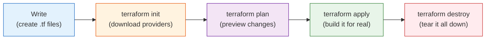

# Terraform - Day 1: Infrastructure as Code & Your First EC2

> **Goal:** Understand what Infrastructure as Code (IaC) is, install Terraform, and launch your very first cloud server (an AWS EC2 instance) by *describing* it in a file - no clicking around in the AWS console.

> **Interactive demo:** open [../animations/terraform-workflow.html](../animations/terraform-workflow.html)

---

## What problem does this solve?

Imagine you set up a server by hand in the AWS web console: you click 30 buttons, pick a region, choose an instance size, attach security rules... It works!

Now your boss says: *"Great, build me 10 more exactly like it - and one for the test team, and recreate it in Europe."*

Doing that by hand is slow, error-prone, and **impossible to remember exactly what you clicked**. If the server breaks, nobody knows how it was built.

**Infrastructure as Code (IaC)** fixes this. Instead of clicking, you write a small text file that *describes* the server you want. A tool (Terraform) reads that file and builds it for you - the same way, every single time. Need 10 copies? Change one number. Need to delete everything cleanly? One command.

---

## Learning Objectives

By the end of Day 1 you will be able to:

- Explain what **Infrastructure as Code** is and why teams use it
- Describe the difference between **declarative** and **imperative** approaches
- **Install Terraform** and confirm it works
- Write your **first `.tf` file** to define an AWS EC2 instance
- Run the core workflow: **`init` -> `plan` -> `apply` -> `destroy`**
- Keep code tidy with **`terraform fmt`** and **`terraform validate`**

---

## Real-world analogy: IaC is an IKEA instruction sheet

Think about buying a bookshelf from IKEA.

- The **instruction sheet** is the same for everyone. Follow it, and you always get the *exact same bookshelf* - whether you build it in New York or Tokyo.
- You don't memorise *"insert screw, turn 4 times, repeat..."* - the sheet *describes the finished furniture*, and you just follow it.
- Lost a shelf? Grab the sheet and rebuild it identically.

**Terraform is your IKEA instruction sheet for cloud servers.** Your `.tf` files describe the finished result. Anyone (or any computer) following them builds identical infrastructure, anywhere, every time.

---

## Declarative vs Imperative: ordering a pizza

This is the single most important idea in Terraform, so let's make it stick.

| Style | What you say | Example |
|-------|--------------|---------|
| **Imperative** (step-by-step) | You give *every instruction*, in order | "Get dough. Spread sauce. Add cheese. Bake 12 min at 220 degrees C..." |
| **Declarative** (describe the end result) | You describe *what you want*, and the tool figures out the steps | "I want one large Margherita pizza." |

Terraform is **declarative**. You don't tell it *how* to create a server step by step. You write *"I want one `t2.micro` EC2 instance"* and Terraform works out every API call needed to make that true. Even better: if the server already exists, Terraform does **nothing** - it only changes what's different from your description.

---

## Installing Terraform

Terraform is a single program. Install it, then check the version.

**Windows (PowerShell, using Chocolatey):**
```powershell
choco install terraform
terraform -version
```

**macOS (Homebrew):**
```bash
brew tap hashicorp/tap
brew install hashicorp/tap/terraform
terraform -version
```

**Linux (Ubuntu/Debian):**
```bash
wget -O- https://apt.releases.hashicorp.com/gpg | sudo gpg --dearmor -o /usr/share/keyrings/hashicorp-archive-keyring.gpg
echo "deb [signed-by=/usr/share/keyrings/hashicorp-archive-keyring.gpg] https://apt.releases.hashicorp.com $(lsb_release -cs) main" | sudo tee /etc/apt/sources.list.d/hashicorp.list
sudo apt update && sudo apt install terraform
terraform -version
```

If `terraform -version` prints something like `Terraform v1.x.x`, you're ready.

You also need **AWS credentials** so Terraform can talk to your AWS account. The cleanest way is the AWS CLI:
```bash
aws configure
# It will ask for: Access Key ID, Secret Access Key, default region, output format
```
> **Never** type your AWS keys directly into a `.tf` file. More on this in Common Mistakes.

---

## The Terraform workflow (the heartbeat of everything)

Almost everything you do in Terraform follows the same four steps. Memorise this rhythm.



| Command | Plain-English meaning |
|---------|------------------------|
| `terraform init` | "Get ready." Downloads the plugins (providers) your code needs, like AWS. Run this **once per project** (and again when you add a new provider). |
| `terraform plan` | "Show me what you're about to do." A dry-run preview. Nothing is created or deleted. Always read this before applying. |
| `terraform apply` | "Do it." Builds/changes the real infrastructure. It shows the plan again and asks you to type `yes`. |
| `terraform destroy` | "Clean up." Deletes everything Terraform created, so you stop paying for it. |

Two more tidiness commands you'll love:

| Command | Meaning |
|---------|---------|
| `terraform fmt` | Auto-formats your `.tf` files (consistent spacing/indentation) - like a code beautifier. |
| `terraform validate` | Checks your code for syntax errors *before* you run plan/apply. Fast sanity check. |

---

## Your first Terraform file

Create a folder, and inside it a file called `main.tf`:

```hcl
# Tell Terraform which cloud we're using
provider "aws" {
  region = "us-east-1"
}

# Describe the server we want
resource "aws_instance" "my_first_server" {
  ami           = data.aws_ami.amazon_linux.id  # see the data block below
  instance_type = "t2.micro"                     # free-tier eligible size

  tags = {
    Name = "my-first-terraform-server"
  }
}
```

**Reading it in plain English, block by block:**

- `provider "aws" { ... }` - *"I'm using Amazon Web Services, in the `us-east-1` region."* The provider is the adapter that lets Terraform speak AWS's language.
- `resource "aws_instance" "my_first_server" { ... }` - *"Create a virtual server."* `aws_instance` is the **type**, `my_first_server` is **your nickname** for it (used to reference it in your own code; AWS never sees this name).
- `ami` - the **A**mazon **M**achine **I**mage: the operating system template the server boots from.
- `instance_type` - the size/power of the machine. `t2.micro` is small and free-tier friendly.
- `tags` - friendly labels. `Name` is what you'll see in the AWS console.

### Important: don't hardcode an AMI like `ami-0c55b159cbfafe1f0`

Older tutorials hardcode an AMI such as `ami-0c55b159cbfafe1f0`. **Avoid this.** AMI IDs are:

- **Region-specific** - the same ID does *not* exist in another region, so your code breaks if you switch regions.
- **Time-sensitive** - Amazon retires and replaces images, so a hardcoded ID slowly goes stale and may stop working.

The professional fix is a `data` block that **looks up the latest matching AMI automatically**:

```hcl
data "aws_ami" "amazon_linux" {
  most_recent = true
  owners      = ["amazon"]

  filter {
    name   = "name"
    values = ["al2023-ami-*-x86_64"]   # latest Amazon Linux 2023
  }
}
```

A `data` block doesn't *create* anything - it **reads/looks up** existing information from AWS. Here it always finds the newest Amazon Linux image in your chosen region, and you reference it as `data.aws_ami.amazon_linux.id`. Now your code works in any region, forever.

> Alternative for beginners: store the AMI in a **variable** so it's not buried in your code. You'll learn variables on Day 2.

---

## Common Mistakes

1. **Committing `terraform.tfstate` or secrets to Git.** The state file can contain sensitive data, and credentials never belong in Git. Add a `.gitignore`:
   ```
   *.tfstate
   *.tfstate.*
   .terraform/
   *.tfvars
   ```
2. **Hardcoding AWS access keys in `.tf` files.** Anyone who sees your code (or your Git history) now has your account. Use `aws configure`, environment variables, or IAM roles instead.
3. **Forgetting `terraform init`.** If you skip it you'll get `provider not installed` errors. When in doubt, init.
4. **Running `apply` without reading `plan`.** The plan tells you what will be created, changed, or **destroyed**. Skipping it is how people accidentally delete production.
5. **Hardcoding a stale AMI ID** (see above) - use a `data` lookup or a variable.

---

## Hands-On Lab: launch and destroy your first server

Copy-paste these steps. (Make sure `aws configure` is done first.)

```bash
# 1. Make a project folder
mkdir my-first-tf && cd my-first-tf

# 2. Create main.tf with the provider + data + resource blocks shown above
#    (use your editor; paste the HCL from this lesson)

# 3. Tidy + sanity-check your code
terraform fmt
terraform validate

# 4. Download the AWS provider
terraform init

# 5. Preview what will happen (read it!)
terraform plan

# 6. Build it for real - type 'yes' when prompted
terraform apply

# 7. Go look in the AWS console, open EC2. Your server is there.

# 8. Clean up so you don't get billed - type 'yes' when prompted
terraform destroy
```

**Success check:** after `apply`, you can see an instance named `my-first-terraform-server` in the EC2 dashboard. After `destroy`, it's gone.

---

## Quick Self-Check

1. In one sentence, what is **Infrastructure as Code**?
2. Is Terraform **declarative** or **imperative**? What does that mean using the pizza analogy?
3. What does `terraform init` do, and how often do you run it?
4. Why should you **never hardcode an AMI ID** like `ami-0c55b159cbfafe1f0`?
5. Which two files/patterns must you keep **out of Git**, and why?

<details>
<summary>Answers</summary>

1. Defining and managing your infrastructure in text files that a tool turns into real resources, repeatably.
2. **Declarative** - you describe the end result ("one Margherita pizza" / "one t2.micro server") and Terraform figures out the steps.
3. It downloads the providers your code needs; run it once per project (and again whenever you add a new provider/module).
4. AMI IDs are region-specific and get retired over time, so hardcoding one makes your code fragile and non-portable. Use a `data "aws_ami"` lookup or a variable.
5. `*.tfstate` files (may contain secrets) and any credentials/`*.tfvars` - they're sensitive and should never be public.
</details>

---

## Summary

- **IaC** = describe your infrastructure in text; a tool builds it identically every time (your **IKEA instruction sheet**).
- Terraform is **declarative** - you order the pizza, you don't cook it.
- The core loop is **Write -> init -> plan -> apply -> destroy**, with **`fmt`** and **`validate`** to stay tidy.
- A `resource` block *creates* things; a `data` block *looks things up* (use it to fetch a fresh AMI instead of hardcoding).
- Keep **state files and secrets out of Git**.

**Next up ->** [Day 2: Providers, Resources, State & Variables](../day2/readme.md)
