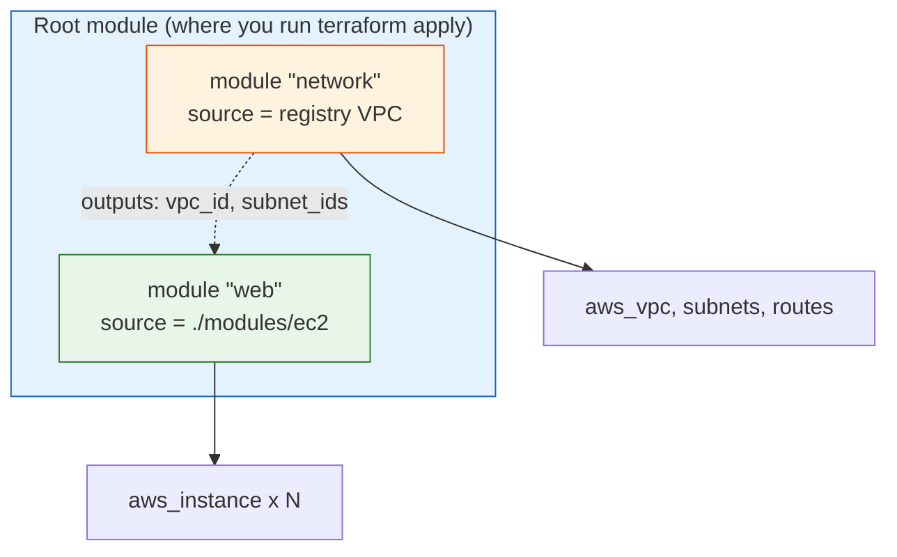
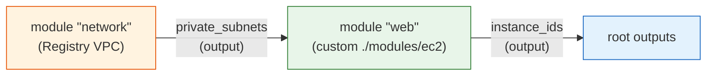

# Day 10 - Modules

> **Goal:** learn to package infrastructure into reusable **modules** - the single most important skill for writing Terraform at a real job. You will build your own module, call it, pull a battle-tested module from the public Registry, wire modules together, and use the commonly-missed tricks: `for_each` on a module and passing providers in.

> **Interactive demo:** [Modules animation](https://siva9800.github.io/devops-animations/terraform/modules.html) - watch a root module call child modules and pass outputs between them.

---

## What problem does this solve?

By now you can write a `main.tf` that creates a VPC, some subnets, a security group, and an EC2 instance. It works.

Then reality hits: you need the **same setup** for `dev`, `staging`, and `prod`. And another team wants "the standard EC2 setup" too. So you copy-paste your `.tf` files into four folders.

Now a security rule changes. You edit it in four places. You miss one. `prod` drifts from `staging`. Someone fixes a bug in their copy and never tells you. This is the classic **copy-paste infrastructure** trap, and it does not scale.

**Modules** fix this. A module is a reusable package of Terraform code with clear **inputs** and **outputs** - just like a function in programming. You write "the standard EC2 setup" once, and everyone *calls* it with their own arguments. Fix a bug once, everyone gets the fix. This is DRY (Don't Repeat Yourself) for infrastructure.

---

## Learning Objectives

By the end of Day 10 you will be able to:
- Explain what a module is and why every Terraform directory is already a module.
- Distinguish the **root module** from **child modules**.
- Build a clean custom module with `main.tf`, `variables.tf`, and `outputs.tf`.
- Call a module with a `module {}` block, pass inputs, and read its outputs.
- Use the three module **sources**: local paths, the public Registry, and Git.
- Pin module **versions** and explain why it matters.
- **Compose** modules - feed one module's output into another's input.
- Use `count` and `for_each` on a module block to stamp out N copies.
- Pass a specific (aliased) provider into a module with `providers = { ... }`.
- Apply module best practices used on real teams.

---

## Real-world analogy: LEGO kits and an app store

Think about building with LEGO.

- A single brick is a `resource` - one small thing.
- A **kit** (say, "the fire station") is a **module**: a curated bag of bricks plus an instruction sheet. You do not re-invent a fire station every time; you grab the kit.
- The kit has **inputs** you choose - the colour, how many floors - and it hands back **outputs** - "here is the door location so you can attach a road."
- The **public Terraform Registry** is the LEGO app store: thousands of prebuilt, tested kits (VPC, EKS, RDS) that experts maintain, so you do not build a VPC from raw bricks ever again.

**A module is a reusable kit. The Registry is the store you shop from.** Your job is mostly *assembling* trusted kits, not carving every brick by hand. You also build a few custom kits for your company's own standards.

Another lens: a module is a **function**. `module "web" { instance_type = "t3.small" }` is just calling `web(instance_type = "t3.small")`. Inputs are arguments; outputs are the return value.

---

## Root module vs child modules

This is the mental model everything hangs on.



| Term | What it is |
|---|---|
| **Root module** | The directory where you run `terraform apply`. Every Terraform project has exactly one. It is "technically a module" too - it just is not called by anyone. |
| **Child module** | Any module invoked from another module with a `module {}` block. |
| **Calling / caller** | The module that contains the `module {}` block (usually the root). |

> Key insight for interviews: *every* Terraform directory is a module. There is nothing special about "making" a module - you point a `module {}` block at a folder of `.tf` files and it becomes a child module. Reusability is just good structure, not a special file type.

---

## Anatomy of a good module

A well-built module is a small folder with three files by convention:

| File | Purpose | Analogy |
|---|---|---|
| `variables.tf` | The **inputs** - typed, described, sometimes defaulted | The knobs on the front of the kit |
| `main.tf` | The **resources** - what actually gets built | The bricks inside |
| `outputs.tf` | The **outputs** - values the caller needs back | The labelled connection points |

Two design rules that separate junior from senior code:

1. **Minimal scope - one logical component.** A module should do *one* thing: a VPC, an EC2 group, an RDS database. Not "my whole app." Small modules compose; giant modules rot.
2. **No hardcoded values, no provider blocks.** Everything that varies is an input variable. The provider is passed in by the caller (more below). A reusable module never says `region = "us-east-1"` inside it.

Standard project layout:

```
my-project/
  main.tf            # root: calls the modules
  variables.tf       # root inputs
  outputs.tf         # root outputs
  terraform.tfvars   # values for this environment
  modules/
    ec2/
      main.tf
      variables.tf
      outputs.tf
      README.md      # how to use this module
```

---

## Building a custom module: `./modules/ec2`

Let us build a small, real module that launches a group of identical EC2 instances. Three files.

**`modules/ec2/variables.tf`** - the typed inputs:

```hcl
variable "name" {
  description = "Name prefix for the instances and their tags."
  type        = string
}

variable "instance_type" {
  description = "EC2 instance size, e.g. t3.micro."
  type        = string
  default     = "t3.micro"
}

variable "instance_count" {
  description = "How many instances to launch."
  type        = number
  default     = 1
}

variable "subnet_ids" {
  description = "Subnet IDs to spread the instances across."
  type        = list(string)
}

variable "tags" {
  description = "Extra tags to apply to every instance."
  type        = map(string)
  default     = {}
}
```

**`modules/ec2/main.tf`** - the resources (note: no provider block, no hardcoded AMI):

```hcl
# Always look up a fresh AMI - never hardcode one (see Day 1)
data "aws_ami" "amazon_linux" {
  most_recent = true
  owners      = ["amazon"]

  filter {
    name   = "name"
    values = ["al2023-ami-*-x86_64"]
  }
}

resource "aws_instance" "this" {
  count         = var.instance_count
  ami           = data.aws_ami.amazon_linux.id
  instance_type = var.instance_type

  # Spread instances across the provided subnets, round-robin
  subnet_id = var.subnet_ids[count.index % length(var.subnet_ids)]

  tags = merge(
    var.tags,
    { Name = "${var.name}-${count.index}" }
  )
}
```

**`modules/ec2/outputs.tf`** - what the caller gets back:

```hcl
output "instance_ids" {
  description = "IDs of the created EC2 instances."
  value       = aws_instance.this[*].id
}

output "private_ips" {
  description = "Private IPs of the created instances."
  value       = aws_instance.this[*].private_ip
}
```

That is a complete, reusable module. Note what makes it good: every varying thing is an input, it exposes exactly what callers need, and it does exactly one job.

---

## Calling a module

From the root `main.tf`, you invoke the module with a `module {}` block:

```hcl
module "web" {
  source = "./modules/ec2"

  name           = "web"
  instance_type  = "t3.small"
  instance_count = 3
  subnet_ids     = ["subnet-abc123", "subnet-def456"]

  tags = {
    Environment = "dev"
    Team        = "platform"
  }
}
```

- `source` is **required** and tells Terraform where the module lives.
- The other arguments are the module's **input variables**, passed by name.
- `"web"` is the **local name** - how you refer to this instance of the module.

Reading a module's outputs uses the pattern `module.<name>.<output>`:

```hcl
output "web_instance_ids" {
  value = module.web.instance_ids
}
```

> Whenever you add or change a `module {}` block, run `terraform init` again so Terraform can fetch/link the module. `plan` will remind you if you forget.

---

## Module sources: where modules come from

The `source` argument accepts three main kinds of location.

| Source type | Example | When to use |
|---|---|---|
| **Local path** | `./modules/ec2` | Modules that live inside this same repo |
| **Public Registry** | `terraform-aws-modules/vpc/aws` | Battle-tested community modules |
| **Git** | `git::https://github.com/org/repo.git//modules/ec2?ref=v1.2.0` | Private/shared modules in your own Git repos |

**Git source, decoded:**

```
git::https://github.com/org/infra-modules.git//modules/ec2?ref=v1.2.0
^^^^^                                        ^^          ^^^^^^^^^^
prefix   repository URL                      subdir      pinned tag/branch/commit
```

- `git::` tells Terraform this is a Git source.
- `//modules/ec2` selects a **subdirectory** inside the repo (the `//` is required).
- `?ref=v1.2.0` pins to a **tag, branch, or commit** - always pin to a tag.

---

## Using the public Registry: the real VPC module

Building a production VPC by hand (subnets, route tables, NAT gateways, gateways) is dozens of resources and easy to get wrong. Instead, use the most-downloaded module in the ecosystem:

```hcl
module "network" {
  source  = "terraform-aws-modules/vpc/aws"
  version = "~> 5.8.0" # pin the version - see below

  name = "my-app-vpc"
  cidr = "10.0.0.0/16"

  azs             = ["us-east-1a", "us-east-1b"]
  private_subnets = ["10.0.1.0/24", "10.0.2.0/24"]
  public_subnets  = ["10.0.101.0/24", "10.0.102.0/24"]

  enable_nat_gateway = true
  single_nat_gateway = true

  tags = {
    Environment = "dev"
  }
}
```

The Registry source is a short 3-part name: `<namespace>/<name>/<provider>` - here `terraform-aws-modules/vpc/aws`. That module exposes outputs like `module.network.vpc_id` and `module.network.private_subnets`.

> `version` is only valid for Registry sources. For Git sources you pin with `?ref=`; for local paths there is no version (it is the same repo).

---

## Version pinning and why it matters

Notice `version = "~> 5.8.0"` above. **Never** call a Registry module without a version constraint.

Without pinning, `terraform init` grabs the newest release. Tomorrow a new major version ships with breaking changes, and a teammate's `init` silently pulls it in - now the plan wants to destroy and recreate your NAT gateways. Pinning makes builds **reproducible**: the same code produces the same result next month.

| Constraint | Meaning | Allows |
|---|---|---|
| `= 5.8.0` | Exactly this version | Nothing else |
| `~> 5.8.0` | Pessimistic: patch updates only | `5.8.1`, `5.8.9`, not `5.9.0` |
| `~> 5.8` | Minor updates within major 5 | `5.9.0`, `5.20.0`, not `6.0.0` |
| `>= 5.8.0, < 6.0.0` | Explicit range | Anything up to (not including) 6.0 |

The common, sensible default is `~> 5.8` (or `~> 5.8.0` if you want to be strict): get bug fixes automatically, never get a surprise breaking major.

---

## Composition: wiring modules together

The real power shows up when you feed one module's **output** into another module's **input**. The network module produces subnets; the EC2 module consumes them.



In the root `main.tf`:

```hcl
provider "aws" {
  region = "us-east-1"
}

module "network" {
  source  = "terraform-aws-modules/vpc/aws"
  version = "~> 5.8.0"

  name            = "my-app-vpc"
  cidr            = "10.0.0.0/16"
  azs             = ["us-east-1a", "us-east-1b"]
  private_subnets = ["10.0.1.0/24", "10.0.2.0/24"]
  public_subnets  = ["10.0.101.0/24", "10.0.102.0/24"]
}

module "web" {
  source = "./modules/ec2"

  name           = "web"
  instance_type  = "t3.small"
  instance_count = 3

  # Composition: the network module's output feeds the EC2 module's input
  subnet_ids = module.network.private_subnets

  tags = {
    Environment = "dev"
  }
}

output "web_instance_ids" {
  value = module.web.instance_ids
}
```

That `subnet_ids = module.network.private_subnets` line is composition in action. Terraform automatically figures out that `network` must be built **before** `web`, because `web` depends on its output. No manual ordering needed.

---

## Meta-arguments on a module block (commonly missed)

You can put `count`, `for_each`, and `providers` on a `module {}` block itself - not just on resources. These come up in interviews and are easy to skip.

### `for_each` on a module - N copies of a whole module

Say you want one identical EC2 group per team. Instead of copy-pasting the `module` block, loop over it:

```hcl
variable "teams" {
  type = map(object({
    instance_type  = string
    instance_count = number
  }))
  default = {
    payments = { instance_type = "t3.small", instance_count = 2 }
    search   = { instance_type = "t3.medium", instance_count = 3 }
  }
}

module "team_web" {
  source   = "./modules/ec2"
  for_each = var.teams

  name           = each.key                     # "payments", "search"
  instance_type  = each.value.instance_type
  instance_count = each.value.instance_count
  subnet_ids     = module.network.private_subnets
}
```

Now `module.team_web` is a **map** of module instances. Reference one with `module.team_web["payments"].instance_ids`, or collect all:

```hcl
output "all_ids" {
  value = { for k, m in module.team_web : k => m.instance_ids }
}
```

### `count` on a module - N indexed copies

When the copies are simple and unnamed, `count` works too:

```hcl
module "worker" {
  source = "./modules/ec2"
  count  = 3

  name           = "worker-${count.index}"
  instance_count = 1
  subnet_ids     = module.network.private_subnets
}
# Reference: module.worker[0].instance_ids
```

> Prefer `for_each` over `count` when instances have stable identities (like team names). With `count`, deleting the middle item re-indexes everything after it and Terraform destroys/recreates the wrong ones. Same rule as resources, from Day 8.

### `providers = { ... }` - passing a provider into a module

A reusable module has **no** `provider` block inside it. So how does a module know *which* AWS account/region to use, especially if you have several? The caller passes the provider in.

First, define aliased providers in the root:

```hcl
provider "aws" {
  region = "us-east-1"
}

provider "aws" {
  alias  = "useast1"
  region = "us-east-1"
}

provider "aws" {
  alias  = "euwest1"
  region = "eu-west-1"
}
```

Then hand a specific one to each module instance:

```hcl
module "web_us" {
  source    = "./modules/ec2"
  providers = { aws = aws.useast1 }

  name       = "web-us"
  subnet_ids = module.network_us.private_subnets
}

module "web_eu" {
  source    = "./modules/ec2"
  providers = { aws = aws.euwest1 }

  name       = "web-eu"
  subnet_ids = module.network_eu.private_subnets
}
```

Same module code, two regions, chosen entirely by the caller. This is exactly why modules must **not** contain provider blocks: it would hardcode the region and make multi-region impossible.

> If a module needs a provider passed in explicitly, it declares that with a `configuration_aliases` entry in its own `required_providers`. For a simple single-provider module, Terraform inherits the default `aws` provider automatically and you only need `providers = {}` when using aliases.

---

## Best practices for real-world modules

| Practice | Why |
|---|---|
| **No hardcoded values inside a module** | Everything that varies becomes an input; the module stays reusable |
| **No `provider` blocks in reusable modules** | Pass providers in from the caller so region/account is the caller's choice |
| **Type and describe every variable** | Callers get validation and clear docs; catches mistakes at plan time |
| **Expose useful outputs** | Downstream modules and the root need IDs, ARNs, endpoints |
| **One logical component per module** | Small modules compose cleanly; giant ones become unmaintainable |
| **Pin versions** (`version` / `?ref=`) | Reproducible builds; no surprise breaking upgrades |
| **Ship a `README.md`** | Document inputs, outputs, and an example call |
| **Use semantic versioning for your own module tags** | `v1.2.0`; bump major on breaking changes so callers can pin safely |

---

## Common Mistakes

1. **Putting a `provider` block inside a reusable module.** It hardcodes region/credentials and breaks multi-region and multi-account use. Declare providers in the root and pass them in with `providers = { ... }`.
2. **Calling a Registry module with no `version`.** A future release can silently break your infra on the next `init`. Always pin.
3. **Hardcoding values inside the module** (AMI IDs, regions, CIDRs). Make them variables. And use a `data "aws_ami"` lookup, never a literal AMI.
4. **Forgetting to run `terraform init` after adding a `module {}` block.** You will get "module not installed" errors.
5. **Building one giant "does everything" module.** Split by logical component (network, compute, database) so pieces are reusable and reviewable.
6. **Using `count` where `for_each` belongs.** Named things (teams, environments) should use `for_each` to avoid destructive re-indexing.
7. **Referencing a module output that the module never declared.** You can only read values the module explicitly puts in `outputs.tf`.

---

## Hands-On Lab: build, call, and compose modules

Make sure `aws configure` is done first.

```bash
# 1. Set up the layout
mkdir -p tf-modules-lab/modules/ec2 && cd tf-modules-lab

# 2. In modules/ec2/ create the three files from this lesson:
#    variables.tf, main.tf, outputs.tf

# 3. In the root, create main.tf that:
#    - configures the aws provider
#    - calls the Registry VPC module (pinned version)
#    - calls your ./modules/ec2 module
#    - passes module.network.private_subnets into subnet_ids  (composition!)
#    - outputs module.web.instance_ids

# 4. Tidy and sanity-check
terraform fmt
terraform validate

# 5. Download providers AND modules (init pulls the Registry module)
terraform init

# 6. Preview - notice Terraform builds network before web on its own
terraform plan

# 7. Build it - type yes
terraform apply

# 8. Now add for_each: convert "web" to loop over a var.teams map,
#    run plan again, and watch it create one module instance per team.

# 9. Clean up so you are not billed - type yes
terraform destroy
```

**Success check:** `terraform init` reports it installed the VPC module; `apply` creates a VPC plus your EC2 instances in private subnets; the root output lists their instance IDs. After the `for_each` change, `plan` shows one EC2 group per team.

---

## Quick Self-Check

1. What are a module's two "interfaces" to the outside world, and which file declares each?
2. What is the difference between the root module and a child module?
3. How do you read the output `instance_ids` from a module named `web`?
4. Why must a reusable module not contain a `provider` block, and how does it get a provider instead?
5. Give one reason to always pin a Registry module's `version`.

<details>
<summary>Answers</summary>

1. Inputs (variables), declared in `variables.tf`, and outputs, declared in `outputs.tf`. Inputs are the arguments callers pass; outputs are the values callers read back.
2. The root module is the directory where you run `terraform apply` (there is exactly one, and nobody calls it). A child module is any module invoked from another via a `module {}` block. Every directory is technically a module.
3. `module.web.instance_ids`.
4. A hardcoded provider locks the module to one region/account and breaks multi-region/multi-account reuse. The caller defines the provider (often aliased) and passes it in with `providers = { aws = aws.useast1 }`.
5. Reproducible builds - without a pin, a future breaking release gets pulled in on the next `init` and can destroy/recreate infrastructure unexpectedly.
</details>

---

## Summary

- A module is a reusable package of `.tf` files with typed **inputs** (variables) and **outputs** - a function for infrastructure, a LEGO kit you assemble.
- Every directory is a module; the one you apply is the **root**, the ones it calls are **child** modules.
- A good module has `main.tf` / `variables.tf` / `outputs.tf`, does one logical job, hardcodes nothing, and contains no provider block.
- Call a module with `module "name" { source = ... }`, pass inputs by name, read outputs as `module.name.output`.
- Sources are local paths, the public Registry (pin with `version`), or Git (pin with `?ref=`).
- **Compose** modules by feeding one's output into another's input; Terraform orders them automatically.
- Put `count` / `for_each` on a module block to stamp out N copies, and use `providers = { ... }` to inject a specific/aliased provider - both are common job topics.

**Next up ->** [Day 11 - Managing Multiple Environments](../day11-environments/notes.md)
