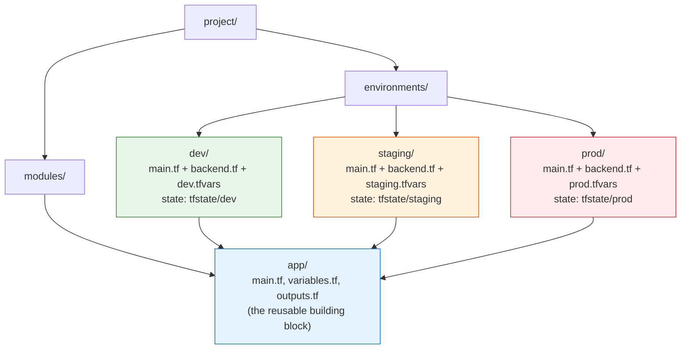

# Day 11 - Managing Multiple Environments

> **Goal:** learn how to run the same infrastructure as separate dev, staging, and prod environments - each with the right size and settings - without copy-pasting your code and without one careless mistake wiping out production.

> **Interactive demo:** [Environments animation](https://siva9800.github.io/devops-animations/terraform/environments.html) - watch how directory-per-environment keeps prod state isolated from dev.

---

## What problem does this solve?

You have written a lovely Terraform config that builds an app: a couple of servers, a database, some networking. It works. Now reality shows up.

You do not run one copy of that app. You run at least three:

- **dev** - where developers try things and break things all day. Tiny and cheap.
- **staging** - a rehearsal of production for final testing. Medium-sized, prod-like.
- **prod** - the real thing that customers touch. Bigger, redundant, guarded.

They are 95% the same code, but they differ: dev runs 1 tiny server, prod runs 5 large ones; dev points at a test database, prod at the real one; prod has stricter settings.

The naive fix is to copy your whole project folder three times. Now you have three drifting copies. Fix a bug in one, forget the other two. Worse, if everything shares one state file and one set of credentials, a single `terraform apply` aimed at the wrong target can delete production while you thought you were touching dev.

We need environments that are **similar but not copy-pasted**, and that are **isolated** so a mistake in dev cannot reach prod. That is today's whole topic.

---

## Learning Objectives

By the end of Day 11 you will be able to:
- Explain why teams split infrastructure into dev, staging, and prod.
- Use CLI **workspaces** and understand the honest limits of what they are for.
- Interpolate `terraform.workspace` into names and sizes.
- Build the recommended **directory-per-environment** pattern with isolated state and credentials.
- Compare the two approaches and pick the right one in an interview or at work.
- Keep it DRY with shared modules plus per-environment `tfvars`.
- Pass per-environment var files and backend configs on the command line.
- Apply consistent naming and tagging so you always know which environment you are in.

---

## Real-world analogy: two kitchens, not one

Imagine a restaurant.

- The **practice kitchen** is where cooks experiment, try new recipes, and occasionally set a pan on fire. Nobody eats this food.
- The **real kitchen** cooks the meals that go out to paying customers. A mistake here ruins someone's dinner and your reputation.

A serious restaurant keeps these as **separate rooms** with separate ingredients and separate staff. A fire in the practice kitchen never touches a customer's plate. That is **directory-per-environment**: real, physical separation, so blast radius is contained.

Now imagine the cheap version: **one kitchen** with a whiteboard on the wall that says "RIGHT NOW WE ARE COOKING: practice" or "...customer meal." You flip the flag before you start. It works - until someone forgets to flip it and serves the experimental dish to a customer. That is a **workspace**: one shared room, a flag telling you which mode you are in, and it is very easy to forget which mode you are in.

Both are valid tools. You just need to know which one you are holding.

---

## Approach 1: CLI Workspaces

Terraform has a built-in feature called **workspaces**. A workspace is a named, separate **state file** stored inside the *same* backend. You switch between them with commands.

```bash
terraform workspace list          # show workspaces (default is "default")
terraform workspace new dev       # create and switch to "dev"
terraform workspace new prod      # create and switch to "prod"
terraform workspace select dev    # switch to an existing workspace
terraform workspace show          # print the current workspace name
```

Inside your code, the special value `terraform.workspace` holds the current workspace name. You can interpolate it into resource names and use it to pick sizes.

```hcl
provider "aws" {
  region = "us-east-1"
}

locals {
  # Pick an instance size based on the current workspace.
  instance_size = {
    dev  = "t3.micro"
    prod = "t3.large"
  }

  # Fall back to a safe small size if the workspace is not in the map.
  size = lookup(local.instance_size, terraform.workspace, "t3.micro")
}

data "aws_ami" "amazon_linux" {
  most_recent = true
  owners      = ["amazon"]

  filter {
    name   = "name"
    values = ["al2023-ami-*-x86_64"]
  }
}

resource "aws_instance" "app" {
  ami           = data.aws_ami.amazon_linux.id
  instance_type = local.size

  tags = {
    # The name changes per workspace: "myapp-dev" or "myapp-prod".
    Name        = "myapp-${terraform.workspace}"
    Environment = terraform.workspace
  }
}
```

Run `terraform workspace select dev && terraform apply` and you get a `t3.micro` named `myapp-dev`. Switch to `prod` and apply, and you get a `t3.large` named `myapp-prod`, in its own state file. The code never changed.

### The honest caveat (this is the interview point)

Workspaces look like the perfect answer for dev/prod. They are not, and **HashiCorp themselves do not recommend workspaces for strong dev/prod separation.** Here is why:

- **One backend for all workspaces.** Every workspace shares the *same* backend configuration and the *same* credentials. Dev state and prod state live in the same bucket, reachable with the same keys.
- **Easy to hit the wrong one.** The only thing standing between you and prod is a flag you set earlier with `workspace select`. Forget to flip it, and `terraform apply` happily modifies prod while you believe you are in dev. There is no separate approval, no separate account, nothing.
- **No credential isolation.** Because there is one backend and usually one AWS account/role, a compromised or mistaken run can reach every environment.

So what are workspaces actually good for? **Lightweight, low-risk variations** that genuinely share the same trust boundary: a per-developer sandbox, a quick feature-branch copy, a set of near-identical regional stacks you are comfortable managing together. They are not for isolating production from the place where people break things.

---

## Approach 2: Directory-per-environment (the recommended pattern)

The widely recommended pattern for real dev/staging/prod separation is boringly simple: **give each environment its own folder**, each with its own backend (its own state), its own variables, and its own credentials, all calling the **same shared modules**.



Each environment folder is a tiny root module. It does almost nothing itself - it just calls the shared `modules/app` with different inputs, and it has its **own backend block** so its state is completely separate.

Why this gives real blast-radius isolation:

- **Separate state.** Prod state lives in a different backend location (often a different bucket or even a different account). A botched `apply` in `environments/dev` physically cannot touch prod state.
- **Separate credentials.** Each environment can use a different AWS account or IAM role. Your dev credentials often have *no permission at all* to reach prod, so the wrong command fails safely instead of doing damage.
- **Explicit, not a flag.** To touch prod you must `cd environments/prod`. There is no invisible "current workspace" to forget. What you are targeting is written in the path.
- **Still DRY.** The actual infrastructure logic lives once, in `modules/app`. The folders only carry the differences.

The cost is more folders and some repeated backend/provider boilerplate. That is the tradeoff you accept for isolation - and for production, it is worth it.

---

## Workspaces vs directory-per-environment

| Dimension | CLI Workspaces | Directory-per-environment |
|---|---|---|
| **State separation** | Separate state, but same backend | Separate state in separate backends |
| **Credentials** | Shared (one backend, usually one account) | Isolated per environment (different accounts/roles) |
| **Blast radius** | Large - wrong flag can hit prod | Small - dev cannot reach prod state |
| **Isolation strength** | Weak (soft flag) | Strong (physical + IAM) |
| **DRY** | Very DRY (one folder) | DRY via shared modules |
| **Complexity / boilerplate** | Low | Higher (folders, repeated backend blocks) |
| **How you switch** | `terraform workspace select` | `cd environments/<env>` |
| **When to use** | Sandboxes, feature branches, low-risk near-identical variants | Real dev/staging/prod, anything with production |

> **One line for interviews:** workspaces are separate state in one shared backend and are fine for lightweight variations, but HashiCorp does not recommend them for prod isolation - use directory-per-environment (separate state, separate credentials) when a mistake in dev must never reach prod.

---

## Keeping it DRY: shared modules + per-environment tfvars

The trick that makes directory-per-environment sane is **not** repeating your infrastructure. You write the real logic once as a module, and each environment supplies only the values that differ.

- **Shared module** (`modules/app`) - the reusable recipe: how to build the servers, database, and networking. It exposes inputs like `instance_type`, `instance_count`, and `environment`.
- **Per-environment tfvars** - a small file per environment holding just the differences: dev sets `instance_count = 1`, prod sets `instance_count = 5`.

That way a bug fix or a new feature goes into the module once, and every environment picks it up on its next apply. The tfvars stay tiny.

> **Terragrunt (one paragraph, no deep-dive):** the directory-per-environment pattern does create repeated backend and provider blocks across folders. [Terragrunt](https://terragrunt.gruntwork.io/) is a popular third-party wrapper around Terraform that generates that boilerplate for you and keeps backends DRY, so your per-environment files shrink to almost nothing. It is not part of Terraform itself and you do not need it to start - plain directory-per-environment works fine. Reach for Terragrunt only once the repetition genuinely hurts.

---

## Passing per-environment var files and backends

You do not hardcode which environment you are in. You pass it at the command line.

```bash
# From inside environments/prod/
terraform init -backend-config=backend.hcl   # wire up THIS env's backend
terraform plan  -var-file=prod.tfvars        # preview with prod values
terraform apply -var-file=prod.tfvars        # apply prod values
```

- `-var-file=prod.tfvars` feeds this environment's differences (sizes, counts, names) into the config.
- `-backend-config=backend.hcl` (or a full `backend.tf` block) points this environment at its own state location. Passing backend settings as a file lets each environment share the same module code while writing to a different state path.

Note: `*.tfvars` files whose *names* are `terraform.tfvars` or end in `.auto.tfvars` load automatically. Files like `prod.tfvars` do **not** - you must pass them with `-var-file`, which is exactly what you want here so you never apply prod values by accident.

---

## Naming and tagging conventions

When you run three near-identical environments, the fastest way to cause an outage is to act on the wrong one because everything looks the same. Fix that with consistent names and tags.

```hcl
variable "environment" {
  type        = string
  description = "dev, staging, or prod"
}

locals {
  # A prefix every resource name starts with, e.g. "myapp-prod-".
  name_prefix = "myapp-${var.environment}-"

  # Tags stamped onto every resource so you can filter by environment.
  common_tags = {
    Project     = "myapp"
    Environment = var.environment
    ManagedBy   = "terraform"
  }
}

resource "aws_instance" "app" {
  ami           = data.aws_ami.amazon_linux.id
  instance_type = var.instance_type

  tags = merge(local.common_tags, {
    Name = "${local.name_prefix}app"   # "myapp-prod-app"
  })
}
```

Now every resource carries an `Environment` tag, and every name starts with `myapp-prod-` or `myapp-dev-`. In the AWS console you can filter by the tag, and cost reports can be grouped by environment. When a name on your screen says `myapp-prod-app`, you know exactly where you are.

---

## A realistic example: one module, two environments

Here is the whole shape: a shared `modules/app` called by `environments/dev` and `environments/prod` with different tfvars, each with its own backend.

**`modules/app/variables.tf`**
```hcl
variable "environment" {
  type        = string
  description = "Environment name (dev/staging/prod)"
}

variable "instance_type" {
  type        = string
  description = "EC2 size for this environment"
}

variable "instance_count" {
  type        = number
  description = "How many app servers to run"
}
```

**`modules/app/main.tf`**
```hcl
data "aws_ami" "amazon_linux" {
  most_recent = true
  owners      = ["amazon"]

  filter {
    name   = "name"
    values = ["al2023-ami-*-x86_64"]
  }
}

locals {
  name_prefix = "myapp-${var.environment}-"

  common_tags = {
    Project     = "myapp"
    Environment = var.environment
    ManagedBy   = "terraform"
  }
}

resource "aws_instance" "app" {
  count         = var.instance_count
  ami           = data.aws_ami.amazon_linux.id
  instance_type = var.instance_type

  tags = merge(local.common_tags, {
    Name = "${local.name_prefix}app-${count.index}"
  })
}
```

**`environments/dev/main.tf`**
```hcl
terraform {
  backend "s3" {
    bucket = "mycompany-tfstate-dev"
    key    = "app/terraform.tfstate"
    region = "us-east-1"
  }
}

provider "aws" {
  region = "us-east-1"
  # Dev credentials/profile - separate from prod.
  profile = "myapp-dev"
}

module "app" {
  source         = "../../modules/app"
  environment    = var.environment
  instance_type  = var.instance_type
  instance_count = var.instance_count
}
```

**`environments/dev/dev.tfvars`**
```hcl
environment    = "dev"
instance_type  = "t3.micro"
instance_count = 1
```

**`environments/prod/main.tf`**
```hcl
terraform {
  backend "s3" {
    # A DIFFERENT bucket - prod state is fully isolated from dev.
    bucket = "mycompany-tfstate-prod"
    key    = "app/terraform.tfstate"
    region = "us-east-1"
  }
}

provider "aws" {
  region = "us-east-1"
  # Prod credentials/profile - a different account or role.
  profile = "myapp-prod"
}

module "app" {
  source         = "../../modules/app"
  environment    = var.environment
  instance_type  = var.instance_type
  instance_count = var.instance_count
}
```

**`environments/prod/prod.tfvars`**
```hcl
environment    = "prod"
instance_type  = "t3.large"
instance_count = 5
```

Both environments reuse the exact same `modules/app` (no hardcoded AMI - it is looked up with `data "aws_ami"`). The only differences live in the small tfvars files, and each environment writes to its **own** S3 bucket with its **own** AWS profile. A mistake in `environments/dev` cannot reach the prod bucket, and dev's profile has no rights over prod.

---

## Common Mistakes

1. **Using workspaces for real prod isolation.** They share one backend and one set of credentials. HashiCorp does not recommend them for dev/prod separation. Use directory-per-environment when production is on the line.
2. **Copy-pasting the whole project per environment.** The copies drift, and a fix in one is forgotten in the others. Put the logic in a shared module and vary only the tfvars.
3. **Forgetting to `terraform workspace select` (or forgetting to `cd`).** With workspaces you can apply to the wrong environment silently. The directory pattern makes the target explicit in the path.
4. **Sharing one backend/state across environments.** If dev and prod share a state file, a bad apply can corrupt both. Give each environment its own backend.
5. **Re-running `terraform init` without re-selecting the backend.** When you move between environment folders, each has its own backend - run `init` (or `init -reconfigure`) in each folder so you are pointed at the right state.
6. **No `Environment` tag or name prefix.** Without them, every environment looks identical in the console and you act on the wrong one. Always stamp `common_tags` and a `name_prefix`.

---

## Hands-On Lab: run dev and prod from one module

You will build the folder structure above and apply two environments.

```bash
# 1. Create the layout
mkdir -p modules/app environments/dev environments/prod

# 2. Fill in the files from the "realistic example" section:
#    - modules/app/{variables.tf,main.tf}
#    - environments/dev/{main.tf,dev.tfvars}
#    - environments/prod/{main.tf,prod.tfvars}

# 3. Bring up DEV
cd environments/dev
terraform init
terraform plan  -var-file=dev.tfvars    # expect 1 t3.micro named myapp-dev-app-0
terraform apply -var-file=dev.tfvars

# 4. Bring up PROD (separate state, separate profile)
cd ../prod
terraform init
terraform plan  -var-file=prod.tfvars   # expect 5 t3.large servers named myapp-prod-app-*
terraform apply -var-file=prod.tfvars

# 5. Prove isolation: destroying dev leaves prod untouched
cd ../dev
terraform destroy -var-file=dev.tfvars  # prod servers are still running
```

**Bonus workspace drill (to feel the risk):**
```bash
cd ../../   # a scratch folder with the workspace example from Approach 1
terraform workspace new dev
terraform workspace new prod
terraform workspace select dev
terraform workspace show    # notice: nothing stops you applying while you THINK you are elsewhere
```

**Success check:** dev and prod each have their own state file, different sizes and counts, and destroying dev does not affect prod.

---

## Quick Self-Check

1. Why do teams split infrastructure into dev, staging, and prod instead of one shared setup?
2. What does `terraform.workspace` give you, and show one way to use it?
3. Give the honest reason HashiCorp does not recommend workspaces for prod isolation.
4. In directory-per-environment, what two things make prod truly isolated from dev?
5. How do you keep three environments DRY while still letting them differ?

<details>
<summary>Answers</summary>

1. So developers can break things safely in dev/staging without ever risking the production environment that customers use - separation limits the blast radius of mistakes.
2. It holds the current workspace name. You can interpolate it, e.g. `Name = "myapp-${terraform.workspace}"`, or use `lookup(local.sizes, terraform.workspace, "t3.micro")` to pick a size.
3. All workspaces share one backend and one set of credentials, so there is no real isolation - it is easy to forget which workspace is selected and apply to prod by accident.
4. Separate state (its own backend, often a different bucket/account) and separate credentials (a different AWS account or IAM role), so a dev mistake physically and permission-wise cannot reach prod.
5. Put the real logic once in a shared module and give each environment a small `tfvars` file with only its differences (sizes, counts, names).
</details>

---

## Summary

- You almost never run one copy of your infrastructure - you run dev, staging, and prod, similar but not identical.
- Copy-pasting whole projects causes drift; a shared state/credentials setup lets one mistake take down prod.
- **Workspaces** are separate state in one shared backend (`terraform.workspace` lets you vary names/sizes). They suit lightweight, low-risk variations - HashiCorp does not recommend them for prod isolation.
- **Directory-per-environment** gives each env its own folder, backend, credentials, and tfvars while calling shared modules - real blast-radius isolation, and the recommended pattern for production.
- Keep it DRY with shared modules plus per-environment tfvars; pass `-var-file` and `-backend-config` per environment; Terragrunt exists to reduce the boilerplate.
- Always tag with `Environment` and use a name prefix like `myapp-prod-` so you always know where you are.

**Next up ->** [Day 12 - Refactoring and Drift](../day12-refactoring-drift/notes.md)
