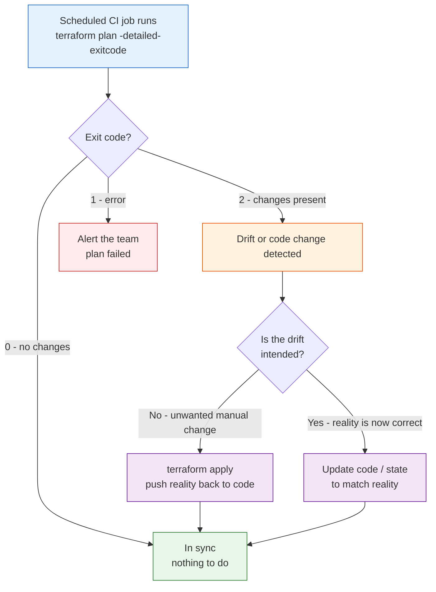

# Day 12 - Refactoring and Drift

> **Goal:** learn how to safely change existing Terraform code without destroying live infrastructure, and how to handle the real world diverging from your code - using the modern tools (`moved` blocks, `import` blocks, `-refresh-only`, `-replace`) that most courses skip.

---

## What problem does this solve?

On Day 1 you built infrastructure from scratch. But in a real job, the infrastructure already exists - and it is running production databases that customers depend on. Two painful things happen constantly:

1. **You want to rename or reorganise your code.** You rename `aws_instance.web` to `aws_instance.frontend`, or you move it into a module for tidiness. Terraform sees an unfamiliar name, assumes the old thing is gone, and plans to **destroy your live server and create a brand-new one.** For a database, that is a resume-generating event.

2. **Reality drifts away from your code.** Someone opens the AWS console at 2am during an incident, changes a security group by hand, and forgets to tell anyone. Now your code says one thing and reality says another. This is called **drift**, and if you do not catch it, your next `apply` may silently revert their emergency fix - or blow up.

Today is about doing both safely: telling Terraform "it is the same thing, just moved," adopting resources that already exist, and detecting and reconciling drift.

---

## Learning Objectives

By the end of Day 12 you will be able to:
- Explain why renaming or moving a resource normally triggers a dangerous destroy-and-recreate.
- Use `moved` blocks (Terraform 1.1+) to rename resources and move them into modules with zero downtime.
- Use `import` blocks (Terraform 1.5+) to bring existing cloud resources under Terraform management, and scaffold config with `-generate-config-out`.
- Define drift, detect it with `plan`, `plan -refresh-only`, and `plan -detailed-exitcode`.
- Reconcile drift by updating code or applying, and use `ignore_changes` for intentional drift.
- Force-recreate a single resource with `terraform apply -replace`.
- Know the older imperative equivalents (`terraform state mv/rm`, `terraform import`, `taint`) and why the code-based versions are now preferred.

---

## Real-world analogy: the filing cabinet, the room, and the logbook

Imagine you manage a large office building with a logbook that records every room and every filing cabinet.

- **`moved` block = relabelling a drawer.** You want to rename a filing cabinet drawer from "Web" to "Frontend." The naive move is to throw out the old drawer (and everything in it) and buy a new empty one. The sane move is to peel off the old label and stick on a new one. The contents never move. A `moved` block is that new label.

- **`import` block = registering a room someone built without telling you.** A contractor built a room and started using it, but it was never entered in the logbook. You do not demolish it and rebuild - you simply add an entry to the logbook so the building manager (Terraform) now knows it exists and manages it.

- **Drift = someone repainted a room without updating the logbook.** Reality (fresh blue paint) no longer matches the record (says white). Drift detection is walking the halls and comparing what you see to what the logbook says. Then you either update the logbook to say blue, or repaint it white to match the record.

Keep these three pictures in mind - the whole lesson maps onto them.

---

## Part 1: Refactoring safely with `moved` blocks

### Why renaming is dangerous by default

Terraform tracks every resource by its **address** - the combination of type and name, like `aws_instance.web`. It stores this address in state. When you change the name in your code, Terraform has no idea the two are related:

```hcl
# Before
resource "aws_instance" "web" { ... }

# After - you just renamed it
resource "aws_instance" "frontend" { ... }
```

Terraform reads this as: "`aws_instance.web` disappeared from the code (destroy it), and a new `aws_instance.frontend` appeared (create it)." The plan shows the dreaded:

```
  # aws_instance.web will be destroyed
  # aws_instance.frontend will be created
Plan: 1 to add, 0 to change, 1 to destroy.
```

That is a full destroy and recreate. For a stateless web server, annoying. For an RDS database, catastrophic.

### The modern fix: a `moved` block

A `moved` block (Terraform 1.1+) is a piece of **code** that tells Terraform "the thing formerly at address A is now at address B - it is the same resource, do not destroy it."

```hcl
resource "aws_instance" "frontend" {
  ami           = data.aws_ami.amazon_linux.id
  instance_type = "t2.micro"

  tags = {
    Name = "frontend"
  }
}

# "The resource I used to call web is now called frontend."
moved {
  from = aws_instance.web
  to   = aws_instance.frontend
}
```

Now `terraform plan` shows a harmless:

```
  # aws_instance.web has moved to aws_instance.frontend
Plan: 0 to add, 0 to change, 0 to destroy.
```

Zero changes to real infrastructure. Terraform just updated the address in its state file.

### Moving a resource INTO a module

The same block handles the very common refactor of lifting a bare resource into a module:

```hcl
# The resource now lives inside module "web" as aws_instance.this
moved {
  from = aws_instance.web
  to   = module.web.aws_instance.this
}
```

You can also move things between modules, or move a whole module (`from = module.old`, `to = module.new`).

### Why `moved` blocks beat the old `terraform state mv`

Before 1.1, the only tool was the imperative CLI command:

```bash
terraform state mv aws_instance.web aws_instance.frontend
```

It works, but it has real downsides that `moved` blocks fix:

| Aspect | `terraform state mv` (old) | `moved` block (modern) |
|---|---|---|
| Where it lives | A command someone types once | Code in your `.tf` files |
| Code review | Invisible - reviewers never see it | Shows up in the pull request |
| Repeatable | Must be re-run per state / per teammate | Runs automatically on every `apply` |
| CI / automation friendly | Awkward (manual step) | Applied like any other change |
| Auditable | Only in someone's shell history | In Git history forever |

> **Interview line:** "`moved` blocks made resource refactors declarative and code-reviewable. The state edit is now part of the pull request instead of a manual `state mv` someone ran on their laptop."

### Cleaning up `moved` blocks

A `moved` block is a one-time instruction, but it is safe to leave in. Once every environment has applied it, you can delete it - just make sure all your state files (dev, staging, prod) have run through it first. Many teams keep them for a release cycle, then remove them.

---

## Part 2: Adopting existing resources with `import` blocks

Sometimes a resource already exists in the cloud - created by hand, by an old script, or by another team - and you want Terraform to manage it. You do **not** want to destroy and recreate it.

### The modern way: an `import` block

An `import` block (Terraform 1.5+) is declarative and reviewable. You write a resource block (or scaffold it - see below) plus an `import` block that points at the real resource's ID:

```hcl
resource "aws_instance" "web" {
  ami           = data.aws_ami.amazon_linux.id
  instance_type = "t2.micro"

  tags = {
    Name = "adopted-web-server"
  }
}

# "Bring the existing instance i-0abc123def456 under management as aws_instance.web."
import {
  to = aws_instance.web
  id = "i-0abc123def456"
}
```

Run `terraform plan` and Terraform reads the real instance, compares it to your resource block, and shows what (if anything) it would change to make reality match your code. Run `terraform apply` and the resource is now in state - no recreation.

### Scaffolding the config automatically

Writing a full resource block by hand to match an existing resource is tedious and easy to get wrong. Terraform can generate it for you:

```bash
terraform plan -generate-config-out=generated.tf
```

With an `import` block present, this writes a `generated.tf` file containing a resource block that matches the real resource's current attributes. Review it, clean it up (remove read-only fields, swap the hardcoded AMI for a `data` lookup), move it into your normal files, and delete the `import` block once applied.

### Contrast with the old `terraform import` CLI

The pre-1.5 way was a CLI command:

```bash
terraform import aws_instance.web i-0abc123def456
```

It still works, but like `state mv` it is imperative and invisible to review. You also had to hand-write the matching resource block yourself first, with no config generation.

| Aspect | `terraform import` (old) | `import` block (modern) |
|---|---|---|
| Form | CLI command, run once | Code in `.tf`, reviewable |
| Config generation | None - write it all by hand | `-generate-config-out` scaffolds it |
| Preview before doing it | No - it just imports | Yes - shows up in `plan` |
| Bulk imports | One command per resource | Many blocks, applied together |

> After the import is applied and the resource is safely in state, **remove the `import` block** - it has done its job.

---

## Part 3: Drift - when reality diverges from state

### What drift is

**Drift** is any difference between what Terraform recorded in state and what actually exists in the cloud, caused by a change made outside Terraform. Common causes:

- Someone edited a resource by hand in the AWS console during an incident.
- Another tool or script modified the resource.
- The cloud provider changed a default or auto-scaled something.

Terraform is the logbook; drift is the room that got repainted without an update.

### Detecting drift



Three commands do the detecting:

| Command | What it does |
|---|---|
| `terraform plan` | Refreshes state against reality, then shows the diff between reality and your code. If someone changed a tag by hand, the plan shows Terraform wanting to change it back. |
| `terraform plan -refresh-only` | Only compares state to reality and shows how state would be updated to match - it does **not** propose changing your infrastructure to match your code. Great for seeing pure drift. |
| `terraform plan -detailed-exitcode` | Same plan, but the exit code is machine-readable: `0` = no changes, `2` = changes present, `1` = error. This is the drift-detection primitive for CI. |

### `-detailed-exitcode` in automation

The special exit codes let a scheduled pipeline shout when reality drifts:

```bash
# Runs nightly in CI. Exit 2 means "something drifted or code changed."
terraform plan -detailed-exitcode -refresh-only

# In a shell wrapper:
terraform plan -detailed-exitcode
case $? in
  0) echo "No drift - all in sync." ;;
  2) echo "DRIFT DETECTED - alerting team." ;; # send Slack alert here
  1) echo "Plan errored." ; exit 1 ;;
esac
```

> Note: normal `plan` exits `0` whether or not there are changes. You must pass `-detailed-exitcode` to get the `2`.

### Reconciling drift

Once you have found drift, you have two honest choices:

1. **Reality is wrong - push your code back onto it.** Run `terraform apply`. Terraform changes the real resource back to match your code. (Use when the manual change was a mistake.)

2. **Reality is right - update your record to match it.** Either edit your `.tf` code to describe the new reality, then apply (no-op), or run `terraform apply -refresh-only` to update just the state without touching infrastructure. (Use when the manual change was a legitimate fix you want to keep.)

```bash
# Update state to match reality, without changing any infrastructure
terraform apply -refresh-only
```

### `ignore_changes` for intentional drift (recap from Day 9)

Some attributes are *meant* to drift - an autoscaler adjusts `desired_capacity`, or a deploy tool updates a tag. You do not want Terraform fighting those changes on every apply. Use a `lifecycle` block:

```hcl
resource "aws_instance" "web" {
  ami           = data.aws_ami.amazon_linux.id
  instance_type = "t2.micro"

  tags = {
    Name = "web"
  }

  lifecycle {
    # Let an external tool manage these tags without Terraform reverting them
    ignore_changes = [tags]
  }
}
```

Now drift in `tags` is accepted and never shows up as a change. Use it sparingly - it is a way of officially telling Terraform "this attribute is not my job."

---

## Part 4: Force-recreating one resource with `-replace`

Sometimes a single resource is in a bad state - a corrupted instance, a machine that needs a clean boot from its AMI - and you want to recreate just that one, without touching anything else.

```bash
terraform apply -replace="aws_instance.web"
```

This plans to destroy and recreate exactly that resource, and leaves everything else alone. You can preview it first:

```bash
terraform plan -replace="aws_instance.web"
```

### Why not `taint`?

The old way was `terraform taint` / `terraform untaint`, which marked a resource for recreation on the next apply. It is **deprecated**. `-replace` is better because:

| Aspect | `taint` (deprecated) | `-replace` (modern) |
|---|---|---|
| When you see the effect | Later, on the next apply | Right now, in the same plan |
| Preview | No preview of the taint itself | `plan -replace` shows exactly what happens |
| State side effects | Mutates state immediately | No state change until you apply |

> Use `-replace`. If you see `taint` in a tutorial, it is out of date.

---

## The older imperative commands (know they exist)

The modern, code-based tools above are preferred because they live in Git and get reviewed. But you will still meet the imperative CLI equivalents, and occasionally need them:

| Old imperative command | Modern preferred equivalent | Purpose |
|---|---|---|
| `terraform state mv A B` | `moved` block | Rename / relocate a resource in state |
| `terraform import ADDR ID` | `import` block | Adopt an existing cloud resource |
| `terraform taint ADDR` | `terraform apply -replace=ADDR` | Force-recreate a resource |
| `terraform state rm ADDR` | (no direct code equivalent) | Stop managing a resource without destroying it |

`terraform state rm` is the one still commonly used from the CLI - it removes a resource from state (Terraform forgets it, the real resource stays alive), for example when handing a resource off to another team's Terraform config.

```bash
# Terraform forgets this resource; the real instance keeps running untouched
terraform state rm aws_instance.web
```

---

## Common Mistakes

1. **Renaming a resource with no `moved` block, then applying.** The plan quietly says "1 to destroy" and you nuke a live database. Always read the plan; if you see an unexpected destroy after a rename, add a `moved` block.
2. **Leaving hardcoded values in `-generate-config-out` output.** The generated config captures the current AMI ID and every read-only field. Clean it up - swap the AMI for a `data` lookup and remove computed attributes before committing.
3. **Forgetting to remove `import` blocks after applying.** Once imported, the block is dead weight. Delete it so the config stays clean.
4. **Assuming plain `terraform plan` returns a useful exit code for CI.** It returns `0` even when there are changes. You need `-detailed-exitcode` to get `2`.
5. **Using `taint`.** It is deprecated. Use `terraform apply -replace=ADDRESS`.
6. **Overusing `ignore_changes`.** Ignoring too many attributes means Terraform stops protecting you from drift. Only ignore what another system legitimately owns.

---

## Hands-On Lab: rename, adopt, and detect drift

This lab has no destructive steps on real production data - use a throwaway instance.

```bash
# --- Part A: safe rename with a moved block ---
# 1. Start with a resource named aws_instance.web and apply it.
# 2. Rename it to aws_instance.frontend in your code.
# 3. Run plan - notice it wants to destroy + create. Do NOT apply.
terraform plan
# 4. Add the moved block:
#      moved { from = aws_instance.web  to = aws_instance.frontend }
# 5. Plan again - now 0 to add, 0 to destroy. Apply the harmless move.
terraform plan
terraform apply

# --- Part B: adopt a manually-created instance with an import block ---
# 6. In the AWS console, launch a t2.micro by hand. Copy its instance ID (i-...).
# 7. Add an import block pointing at that ID, plus an empty resource block.
# 8. Scaffold the config:
terraform plan -generate-config-out=generated.tf
# 9. Review generated.tf, clean it up (data-source the AMI), then apply.
terraform apply
# 10. Remove the import block. The instance is now managed by Terraform.

# --- Part C: create and detect drift ---
# 11. In the console, manually change a tag on the managed instance.
# 12. Detect the drift three ways:
terraform plan                       # shows Terraform wanting to revert the tag
terraform plan -refresh-only         # shows how state differs from reality
terraform plan -detailed-exitcode    # exit code 2 = changes present
echo "exit code was: $?"
# 13. Decide: revert it (terraform apply) or keep it
#     (edit code to match, or terraform apply -refresh-only).

# --- Part D: force-recreate one resource ---
terraform plan -replace="aws_instance.frontend"    # preview
terraform apply -replace="aws_instance.frontend"   # recreate just this one

# --- Cleanup ---
terraform destroy
```

**Success check:** Part A applies with zero infrastructure changes. Part B ends with the hand-made instance in `terraform state list`. Part C's `-detailed-exitcode` prints `2` while drift exists and `0` after you reconcile it.

---

## Quick Self-Check

1. You rename `aws_instance.db` to `aws_instance.database`. What does Terraform want to do by default, and how do you make it safe?
2. What is the difference between the `import` block and the old `terraform import` CLI command?
3. What does `terraform plan -refresh-only` show that a normal `plan` does not emphasise?
4. Your CI job needs to detect drift automatically. Which flag makes `plan` return a machine-readable result, and what exit code means "changes present"?
5. You need to force-recreate one bad instance without touching anything else. Which command, and which deprecated command does it replace?

<details>
<summary>Answers</summary>

1. By default Terraform plans to **destroy** `aws_instance.db` and **create** `aws_instance.database` (it does not know they are the same). Add a `moved { from = aws_instance.db  to = aws_instance.database }` block so it updates the address in state with no infrastructure change.
2. Both bring an existing resource under management. The `import` block (1.5+) lives in code, is code-reviewed, shows up in `plan`, and can scaffold config with `-generate-config-out`. The CLI `terraform import` is imperative, invisible to review, and requires you to hand-write the resource block first.
3. It focuses purely on **drift** - how state would be updated to match reality - without proposing to change your infrastructure back to match your code. A normal `plan` mixes drift with code changes.
4. Use `terraform plan -detailed-exitcode`. Exit code `2` means changes are present (`0` = no changes, `1` = error).
5. `terraform apply -replace="ADDRESS"`. It replaces the deprecated `terraform taint` (and `untaint`), and unlike taint it shows the effect in the same plan.
</details>

---

## Summary

- Renaming or moving a resource normally makes Terraform destroy and recreate it - dangerous for anything stateful. `moved` blocks (1.1+) tell Terraform "same thing, new address" in reviewable code, replacing the old `terraform state mv`.
- `import` blocks (1.5+) adopt existing cloud resources declaratively, and `terraform plan -generate-config-out=generated.tf` scaffolds the matching config. They replace the imperative `terraform import` CLI.
- Drift is reality diverging from state via out-of-band changes. Detect it with `plan`, `plan -refresh-only`, and `plan -detailed-exitcode` (exit `2` = changes) for CI.
- Reconcile drift by applying (push code onto reality) or by updating code / `apply -refresh-only` (accept reality). Use `ignore_changes` for attributes another system legitimately owns.
- Force-recreate one resource with `terraform apply -replace=ADDRESS` - the modern replacement for deprecated `taint`.
- The imperative `state mv/rm`, `import`, and `taint` still exist, but code-based `moved`/`import`/`-replace` are preferred because they are in Git and get reviewed.

**Next up ->** [Day 13 - Testing and Validation](../day13-testing-validation/notes.md)
