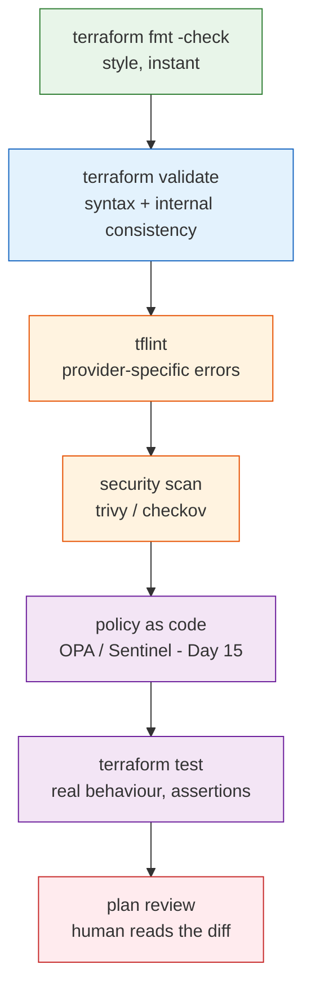
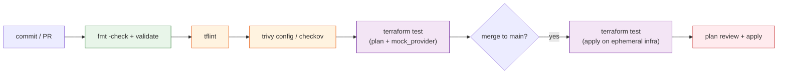

# Day 13 - Testing and Validation

> **Goal:** learn how to prove your Terraform is correct and safe *before* it ships - climbing a ladder of checks from cheap and instant (`fmt`) up to real tests (`terraform test`), so a broken or insecure change is caught on your laptop or in CI, not in production.

---

## What problem does this solve?

You write some Terraform. It looks right. You run `terraform apply` and... it fails halfway through because you typed an instance type that does not exist. Or worse: it *succeeds*, and three weeks later a security auditor finds you shipped an S3 bucket open to the entire internet.

Here is the uncomfortable truth: `terraform apply` will happily build insecure, broken, or wasteful infrastructure. Terraform's job is to make your description real - it does not judge whether your description is a *good idea*.

So we need a set of checks that run *before* apply. Some are instant and free (formatting). Some are slower but deeper (running actual tests against a plan). The skill is knowing which check catches which class of mistake, and running them in the right order - cheap ones first, so you fail fast.

This is a **2026 differentiator**. Most courses stop at `validate`. Teams that ship reliable infrastructure test it like application code.

---

## Learning Objectives

By the end of Day 13 you will be able to:
- Describe the **validation ladder** from cheapest/fastest to most thorough.
- Use `terraform fmt -check` and `terraform validate` and explain what each does *not* check.
- Use `variable validation`, `precondition`, and `postcondition` blocks as your first line of correctness.
- Run **tflint** to catch provider-specific mistakes that `validate` misses.
- Run a **security scanner** (Trivy / Checkov) to flag insecure configuration.
- Write and run **native `terraform test`** files (`.tftest.hcl`) with `run` blocks, `assert` blocks, and `mock_provider`.
- Know where each check fits in the workflow and CI, and how Terratest compares.

---

## Real-world analogy: airport security layers

Think about how an airport screens passengers. It does not do the single most thorough check on everyone - that would take hours. Instead it uses **layers, cheapest and fastest first**:

1. **Boarding-pass glance** (instant) - is this even a valid ticket? (`terraform fmt` / `validate`)
2. **Metal detector walk-through** (seconds) - quick automated pass. (`tflint`)
3. **Bag X-ray** (a bit slower) - looks *inside* for dangerous things. (security scan)
4. **Random pat-down / explosives swab** (thorough, only some people) - deep manual-grade check. (`terraform test`)
5. **The gate agent's final look** (a human decision) - does this all make sense? (`plan` review)

Each layer catches things the previous one cannot, and the expensive layers only run after the cheap ones pass. You would not swab everyone for explosives before checking they have a ticket. Same with Terraform: do not run a 10-minute apply-based test suite on code that has not even been formatted.

Two more analogies you will hear in this lesson:
- **`terraform test` is a test drive before selling the car** - you actually start the engine and check it behaves, rather than just admiring the paint.
- **A security scan is a home inspection** - it walks the house flagging the unlocked doors and exposed wiring you stopped noticing.

---

## The validation ladder

This ordering is the heart of the whole lesson. Cheap and fast at the bottom, thorough and slow at the top. Climb only as far as you need for a quick edit; run the whole ladder in CI.



| Rung | Tool | Speed | Catches | Needs cloud? |
|---|---|---|---|---|
| 1 | `terraform fmt -check` | instant | Inconsistent formatting | No |
| 2 | `terraform validate` | instant | Syntax errors, bad references, wrong argument types | No |
| 3 | `tflint` | fast | Invalid instance types, deprecated syntax, unused declarations | No |
| 4 | Trivy / Checkov | fast | Insecure config (open ports, unencrypted storage, public buckets) | No |
| 5 | Policy (Day 15) | fast | Org rules ("must be tagged", "no public IPs") | No |
| 6 | `terraform test` | medium/slow | Actual behaviour, outputs, conditions | Plan: no. Apply: yes |
| 7 | Plan review | human | Anything a person should sign off on | Reads real state |

> The key insight: rungs 1-5 never touch your cloud account and cost nothing to run. Run them on every save. Only `terraform test` with `command = apply` and the final `plan` review touch real infrastructure.

---

## Rungs 1-2: fmt and validate (recap)

You met these on Day 1. Two things to nail down now.

```bash
# fmt with -check: does NOT rewrite files, just exits non-zero if any file
# is badly formatted. This is the CI-friendly form.
terraform fmt -check -recursive

# validate: checks syntax and internal consistency (do references resolve,
# are argument types correct). Run init first so providers are known.
terraform init -backend=false
terraform validate
```

**What `validate` does NOT do:** it never talks to the cloud. It cannot tell you that `t2.mega` is not a real instance type, that an AMI ID is wrong, or that a bucket name is already taken. It only checks that your code is *internally* consistent - the references line up and the types match. That gap is exactly why the higher rungs exist.

---

## Rungs (first line of defence): validation, precondition, postcondition

Before any external tool, Terraform lets you build correctness *into the code itself*. These are your cheapest tests because they live right beside the resource.

**Input validation** (from Day 3) - reject bad inputs at the door:

```hcl
variable "instance_type" {
  type = string

  validation {
    condition     = contains(["t3.micro", "t3.small", "t3.medium"], var.instance_type)
    error_message = "instance_type must be one of t3.micro, t3.small, or t3.medium."
  }
}

variable "environment" {
  type = string

  validation {
    condition     = can(regex("^(dev|staging|prod)$", var.environment))
    error_message = "environment must be dev, staging, or prod."
  }
}
```

**Precondition and postcondition** (from Day 9) - assert facts around a resource. A `precondition` checks an assumption *before* creating; a `postcondition` checks the *result* after:

```hcl
data "aws_ami" "app" {
  most_recent = true
  owners      = ["amazon"]
  filter {
    name   = "name"
    values = ["al2023-ami-*-x86_64"]
  }
}

resource "aws_instance" "app" {
  ami           = data.aws_ami.app.id
  instance_type = var.instance_type

  lifecycle {
    precondition {
      condition     = data.aws_ami.app.architecture == "x86_64"
      error_message = "Selected AMI must be x86_64 to match the instance type."
    }
    postcondition {
      condition     = self.public_ip != ""
      error_message = "Instance must receive a public IP."
    }
  }
}
```

These run during `plan`/`apply` and stop a bad build cold, with *your* error message instead of a cryptic cloud API failure.

---

## Rung 3: tflint - the linter that knows your provider

`terraform validate` is provider-agnostic; it does not know that `t2.mega` is fake. **tflint** loads a provider plugin (for example the AWS ruleset) and catches real-world, provider-specific mistakes:

- Invalid instance types, AMI attributes, and region names.
- Deprecated syntax and arguments.
- Unused variable / data / declaration warnings.
- Naming-convention rules you configure.

**Install and run:**

```bash
# macOS
brew install tflint

# Linux / CI
curl -s https://raw.githubusercontent.com/terraform-linters/tflint/master/install_linux.sh | bash

# Windows (Chocolatey)
choco install tflint

# In your project: install the rulesets declared in config, then lint
tflint --init
tflint
```

**A tiny `.tflint.hcl`** placed at the project root - it turns on the AWS ruleset and a couple of handy checks:

```hcl
plugin "aws" {
  enabled = true
  version = "0.30.0"
  source  = "github.com/terraform-linters/tflint-ruleset-aws"
}

rule "terraform_unused_declarations" {
  enabled = true
}

rule "terraform_naming_convention" {
  enabled = true
  format  = "snake_case"
}
```

**Sample finding** - if you wrote `instance_type = "t2.mega"`:

```
Error: "t2.mega" is an invalid value as instance_type (aws_instance_invalid_type)

  on main.tf line 12:
  12:   instance_type = "t2.mega"
```

`validate` would pass this happily; tflint catches it before you waste an apply.

---

## Rung 4: security scanning - the home inspection

Static analysis tools read your `.tf` files and flag **insecure configuration** without deploying anything: security groups open to `0.0.0.0/0`, unencrypted storage, public S3 buckets, missing logging.

| Tool | Notes |
|---|---|
| **Trivy** | All-in-one scanner from Aqua. **tfsec is now folded into Trivy** - `trivy config` is the current, maintained path. Use this. |
| **Checkov** | Python-based, from Bridgecrew/Prisma. Huge policy library, great CI integration, supports custom policies. |
| **tfsec** | The original standalone Terraform scanner. **Deprecated - merged into Trivy.** You will still see it referenced; prefer Trivy. |

**Running Trivy** (the modern default, since tfsec merged into it):

```bash
# Scan the current directory's Terraform for misconfigurations
trivy config .
```

**Running Checkov** (popular alternative):

```bash
checkov -d .
```

**Example finding** for a wide-open security group:

```hcl
resource "aws_security_group" "web" {
  ingress {
    from_port   = 22
    to_port     = 22
    protocol    = "tcp"
    cidr_blocks = ["0.0.0.0/0"]   # SSH open to the whole internet
  }
}
```

```
HIGH: Security group rule allows ingress from public internet on port 22.
  Restrict cidr_blocks to known IP ranges.
```

Fix by scoping `cidr_blocks` to your office/VPN range. The scanner just did a home inspection and found the unlocked front door.

---

## Rung 6: terraform test - the native testing framework (the centerpiece)

This is the modern way to test Terraform, built into the CLI since **Terraform 1.6**. No third-party framework, no Go. You write test files ending in **`.tftest.hcl`**, and Terraform runs them for you.

### The shape of a test file

A `.tftest.hcl` file contains one or more **`run` blocks**. Each `run` executes the module and then checks **`assert` blocks**. The critical choice is `command`:

| `command` | What it does | Touches cloud? | Use for |
|---|---|---|---|
| `plan` (default) | Runs a plan, asserts against planned values | **No** | Fast unit tests of logic, defaults, computed values |
| `apply` | Actually creates resources, asserts, then destroys | **Yes** | Integration tests that need real infra |

Each `assert` has two required parts:
- `condition` - an expression that must be `true`.
- `error_message` - what to print if it is `false`.

### A real example

Say your module takes an `environment` and a `bucket_name`, and creates an S3 bucket that must be encrypted and named `<name>-<environment>`. Here is a `main.tf`:

```hcl
variable "environment" {
  type = string
}

variable "bucket_name" {
  type = string
}

resource "aws_s3_bucket" "this" {
  bucket = "${var.bucket_name}-${var.environment}"
}

resource "aws_s3_bucket_server_side_encryption_configuration" "this" {
  bucket = aws_s3_bucket.this.id
  rule {
    apply_server_side_encryption_by_default {
      sse_algorithm = "AES256"
    }
  }
}

output "bucket_id" {
  value = aws_s3_bucket.this.id
}
```

Now create `tests/bucket.tftest.hcl`:

```hcl
# A shared provider config all runs inherit.
provider "aws" {
  region = "us-east-1"
}

# Run 1: fast, plan-only. Checks naming logic without creating anything.
run "bucket_name_is_composed_correctly" {
  command = plan

  variables {
    environment = "dev"
    bucket_name = "acme-logs"
  }

  assert {
    condition     = aws_s3_bucket.this.bucket == "acme-logs-dev"
    error_message = "Bucket name did not combine name and environment correctly."
  }
}

# Run 2: also plan-only. Checks encryption is configured.
run "bucket_is_encrypted" {
  command = plan

  variables {
    environment = "prod"
    bucket_name = "acme-logs"
  }

  assert {
    condition = (
      aws_s3_bucket_server_side_encryption_configuration.this.rule[0].apply_server_side_encryption_by_default[0].sse_algorithm
      == "AES256"
    )
    error_message = "Bucket must use AES256 server-side encryption."
  }
}
```

Run the whole suite:

```bash
terraform test
```

Terraform discovers every `*.tftest.hcl` file (by default in the root and a `tests/` directory), executes each `run`, and reports pass/fail per assertion. Because both runs above use `command = plan`, this suite is **fast and touches no cloud resources** - ideal for running on every commit.

### mock_provider: tests that never touch the cloud (Terraform 1.7+)

Even `command = plan` normally needs provider credentials to look things up. Since **Terraform 1.7** you can declare a **`mock_provider`** so tests run fully offline, with fake resource data. This is perfect for CI where you do not want to hand out cloud credentials.

```hcl
# Fake AWS - no credentials, no network, no real resources.
mock_provider "aws" {}

run "name_logic_offline" {
  command = plan

  variables {
    environment = "dev"
    bucket_name = "acme-logs"
  }

  assert {
    condition     = aws_s3_bucket.this.bucket == "acme-logs-dev"
    error_message = "Bucket name composition is wrong."
  }
}
```

### An apply-based test (real infra, then auto-destroy)

When you must verify behaviour that only exists after creation, use `command = apply`. Terraform creates the resources, runs the asserts, and **automatically destroys everything at the end of the test run** - even if an assertion fails.

```hcl
run "bucket_actually_exists" {
  command = apply

  variables {
    environment = "test"
    bucket_name = "acme-ephemeral"
  }

  assert {
    condition     = output.bucket_id != ""
    error_message = "Applied bucket did not return an id."
  }
}
```

Because this spins up real resources, run it in CI against **ephemeral infrastructure**, not on every keystroke.

---

## Where tests fit in the workflow and CI

Locally, run the cheap rungs constantly and the whole ladder before you push. In CI (Day 14), the ladder becomes your pipeline gates:



Fast, cloud-free checks run on every PR. The expensive apply-based tests run only on the path to `main`, against throwaway infrastructure that is destroyed immediately.

---

## A note on Terratest (the older approach)

Before `terraform test` existed, teams reached for **Terratest** - a Go library that runs `terraform apply`, inspects the result with Go code, and then runs `destroy`. It is powerful and still used, especially where you need complex logic or to make live API calls to verify a deployed endpoint.

But it means writing and maintaining **Go code and a Go toolchain** alongside your Terraform. For most modules, the **native `terraform test` is the modern default**: it is built in, uses HCL you already know, and needs no extra language. Reach for Terratest only when native tests genuinely cannot express what you need.

| | terraform test (native) | Terratest |
|---|---|---|
| Language | HCL (`.tftest.hcl`) | Go |
| Setup | Built into CLI (1.6+) | Go toolchain + library |
| Offline tests | Yes (`mock_provider`, 1.7+) | No (always applies) |
| Best for | Most module testing | Complex/custom verification |

---

## Common Mistakes

1. **Stopping at `terraform validate`.** It never checks against the cloud - it will not catch a fake instance type, an insecure security group, or a public bucket. Climb the ladder.
2. **Running expensive checks first.** Do not kick off a 10-minute apply-based test on code that fails `fmt`. Fail fast on the cheap rungs.
3. **Using apply-based tests everywhere.** They cost time and money and need credentials. Default to `command = plan` (and `mock_provider`); reserve `apply` for CI on ephemeral infra.
4. **Forgetting `error_message` on an assert.** It is required, and a clear message is what makes a failing test actually useful.
5. **Reaching for `tfsec`.** It is deprecated and folded into Trivy. Use `trivy config .` instead.
6. **Skipping `tflint --init`.** Without initialising the plugin, the AWS ruleset is not loaded and you get far weaker linting.
7. **Not destroying test infra.** Native `terraform test` auto-destroys, but home-grown scripts often leak resources - always clean up.

---

## Hands-On Lab: build the ladder for a small module

```bash
# 1. In a module folder with main.tf (the S3 bucket example above):
terraform fmt -check -recursive        # rung 1
terraform init -backend=false
terraform validate                     # rung 2

# 2. Add the .tflint.hcl from this lesson, then:
tflint --init
tflint                                 # rung 3

# 3. Security scan (Trivy - tfsec is folded in here):
trivy config .                         # rung 4

# 4. Create tests/bucket.tftest.hcl with the run blocks from this lesson.
#    Start with command = plan and a mock_provider so it needs no cloud.
terraform test                         # rung 6

# 5. Read the output: each run reports pass/fail per assert.
#    Now break something on purpose - change the expected bucket name in an
#    assert - and re-run to watch the test fail with your error_message.
```

**Success check:** `terraform test` prints a pass line for each `run` block, and when you introduce a deliberate mistake, the matching assertion fails with the exact `error_message` you wrote.

---

## Quick Self-Check

1. Put these in cheapest-to-most-thorough order: security scan, `terraform test`, `fmt`, `tflint`, `validate`.
2. What class of error does `tflint` catch that `terraform validate` does not, and why?
3. In a `.tftest.hcl` `run` block, what is the difference between `command = plan` and `command = apply`?
4. What does `mock_provider` give you, and which Terraform version introduced it?
5. Which security scanner is now folded into Trivy, and what should you run instead?

<details>
<summary>Answers</summary>

1. `fmt` -> `validate` -> `tflint` -> security scan -> `terraform test`. Cheap and cloud-free first, real behaviour tests last.
2. Provider-specific mistakes such as invalid instance types, deprecated arguments, and unused declarations. `validate` is provider-agnostic and only checks internal consistency, so it never knows `t2.mega` is not a real type; tflint loads the AWS ruleset and does.
3. `command = plan` (the default) runs a plan and asserts against planned values without creating anything - fast and cloud-free. `command = apply` actually creates the resources, runs the asserts, then auto-destroys them - slower and touches real infrastructure.
4. `mock_provider` lets a test run fully offline with fake resource data - no credentials, no network, no real resources - which is ideal for CI. It arrived in Terraform 1.7.
5. **tfsec** is deprecated and folded into Trivy. Run `trivy config .` instead.
</details>

---

## Summary

- `terraform apply` does not judge whether your config is correct or safe - you need checks *before* it runs.
- Climb the **validation ladder** cheapest-first: `fmt` -> `validate` -> `tflint` -> security scan -> policy (Day 15) -> `terraform test` -> plan review.
- `validate` checks internal consistency only; it never talks to the cloud. `tflint` catches provider-specific errors; Trivy/Checkov flag insecure config.
- Build correctness into the code first with `variable validation`, `precondition`, and `postcondition`.
- **`terraform test`** (native, 1.6+) is the centerpiece: `.tftest.hcl` files with `run` blocks, `command = plan` (fast, no cloud) vs `command = apply` (real infra, auto-destroyed), and `assert` blocks with `condition` + `error_message`. Use `mock_provider` (1.7+) for fully offline tests.
- Terratest (Go) is the older approach; prefer native tests unless you truly need it.
- In CI: run cheap cloud-free checks on every PR; run apply-based tests on ephemeral infra on the path to main.

**Next up ->** [Day 14 - CI/CD for Terraform](../day14-cicd/notes.md)
