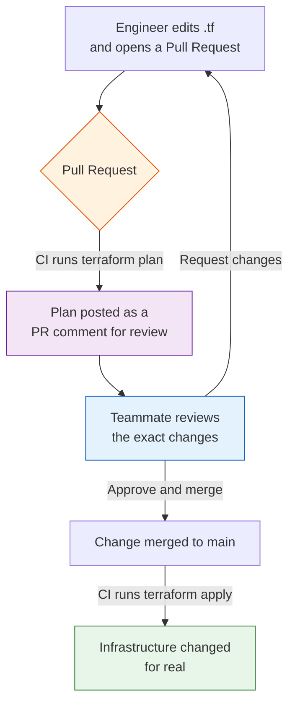
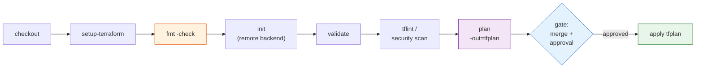
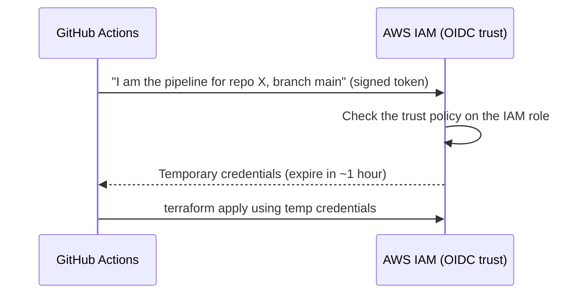

# Day 14 - CI/CD for Terraform

> **Goal:** stop running `terraform apply` from your laptop. Learn the industry-standard pipeline pattern - plan on every Pull Request, apply only on merge to main - and build a complete, correct GitHub Actions workflow that authenticates to AWS with OIDC (no stored keys), applies the exact plan that was reviewed, and shares remote state with your team.

---

## What problem does this solve?

Right now you probably run Terraform like this: you edit a `.tf` file on your laptop, you type `terraform apply`, you squint at the plan, and you type `yes`. It works - for you, today.

Now imagine a real team. Five engineers all have AWS admin keys sitting in `~/.aws/credentials`. Anyone can apply at any time. Two people apply different changes an hour apart and nobody reviewed either one. When production breaks, there is no record of who changed what, or why. Someone runs `apply` against the wrong environment because their laptop was pointed at prod. A key leaks from a laptop and now an attacker has permanent access.

This is the exact problem CI/CD solves. Instead of applying from laptops, **a pipeline applies for you.** Every change becomes a Pull Request that a teammate reviews. The plan is posted for everyone to see. Apply only happens after the PR is merged, on a trusted server, using short-lived credentials that expire in an hour. Every action is logged.

**CI/CD turns Terraform from a personal tool into a team process with review, audit, and consistency built in.** This is *the* most common advanced Terraform interview topic, so we will go deep.

---

## Learning Objectives

By the end of Day 14 you will be able to:
- Explain why teams automate Terraform instead of running `apply` from a laptop.
- Describe the standard pattern: `plan` on every Pull Request, `apply` only on merge to main.
- List the pipeline stages: checkout, setup, fmt, init, validate, lint/scan, plan, gate, apply.
- Explain why you save a plan with `-out=tfplan` and apply that exact file.
- Authenticate CI to AWS with OIDC (a temporary IAM role) instead of storing long-lived keys.
- Use remote state (S3) so the pipeline and humans share one state file.
- Add a manual approval gate for production using GitHub Environments.
- Write a complete, correct GitHub Actions workflow.
- Set up scheduled drift detection.

---

## Real-world analogy: the building inspector

Think about constructing a building.

- **Plan on a Pull Request = the inspector reviews the blueprint.** Before a single brick is laid, an independent inspector looks at the drawings and says "yes, this is safe" or "no, change this." The `terraform plan` posted on your PR *is* that blueprint. Your teammate reviews exactly what will change before anything is built.
- **Apply on merge = construction only starts after sign-off.** Nobody pours concrete until the blueprint is stamped and approved. Merging the PR is the stamp; only then does the pipeline `apply`.
- **OIDC = a temporary visitor badge, not a permanent master key.** You do not hand every contractor a permanent key to the building. You give them a badge that works for today and expires tonight. OIDC gives the pipeline a badge that lasts about an hour, instead of a master key (a long-lived AWS access key) that could be copied and used forever.

Keep these three pictures in mind. Everything below is just the mechanics of making them real.

---

## The standard pattern: plan on PR, apply on merge

This is the single most important idea in the whole lesson. Interviewers ask it directly.



| Trigger | What runs | Why |
|---|---|---|
| **Open / update a Pull Request** | `terraform plan` (read-only preview) | Let a human review the exact change before anything happens. Nothing is created. |
| **Merge to `main`** | `terraform apply` | The change is now approved and part of the trusted branch, so build it for real. |

Read that table twice. **Plan is safe and happens on every PR. Apply is dangerous and happens only after review and merge.** The `main` branch becomes the single source of truth: what is on `main` is what is deployed.

---

## Why automate at all? (the interview list)

| Problem with laptop applies | How CI/CD fixes it |
|---|---|
| No review - anyone applies anything | Every change is a PR someone must approve |
| No record of who changed what | The pipeline logs every plan and apply; Git shows who merged |
| Inconsistent - works on my machine | One pipeline, one Terraform version, one environment, every time |
| Long-lived AWS keys on many laptops | OIDC gives short-lived credentials; no keys stored anywhere |
| Easy to apply to the wrong environment | The pipeline is wired to one environment deliberately |
| Two people apply at once and clash | Merges are serialized; remote state locking prevents overlap |

> **One line for interviews:** "We never apply from laptops. Plan runs on every PR for review, apply runs only on merge to main, CI authenticates with OIDC not stored keys, and we apply the exact saved plan that was reviewed."

---

## The pipeline stages

A good Terraform pipeline runs these stages in order. The early ones are cheap sanity checks; the expensive, dangerous one (apply) is last and gated.



| Stage | Command | Purpose |
|---|---|---|
| Checkout | `actions/checkout` | Pull the repository code into the runner. |
| Setup Terraform | `hashicorp/setup-terraform` | Install a pinned Terraform version on the runner. |
| Format check | `terraform fmt -check` | Fail if code is not formatted. Keeps the codebase clean. |
| Init | `terraform init` | Download providers and connect to the remote backend (S3). |
| Validate | `terraform validate` | Catch syntax and internal errors fast. |
| Lint / scan | `tflint`, `tfsec` / `checkov` / `trivy` | Catch bad practices and insecure settings before apply. |
| Plan | `terraform plan -out=tfplan` | Preview changes and save the plan to a file. |
| Gate | merge + environment approval | A human must approve before prod apply. |
| Apply | `terraform apply tfplan` | Apply the exact saved plan. |

---

## Saving and applying the SAME plan (`-out`)

This is subtle and heavily tested, so slow down here.

When you run `terraform plan`, Terraform looks at the world *right now* and works out what to change. If you then run a plain `terraform apply`, it looks at the world *again* - and the world may have changed in between. The apply could do something different from what you reviewed.

The fix is to save the plan to a file and apply that exact file:

```bash
# On the PR: produce a plan and write it to a file called tfplan
terraform plan -out=tfplan

# On merge: apply that exact file - no re-planning
terraform apply tfplan
```

- `terraform plan -out=tfplan` writes the full, concrete set of changes into a binary file named `tfplan`.
- `terraform apply tfplan` applies **exactly** those changes - it does not re-plan, does not re-evaluate, and does not prompt for `yes` (a saved plan is treated as already approved).

**Why this matters:** what your teammate reviewed on the PR is a specific plan. Applying that saved plan guarantees the pipeline does precisely what was reviewed - no surprises, no drift between review and apply. If you re-plan at apply time, you might apply something nobody looked at.

> In real pipelines the `tfplan` file is saved as a build **artifact** on the plan job and downloaded by the apply job, so the reviewed plan literally travels from PR to apply.

---

## Authentication without long-lived keys: OIDC

Here is the old, bad way and the modern, good way.

**Old way (avoid):** create an AWS access key, paste it into GitHub as a secret (`AWS_ACCESS_KEY_ID`, `AWS_SECRET_ACCESS_KEY`), and the pipeline uses it. The problem: that key is **long-lived**. It sits in your settings forever. If it leaks, an attacker has your account until someone remembers to rotate it. You also have to rotate it manually.

**Modern way (OIDC):** GitHub Actions proves its identity to AWS using a signed token, and AWS hands back **temporary** credentials that expire in about an hour. Nothing secret is stored in GitHub at all.



| | Stored access keys | OIDC role |
|---|---|---|
| Credential lifetime | Forever (until rotated) | ~1 hour |
| Stored in GitHub | Yes (a secret) | No - nothing stored |
| Blast radius if leaked | Full account, indefinitely | Expires almost immediately |
| Rotation | Manual | Automatic (every run) |
| Scoped to a repo/branch | No | Yes, via the trust policy |

You wire this up with `aws-actions/configure-aws-credentials@v4`, passing `role-to-assume` (an IAM role ARN) instead of any keys. The IAM role's trust policy is configured to trust GitHub's OIDC provider for your specific repository. **OIDC is the current best practice; storing AWS keys as secrets is considered legacy.**

---

## Remote state in CI (ties to Day 5)

The pipeline runs on a fresh, throwaway server every time. If your state were a local `terraform.tfstate` file, it would vanish the moment the job ended - and humans and the pipeline would each have their own conflicting copy.

So CI **requires** a remote backend. The state lives in S3 (with a DynamoDB lock table, or S3 native locking on newer Terraform), and both the pipeline and any human share that one state file.

```hcl
terraform {
  backend "s3" {
    bucket       = "my-team-tf-state"
    key          = "prod/terraform.tfstate"
    region       = "us-east-1"
    encrypt      = true
    use_lockfile = true # S3 native state locking (Terraform 1.10+)
  }
}
```

When the pipeline runs `terraform init`, it connects to this backend. State locking means if two runs happen at once, the second waits instead of corrupting state. This is exactly the remote state you set up on Day 5 - CI is the reason it is not optional in a real team.

---

## GitHub Environments: a manual approval gate for prod

Merging to `main` triggers the apply job - but you may want a human to click "Approve" before the pipeline touches production.

GitHub **Environments** provide this. You create an environment named `production`, add yourself (or a team) as a **required reviewer**, and tell the apply job it runs in that environment. Now, when the apply job starts, GitHub pauses it and waits for an approver to click a button. Nothing applies until someone does.

This gives you: merge-to-main triggers the run, but a named human still signs off before prod changes. It is the "stamp the blueprint" step made explicit.

---

## The complete GitHub Actions workflow

Here is a full, correct workflow. Save it as `.github/workflows/terraform.yml`. It has a **plan job** that runs on Pull Requests and an **apply job** that runs on merge to `main`, uses OIDC (no stored keys), and applies the exact saved plan.

```yaml
name: Terraform

on:
  pull_request:
    branches: [main]
  push:
    branches: [main]

# OIDC needs id-token: write. contents: read to check out the code.
permissions:
  id-token: write
  contents: read
  pull-requests: write # so the plan job can comment on the PR

env:
  TF_VERSION: "1.9.5"
  AWS_REGION: "us-east-1"
  TF_ROLE_ARN: "arn:aws:iam::123456789012:role/github-actions-terraform"

jobs:
  # --------- PLAN: runs on every Pull Request ---------
  plan:
    if: github.event_name == 'pull_request'
    runs-on: ubuntu-latest
    steps:
      - name: Checkout
        uses: actions/checkout@v4

      - name: Setup Terraform
        uses: hashicorp/setup-terraform@v3
        with:
          terraform_version: ${{ env.TF_VERSION }}

      - name: Configure AWS credentials (OIDC)
        uses: aws-actions/configure-aws-credentials@v4
        with:
          role-to-assume: ${{ env.TF_ROLE_ARN }}
          aws-region: ${{ env.AWS_REGION }}

      - name: Format check
        run: terraform fmt -check -recursive

      - name: Init
        run: terraform init

      - name: Validate
        run: terraform validate

      - name: Plan
        id: plan
        run: terraform plan -no-color -out=tfplan

      - name: Upload plan artifact
        uses: actions/upload-artifact@v4
        with:
          name: tfplan
          path: tfplan
          retention-days: 5

      - name: Comment plan on PR
        uses: actions/github-script@v7
        with:
          script: |
            const output = `#### Terraform Plan\n\`\`\`\n${{ steps.plan.outputs.stdout }}\n\`\`\``;
            github.rest.issues.createComment({
              issue_number: context.issue.number,
              owner: context.repo.owner,
              repo: context.repo.repo,
              body: output
            });

  # --------- APPLY: runs only on merge to main ---------
  apply:
    if: github.event_name == 'push' && github.ref == 'refs/heads/main'
    runs-on: ubuntu-latest
    environment: production # requires reviewer approval before it runs
    steps:
      - name: Checkout
        uses: actions/checkout@v4

      - name: Setup Terraform
        uses: hashicorp/setup-terraform@v3
        with:
          terraform_version: ${{ env.TF_VERSION }}

      - name: Configure AWS credentials (OIDC)
        uses: aws-actions/configure-aws-credentials@v4
        with:
          role-to-assume: ${{ env.TF_ROLE_ARN }}
          aws-region: ${{ env.AWS_REGION }}

      - name: Init
        run: terraform init

      - name: Plan and save
        run: terraform plan -out=tfplan

      - name: Apply the saved plan
        run: terraform apply -auto-approve tfplan
```

Reading the important parts in plain English:

- `permissions: id-token: write` - the line that makes OIDC possible. Without it, GitHub cannot mint the token AWS needs.
- Two jobs with `if:` guards - `plan` only on `pull_request`, `apply` only on `push` to `main`. This *is* the plan-on-PR / apply-on-merge pattern.
- `configure-aws-credentials@v4` with `role-to-assume` and **no secret keys** - OIDC in action.
- `terraform plan -out=tfplan` then `terraform apply ... tfplan` - the saved-plan pattern; apply does exactly what plan produced.
- `environment: production` - the manual approval gate.

> **Note on the saved plan across jobs:** in this simple version the apply job re-plans on `main` and immediately applies it. For the strictest "apply the identical reviewed plan," download the `tfplan` artifact from the PR run in the apply job and apply that. The re-plan on `main` is a common, pragmatic middle ground because the state may have moved on between PR and merge.

---

## Drift detection in CI (ties to Day 12)

Someone might change infrastructure by hand in the AWS console, so reality "drifts" away from your code. A scheduled pipeline can catch this automatically.

`terraform plan -detailed-exitcode` returns a special exit code:

| Exit code | Meaning |
|---|---|
| `0` | No changes - reality matches code, no drift |
| `1` | Error |
| `2` | There are changes - **drift detected** |

Run it on a schedule and alert if the exit code is `2`:

```yaml
on:
  schedule:
    - cron: "0 8 * * 1-5" # 08:00 UTC on weekdays

jobs:
  drift:
    runs-on: ubuntu-latest
    permissions:
      id-token: write
      contents: read
    steps:
      - uses: actions/checkout@v4
      - uses: hashicorp/setup-terraform@v3
      - uses: aws-actions/configure-aws-credentials@v4
        with:
          role-to-assume: arn:aws:iam::123456789012:role/github-actions-terraform
          aws-region: us-east-1
      - run: terraform init
      - name: Detect drift
        run: terraform plan -detailed-exitcode
        # exit code 2 fails the job -> you get notified drift exists
```

If this job fails with exit code 2, you know something changed outside Terraform and can investigate.

---

## Managed alternatives (Day 15 goes deeper)

You do not have to build all of this yourself. Managed platforms handle the pipeline, state, locking, and approvals for you.

| Option | What it is |
|---|---|
| **HCP Terraform** (formerly Terraform Cloud) | HashiCorp's hosted service: remote runs, state, and policy. Full treatment on Day 15. |
| **Atlantis** | Open-source, self-hosted; comments plans on PRs and applies via chat commands. |
| **Spacelift / env0 / Terrateam** | Commercial platforms with policy, drift detection, and multi-cloud governance built in. |

Building your own with GitHub Actions (as above) is common and gives full control; managed tools trade some control for convenience and governance features.

---

## Hands-On Lab: build a plan-on-PR pipeline

You need a GitHub repo with Terraform code and an S3 backend already configured (Day 5).

```bash
# 1. In AWS, create an IAM role trusted by GitHub's OIDC provider.
#    Trust policy condition example (scope to your repo):
#    "token.actions.githubusercontent.com:sub": "repo:YOUR_ORG/YOUR_REPO:*"
#    Attach the permissions Terraform needs. Copy the role ARN.

# 2. In your repo, create the workflow file
mkdir -p .github/workflows
# Paste the complete workflow from this lesson into
# .github/workflows/terraform.yml and set TF_ROLE_ARN to your role.

# 3. In GitHub, create an Environment named "production" with
#    yourself as a required reviewer (Settings -> Environments).

# 4. Make a change on a branch and open a Pull Request
git checkout -b add-tag
# edit a .tf file, e.g. add a tag
git add . && git commit -m "Add owner tag"
git push -u origin add-tag
# open the PR in GitHub

# 5. Watch the plan job run and post the plan as a PR comment.

# 6. Merge the PR. The apply job starts, pauses for your approval.
#    Approve it, and watch it apply the plan.
```

**Success check:** the PR shows a Terraform plan comment; after merge and approval, the apply job completes and your change is live - and you never touched an AWS key or ran `apply` from your laptop.

---

## Common Mistakes

1. **Running a plain `terraform apply` in CI instead of applying a saved plan.** The apply re-plans against a possibly-changed world and may do something nobody reviewed. Use `plan -out=tfplan` then `apply tfplan`.
2. **Storing long-lived AWS keys as GitHub secrets.** Use OIDC with `role-to-assume` - no stored keys, credentials expire in an hour.
3. **Using local state.** CI runs on throwaway servers; without a remote (S3) backend, state is lost and humans and CI diverge. Remote state is mandatory.
4. **Applying on every push including PRs.** Apply must be gated to `main` after review. Guard jobs with `if:` on the event and branch.
5. **Echoing secrets or dumping full plan output publicly.** A plan can contain sensitive values (passwords, keys). Do not print secrets, and be careful where plan output is posted.
6. **No approval gate for prod.** Merge alone should not silently change production. Use a GitHub Environment with a required reviewer.

---

## Quick Self-Check

1. In the standard pattern, what runs on a Pull Request and what runs on merge to main - and why the split?
2. Why do you run `terraform plan -out=tfplan` and then `terraform apply tfplan` instead of a plain `apply`?
3. What is OIDC in this context, and why is it preferred over storing AWS access keys as GitHub secrets?
4. Why must a CI pipeline use a remote backend instead of local state?
5. How does `terraform plan -detailed-exitcode` help with drift detection?

<details>
<summary>Answers</summary>

1. `terraform plan` runs on the PR so a human can review the exact changes before anything happens; `terraform apply` runs only on merge to main because at that point the change has been reviewed and approved. Plan is safe and read-only; apply is dangerous and must be gated.
2. So that what is applied is exactly what was reviewed. `-out=tfplan` saves the concrete set of changes; `apply tfplan` applies that exact file without re-planning, avoiding surprises if the world changed between plan and apply.
3. OIDC lets GitHub Actions prove its identity to AWS with a signed token and receive temporary credentials (about an hour) via an IAM role. It is preferred because nothing secret is stored in GitHub, credentials expire automatically, and the trust is scoped to your repo - unlike a long-lived key that lives forever and grants full access if it leaks.
4. CI runs on fresh, throwaway servers, so local state would be lost each run, and the pipeline and humans would keep separate, conflicting copies. A remote backend (S3) gives one shared, locked state file.
5. It returns exit code `2` when there are pending changes (drift) and `0` when reality matches code. A scheduled job running it can fail and alert you when someone changed infrastructure outside Terraform.
</details>

---

## Summary

- Automate Terraform so changes are reviewed, audited, consistent, and applied without laptop credentials - the building inspector reviews the blueprint before any construction.
- The standard pattern: `terraform plan` on every Pull Request (posted for review), `terraform apply` only on merge to `main`.
- Pipeline stages: checkout, setup-terraform, fmt check, init, validate, lint/scan, plan `-out=tfplan`, gate, apply the saved plan.
- Save the plan with `-out` and apply that exact file so what is applied is exactly what was reviewed.
- Authenticate with OIDC (`role-to-assume`, temporary credentials) instead of storing long-lived AWS keys - the temporary visitor badge, not the master key.
- Use a remote (S3) backend so CI and humans share one locked state file, and a GitHub Environment for a manual prod approval gate.
- Add scheduled `plan -detailed-exitcode` for drift detection; managed options (HCP Terraform, Atlantis, Spacelift) exist if you do not want to build it yourself.

**Next up ->** [Day 15 - HCP Terraform and Policy as Code](../day15-hcp-policy/notes.md)
