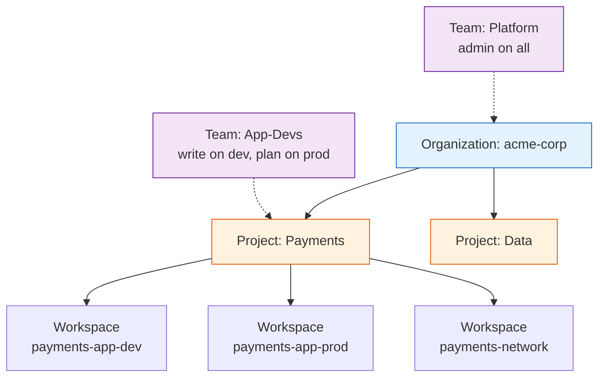
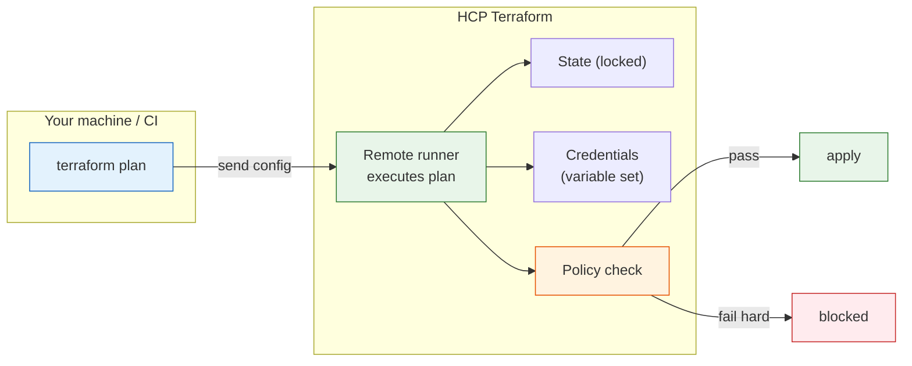
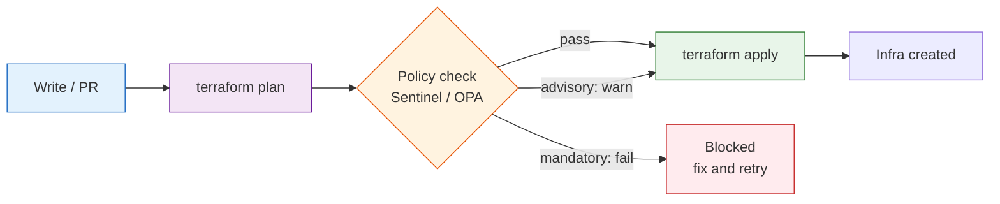

# Day 15 - HCP Terraform and Policy as Code

> **Goal:** understand HCP Terraform (formerly Terraform Cloud) - HashiCorp's managed platform that stores state, runs plan/apply remotely, and enforces governance - and learn Policy as Code (Sentinel and OPA/Rego) so that bad infrastructure is blocked automatically before it is ever applied.

---

## What problem does this solve?

On Day 5 and Day 14 you built the "do-it-yourself" backend: state in an S3 bucket, locking in DynamoDB, and plan/apply driven by GitHub Actions. That works, and plenty of serious teams run exactly that.

But as a team grows, cracks appear:

- Who can run apply on production? Right now, anyone with the AWS keys.
- Where do the cloud credentials live? Scattered across CI secrets and laptops.
- When a plan is about to open a public S3 bucket, what stops it? Nothing but a human reviewer who might be tired.
- Where is the history of *who* changed *what* and *when*? Buried in CI logs.

Two things fix this at senior scale:

1. **HCP Terraform** - a managed service that centralises state, runs, permissions, and history.
2. **Policy as Code** - rules that run automatically on *every* plan and can *block* it, so "no public buckets" is enforced by a machine, not by hope.

This is the enterprise/governance layer of Terraform, and it comes up constantly in senior interviews.

---

## Learning Objectives

By the end of Day 15 you will be able to:
- Explain what HCP Terraform is and how it differs from the DIY (S3 + GitHub Actions) approach.
- Distinguish an HCP workspace from a CLI workspace (Day 11) - they share a name but are completely different things.
- Set up both run workflows: VCS-driven and CLI-driven (the `cloud {}` block).
- Use variable sets to share credentials and variables across workspaces.
- Explain the private module registry, cost estimation, and automatic policy checks.
- Write an illustrative Sentinel policy and a tiny OPA/Rego policy.
- Choose between HCP and DIY for a given team, and defend the tradeoff.

---

## Real-world analogy: managed building operations plus a code inspector

Imagine you own a growing apartment complex.

- **DIY (S3 + Actions):** you personally hold every key, do the plumbing, keep the maintenance log in a notebook, and decide who is allowed into the boiler room. It works when it is one building. At fifty buildings it is chaos.
- **HCP Terraform** is like hiring a **managed building-operations company**. They hold the master keyring (state), log every visit (run history), decide who can enter which room (RBAC), and keep the credentials in one secure office instead of taped under doormats.
- **Policy as Code** is the **automated building-code inspector**. Every blueprint (plan) is checked against the safety code *before* any construction (apply) begins. A blueprint with no fire exits (a public S3 bucket, an oversized instance, a missing tag) is rejected automatically. No inspector needs to be awake at 2am.

HCP runs the building; Policy as Code inspects every blueprint before a single brick is laid.

---

## HCP Terraform: what it actually is

**HCP Terraform (formerly Terraform Cloud)** is a managed SaaS platform from HashiCorp. Instead of you hosting the backend, HashiCorp hosts it. Out of the box you get:

| Capability | What it means | DIY equivalent you built |
|---|---|---|
| **Remote state storage** | State lives in HCP, encrypted, versioned | S3 bucket (Day 5) |
| **Automatic state locking** | Locked during every run, no extra service | DynamoDB table (Day 5) |
| **Remote runs** | plan/apply execute on HCP's runners, not your laptop | GitHub Actions runners (Day 14) |
| **Run history and audit** | Every plan/apply, who and when, kept and searchable | Digging through CI logs |
| **RBAC (teams and permissions)** | Fine-grained "who can apply prod" | AWS IAM + branch protection, hand-rolled |
| **UI** | A web dashboard for runs, state, variables | None - you read logs |
| **Policy checks and cost estimation** | Run automatically on every plan | You bolt on OPA/Infracost yourself |

The mental shift: you stop *operating* the Terraform backend and start *using* one.

> **Note on the name:** what was called "Terraform Cloud" is now "HCP Terraform" (HCP = HashiCorp Cloud Platform). You will see both names in older docs. They are the same product.

---

## HCP workspaces are NOT CLI workspaces

This is the single most common point of confusion, and interviewers love it.

On **Day 11** you met **CLI workspaces**: multiple *named states inside one backend and one configuration* (`terraform workspace new dev`). They share the same `.tf` code and are switched with `terraform.workspace`.

An **HCP workspace** is a completely different concept that happens to reuse the word:

| | CLI workspace (Day 11) | HCP workspace (today) |
|---|---|---|
| What it is | An extra named state slot in one backend | A first-class container in HCP |
| Contains | Just a separate state | One state + its own variables + run history + settings + permissions |
| Typically maps to | A quick dev/prod split within one config | One environment/component (e.g. `networking-prod`) |
| Switching | `terraform workspace select` | You do not switch; each is its own thing |

**An HCP workspace = one state + its own variables + its own run history**, usually mapped to a single environment or component. If you have a `network` layer and an `app` layer across dev/stg/prod, that is six HCP workspaces, not two CLI workspaces.

### Organising workspaces: projects and teams

- **Projects** group related workspaces (e.g. a "Payments" project holding `payments-network`, `payments-app-dev`, `payments-app-prod`).
- **Teams** are groups of users. You grant a team permissions on a project or workspace (read, plan, write, admin).
- This is the **RBAC** layer: the Platform team gets admin on everything, the App team can `apply` on dev but only `plan` (needs approval) on prod.



---

## The two run workflows

HCP can drive runs in two ways. Know both.

### 1. VCS-driven workflow (connect a Git repo)

You link an HCP workspace to a Git repository (GitHub, GitLab, etc.). Then:

- Open a **pull request** -> HCP runs a **speculative plan** (a preview that can never apply) and posts the result on the PR.
- **Merge to the tracked branch** -> HCP runs `apply` (with an approval gate if you require one).

No CI pipeline of your own to maintain - HCP *is* the pipeline. This is the most common enterprise setup.

### 2. CLI-driven workflow (the `cloud {}` block)

You keep running `terraform` from your laptop or CI, but **execution happens remotely in HCP**. State and secrets never touch your machine. You wire it up with a `cloud` block:

```hcl
terraform {
  cloud {
    organization = "acme-corp"

    workspaces {
      name = "payments-app-dev"
    }
  }
}
```

Then:

```bash
terraform login    # one-time: stores an HCP API token locally
terraform init     # connects this config to the HCP workspace
terraform plan     # runs remotely in HCP, streamed back to your terminal
terraform apply    # runs remotely in HCP
```

The `plan`/`apply` still feel local, but the heavy lifting, state, and credentials live in HCP. You can also select multiple workspaces by `tags` instead of a single `name` when one config serves many environments.

> The old `backend "remote" {}` block did the same job; new configs should use `cloud {}`.



---

## Variable sets: credentials in one place

Instead of pasting AWS keys into every CI job (DIY) or every workspace one by one, HCP has **variable sets**: a named bundle of variables/credentials you attach to many workspaces (or the whole org) at once.

- Define `AWS_ACCESS_KEY_ID` / `AWS_SECRET_ACCESS_KEY` once (marked sensitive), attach it to every workspace that needs AWS.
- Rotate a key? Change it in one place, every workspace picks it up.
- Better still, use **dynamic provider credentials** (OIDC) so no long-lived keys are stored at all - HCP mints short-lived AWS credentials per run.

This is the "central secure office" from the analogy: credentials live in HCP, not scattered across GitHub Actions secrets and laptops.

---

## Private module registry

On Day 12 you learned modules. HCP gives your organisation a **private module registry**: publish `terraform-aws-vpc`, `terraform-aws-eks`, etc. internally, versioned, with docs, and every team consumes them the same way they consume public modules:

```hcl
module "vpc" {
  source  = "app.terraform.io/acme-corp/vpc/aws"
  version = "3.2.0"
  # ...
}
```

One blessed, reviewed, versioned VPC module for the whole company instead of ten copy-pasted variants.

---

## Cost estimation and policy checks on every plan

Two governance features run automatically on each plan in HCP:

- **Cost estimation** - HCP estimates the monthly cost delta of a plan ("+$212/month") so reviewers see the price before approving.
- **Policy checks** - Sentinel or OPA policies evaluate the plan and can warn or block. This is the bridge into the second half of the lesson.

---

## Policy as Code: why enforce rules on every plan?

Human review is fallible. A reviewer approving forty PRs a day will eventually wave through a public S3 bucket, an `m5.24xlarge` in dev, or a resource in an un-approved region.

**Policy as Code** encodes your rules as testable code that runs on *every* plan, automatically, and can *block* the apply. Typical rules:

- No public S3 buckets (no `acl = "public-read"`, no public access-block disabled).
- Only approved instance types (e.g. `t3.micro`, `t3.small` in non-prod).
- Mandatory tags (`Owner`, `CostCenter`, `Environment`) on every resource.
- No resources outside allowed regions (e.g. only `eu-west-1`, `eu-central-1`).

The point: **bad infra is stopped before apply, not discovered after an incident.**



---

## Sentinel: HashiCorp's policy language

**Sentinel** is HashiCorp's own policy-as-code language, built into HCP Terraform. Each policy has an **enforcement level**:

| Level | Behaviour on failure | Use for |
|---|---|---|
| **advisory** | Logs a warning, apply still allowed | Style/nudges, soft guidance |
| **soft-mandatory** | Blocks apply, but an admin can override | Important rules with a break-glass path |
| **hard-mandatory** | Blocks apply, no override possible | Non-negotiable rules (security, compliance) |

An illustrative Sentinel policy that restricts EC2 instance types (correct in spirit; real policies use the `tfplan/v2` import):

```python
# restrict-instance-types.sentinel
import "tfplan/v2" as tfplan

# Instance types we allow
allowed_types = ["t3.micro", "t3.small", "t3.medium"]

# Gather all aws_instance resources being created or updated
ec2_instances = filter tfplan.resource_changes as _, rc {
    rc.type is "aws_instance" and
    rc.mode is "managed" and
    rc.change.actions contains "create"
}

# Main rule: every instance must use an allowed type
main = rule {
    all ec2_instances as _, instance {
        instance.change.after.instance_type in allowed_types
    }
}
```

Read in plain English: "find every EC2 instance being created; the policy passes only if all of them use an approved type." Attach it at **hard-mandatory** and no oversized instance can ever be applied through HCP.

---

## OPA and Rego: the open-source alternative

Not everyone wants Sentinel (it is HashiCorp-specific). **Open Policy Agent (OPA)** with its **Rego** language is the popular open-source alternative, and HCP supports OPA policies too. OPA also runs anywhere - in your own GitHub Actions pipeline against `terraform show -json`.

You feed OPA the plan as JSON:

```bash
terraform plan -out=tfplan.binary
terraform show -json tfplan.binary > tfplan.json
```

A tiny Rego policy that denies public S3 buckets:

```rego
package terraform.s3

import rego.v1

# Deny any S3 bucket ACL set to a public value
deny contains msg if {
    rc := input.resource_changes[_]
    rc.type == "aws_s3_bucket_acl"
    rc.change.after.acl == "public-read"
    msg := sprintf("S3 bucket ACL '%s' must not be public", [rc.address])
}
```

`deny` collects violation messages; if the set is non-empty, the policy failed.

### Conftest: testing policies against plan JSON

**Conftest** is a small tool that runs OPA/Rego policies against structured files (like plan JSON), so you can enforce policy in *any* pipeline, HCP or DIY:

```bash
conftest test tfplan.json --policy policy/
```

If any `deny` fires, Conftest exits non-zero and your pipeline stops before apply - exactly the DIY equivalent of HCP's built-in policy step.

---

## When to choose HCP vs DIY (S3 + Actions)

There is no universally correct answer; know the tradeoffs.

| Concern | HCP Terraform | DIY (S3 + DynamoDB + Actions) |
|---|---|---|
| **State storage** | Managed, encrypted, versioned | S3 bucket you manage |
| **Locking** | Built in, automatic | DynamoDB table you manage |
| **RBAC** | Fine-grained teams/projects UI | Hand-rolled via IAM + branch rules |
| **Cost** | Free tier, then per-user/per-run pricing | Pay only cents for S3/DynamoDB |
| **Policy** | Sentinel/OPA built in | Bolt on OPA/Conftest yourself |
| **Runs** | Remote runners + UI + history | Your CI runners + CI logs |
| **Setup effort** | Low - sign up and connect | Higher - you assemble every piece |
| **Lock-in** | HashiCorp platform | Standard AWS + open source |

Rule of thumb: **small team or learning -> DIY is cheap and educational. Large org needing governance, audit, and RBAC -> HCP earns its keep.**

> **Honest note:** HCP has a genuinely usable free tier (small teams, limited resources). Large orgs pay real money. Many strong teams deliberately stay DIY - S3 + GitHub Actions + OPA/Conftest gives you most of the governance at near-zero cost, in exchange for more assembly and maintenance. Both are valid, mature choices. In an interview, do not say one is "better" - say what you would pick for *this* team and why.

---

## Hands-On Lab: connect a workspace and add a policy

You can do this on the free tier without spending anything.

```bash
# 1. Sign up at app.terraform.io (free) and create an organization, e.g. "yourname-labs".

# 2. Add the cloud block to an existing Day 1-style config:
```

```hcl
terraform {
  cloud {
    organization = "yourname-labs"
    workspaces {
      name = "hello-hcp"
    }
  }
}
```

```bash
# 3. Authenticate and initialise (this creates the workspace in HCP)
terraform login
terraform init

# 4. In the HCP UI, set your AWS credentials as a Variable Set
#    (AWS_ACCESS_KEY_ID / AWS_SECRET_ACCESS_KEY, both marked Sensitive),
#    OR configure dynamic credentials (OIDC) for no stored keys.

# 5. Run a remote plan - watch it execute in HCP, not on your laptop
terraform plan

# 6. Apply - approve it in the terminal or the HCP UI
terraform apply
```

**Optional policy exercise (DIY-style, no HCP needed):**

```bash
# Produce plan JSON
terraform plan -out=tfplan.binary
terraform show -json tfplan.binary > tfplan.json

# Save the S3 Rego policy from this lesson into policy/s3.rego, then:
conftest test tfplan.json --policy policy/
# Add a public bucket to your config and re-run - watch the policy block it.
```

**Success check:** your plan runs remotely in HCP (VCS or CLI), and your Conftest/Sentinel policy blocks a deliberately non-compliant plan.

---

## Common Mistakes

1. **Confusing HCP workspaces with CLI workspaces.** They share a name only. An HCP workspace is state + variables + history + permissions; a CLI workspace is just an extra named state. Say this clearly in interviews.
2. **Putting the `backend` block and `cloud` block together.** Use one or the other. New configs use `cloud {}`; do not also declare an S3 backend.
3. **Leaving every policy at advisory.** Advisory only warns. If a rule truly matters, use soft- or hard-mandatory, or people will ignore the warning forever.
4. **Storing credentials per workspace by hand.** Use a variable set (or OIDC) so rotation is one change, not fifty.
5. **Assuming HCP is always the answer.** For a small team, DIY (S3 + Actions + OPA) is cheaper and teaches you more. Match the tool to the team.
6. **Writing policies with no tests.** Policies are code - test them (Conftest, `sentinel test`) against sample plans, or a bad policy blocks everyone.

---

## Quick Self-Check

1. In one sentence, what is HCP Terraform and what does it manage for you?
2. How is an HCP workspace different from a CLI workspace (Day 11)?
3. Show the block you add to run remotely in a specific HCP workspace via the CLI-driven workflow.
4. Name the three Sentinel enforcement levels and what each does on failure.
5. Give one reason a team might deliberately stay DIY (S3 + Actions) instead of adopting HCP.

<details>
<summary>Answers</summary>

1. HCP Terraform (formerly Terraform Cloud) is HashiCorp's managed platform that stores state, locks it, runs plan/apply remotely, and provides run history, RBAC, and policy checks.
2. A CLI workspace is just an extra named state inside one backend/config; an HCP workspace is a full container holding one state plus its own variables, run history, settings, and permissions - usually mapped to one environment/component.
3. 
   ```hcl
   terraform {
     cloud {
       organization = "acme-corp"
       workspaces { name = "payments-app-dev" }
     }
   }
   ```
4. **advisory** = warn only, apply proceeds; **soft-mandatory** = block but an admin can override; **hard-mandatory** = block with no override.
5. Cost (DIY is near-free vs per-user HCP pricing), avoiding platform lock-in, or wanting full control - you can still get governance with OPA/Conftest in your own pipeline.
</details>

---

## Summary

- **HCP Terraform (formerly Terraform Cloud)** is a managed service: remote state, automatic locking, remote runs, run history, RBAC, a UI, and built-in policy/cost checks - the managed building-operations company vs doing facilities yourself.
- **HCP workspaces are not CLI workspaces:** an HCP workspace = one state + its own variables + run history, usually one environment/component, organised under projects with team-based RBAC.
- Two run workflows: **VCS-driven** (PR = speculative plan, merge = apply) and **CLI-driven** (the `cloud {}` block, local commands executing remotely).
- **Variable sets** centralise credentials; the **private module registry** shares blessed modules org-wide.
- **Policy as Code** enforces rules on every plan (plan -> policy check -> apply). **Sentinel** (advisory / soft-mandatory / hard-mandatory) is HashiCorp's language; **OPA/Rego** with **Conftest** is the open-source alternative that works in any pipeline.
- **HCP vs DIY** is a real tradeoff: HCP for governance/audit at scale, DIY (S3 + Actions + OPA) for cheap, low-lock-in control. Both are valid - know why you would pick each.

**Next up ->** [Day 16 - Security and Secrets](../day16-security-secrets/notes.md)
