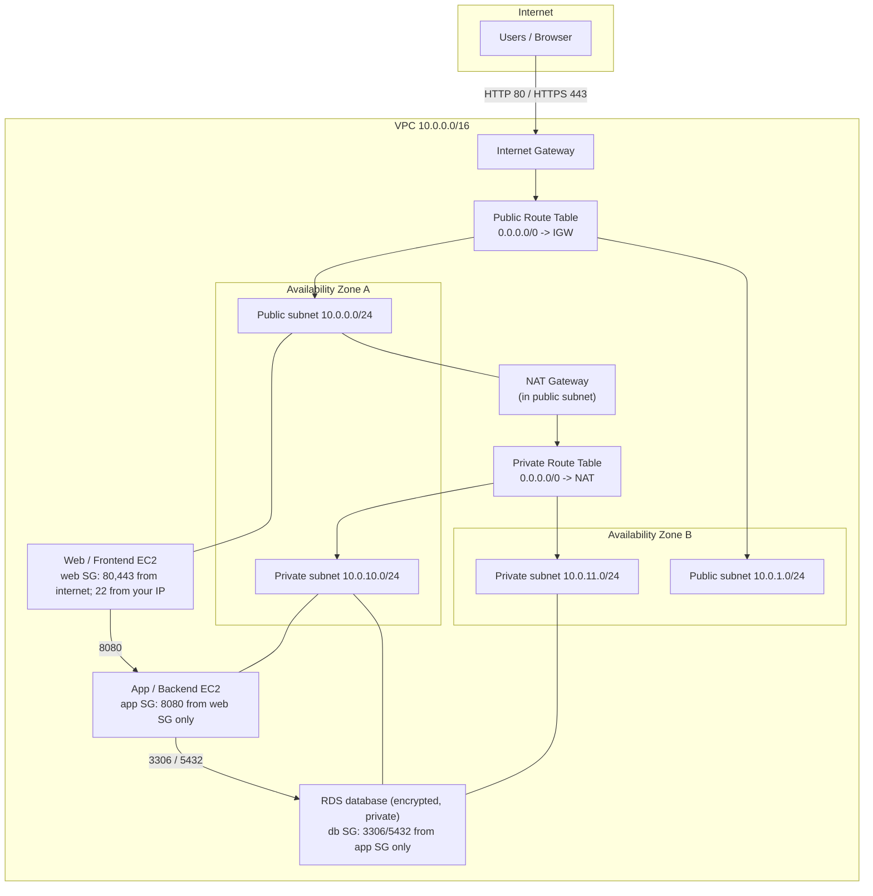
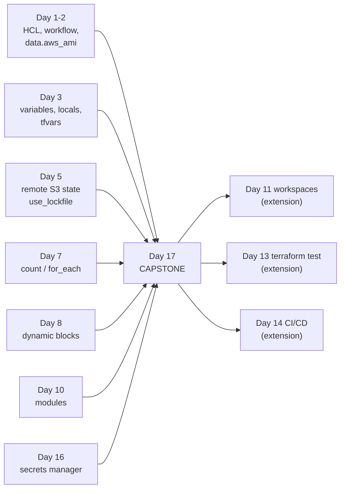
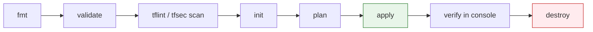

# Day 17 - Capstone Project

> **Goal:** bring every skill from the whole course together and build one complete, production-style AWS environment with Terraform - a real multi-tier architecture using modules, remote state, variables, secrets, and clean practices, from empty folder to `apply` to `destroy`.

> **Interactive demo:** [Capstone Architecture walkthrough](https://siva9800.github.io/devops-animations/terraform/capstone-architecture.html) - hover each tier to see which lesson built it.

---

## Why this lesson exists

Every day so far taught one idea in isolation: variables on Day 3, remote state on Day 5, modules on Day 10, secrets on Day 16. That is like learning individual chords. Today you play the whole song.

You will build a **3-tier architecture**: a public web (frontend) tier, a private application (backend) tier, and a private database tier - all wired together with least-privilege security groups, all described in reusable modules, all backed by remote state. This is the shape of a real starter environment a platform team would hand a new project.

There is accompanying code in the sibling folder `project/` (a working `main.tf`, plus `modules/vpc`, `modules/security_groups`, `modules/ec2`, `modules/rds`). This lesson walks through the same shape and explains every decision. The notes are self-contained - you can build it from here alone.

---

## Learning Objectives

By the end of Day 17 you will be able to:
- Design a multi-tier AWS network (VPC, public and private subnets, IGW, NAT) as code.
- Compose a root configuration from child modules with clean inputs and outputs.
- Wire tiers together with least-privilege security groups using `dynamic` blocks.
- Pull a database password from Secrets Manager instead of hardcoding it.
- Look up a fresh AMI with `data.aws_ami` and template user data with `templatefile`.
- Store state remotely in S3 with native locking (`use_lockfile`, no DynamoDB).
- Run a full quality gate: `fmt` -> `validate` -> lint/scan -> `init` -> `plan` -> `apply` -> verify -> `destroy`.
- Speak confidently about the whole Terraform workflow in an interview.

---

## The architecture we are building



Read the traffic path top to bottom: the internet reaches only the **web tier** in public subnets. The web tier talks to the **app tier** on port 8080. The app tier talks to the **database** on 3306 (MySQL) or 5432 (Postgres). The database accepts connections from nothing except the app security group, sits in private subnets, is encrypted, and is not publicly accessible. Private tiers reach the internet (for updates) only outbound through the NAT gateway.

---

## The whole course, on one map

Here is where each earlier lesson shows up in this single project. This is the payoff of the course.



| Course piece | Lesson | Where it appears in the capstone |
|---|---|---|
| Providers, workflow, `data.aws_ami` | Day 1-2 | Provider block; AMI lookup in the EC2 module |
| Variables, locals, `terraform.tfvars` | Day 3 | `variables.tf`, `locals` for tags, `terraform.tfvars` |
| Outputs | Day 4 | `outputs.tf` surfaces the web public IP and DB endpoint |
| Remote state (S3 + `use_lockfile`) | Day 5 | `backend.tf` |
| `count` / `for_each` | Day 7 | Subnets across AZs, per-tier module wiring |
| `dynamic` blocks | Day 8 | Security-group ingress rules generated from a map |
| Modules | Day 10 | `modules/vpc`, `modules/security_groups`, `modules/ec2`, `modules/rds` |
| Secrets Manager | Day 16 | DB password read from a `data` source, never in code |
| Provider/module version pinning | Day 12 | `required_providers` with `~> 5.0` |
| Workspaces / multi-env | Day 11 | Extension idea |
| `terraform test` | Day 13 | Extension idea |
| CI/CD pipeline | Day 14 | Runs this exact workflow |

---

## Project structure

A clean root that only wires modules together, and one folder per module.

```
day17-capstone/project/
├── backend.tf              # remote S3 state with native locking
├── main.tf                 # provider + calls to the 4 modules
├── variables.tf            # all root inputs
├── outputs.tf              # web IP, db endpoint, vpc id
├── terraform.tfvars        # real values (gitignored)
├── locals.tf               # common tags
├── .gitignore
├── scripts/
│   └── frontend_userdata.sh.tftpl   # templated user data
└── modules/
    ├── vpc/                # vpc, subnets, igw, nat, route tables
    │   ├── main.tf
    │   ├── variables.tf
    │   └── outputs.tf
    ├── security_groups/    # web, app, db SGs (dynamic ingress)
    │   ├── main.tf
    │   ├── variables.tf
    │   └── outputs.tf
    ├── ec2/                # ami lookup + instance + templatefile user_data
    │   ├── main.tf
    │   ├── variables.tf
    │   └── outputs.tf
    └── rds/                # db subnet group + encrypted db instance
        ├── main.tf
        ├── variables.tf
        └── outputs.tf
```

**Rule of thumb:** the root should read like a table of contents. If a module block has more than a handful of inputs, that is fine; if the root has raw resources mixed in, you have leaked module detail upward.

---

## The remote state backend (Day 5, the modern way)

State lives in S3. Locking is native - a lock file object next to the state - so **no DynamoDB table is required**. This needs Terraform 1.10 or newer.

```hcl
# backend.tf
terraform {
  backend "s3" {
    bucket       = "my-company-tf-state"
    key          = "capstone/terraform.tfstate"
    region       = "us-east-1"
    encrypt      = true
    use_lockfile = true # native S3 state locking, no DynamoDB
  }
}
```

The S3 bucket must exist before `init` (create it once by hand or with a small bootstrap config, and turn on versioning). `use_lockfile = true` tells Terraform to write a `.tflock` object during operations so two people cannot apply at once. This replaces the old `dynamodb_table` pattern you may see in older tutorials.

---

## The root configuration

The root wires everything. Note the tiers are separate module calls, the DB password comes from a secret, and tags are centralised in a local.

```hcl
# main.tf
terraform {
  required_version = ">= 1.10"
  required_providers {
    aws = {
      source  = "hashicorp/aws"
      version = "~> 5.0"
    }
  }
}

provider "aws" {
  region = var.aws_region
}

# Day 16: read the DB password from Secrets Manager - never hardcoded
data "aws_secretsmanager_secret" "db" {
  name = var.db_secret_name
}

data "aws_secretsmanager_secret_version" "db" {
  secret_id = data.aws_secretsmanager_secret.db.id
}

module "vpc" {
  source             = "./modules/vpc"
  vpc_cidr           = var.vpc_cidr
  availability_zones = var.availability_zones
  common_tags        = local.common_tags
  name_prefix        = local.name_prefix
}

module "security_groups" {
  source      = "./modules/security_groups"
  vpc_id      = module.vpc.vpc_id
  your_ip     = var.your_ip
  db_port     = var.db_port
  common_tags = local.common_tags
  name_prefix = local.name_prefix
}

module "web" {
  source            = "./modules/ec2"
  name              = "${local.name_prefix}-web"
  instance_type     = var.web_instance_type
  subnet_id         = module.vpc.public_subnet_ids[0]
  security_group_id = module.security_groups.web_sg_id
  assign_public_ip  = true
  user_data = templatefile("${path.module}/scripts/frontend_userdata.sh.tftpl", {
    app_private_ip = module.app.private_ip
  })
  common_tags = local.common_tags
}

module "app" {
  source            = "./modules/ec2"
  name              = "${local.name_prefix}-app"
  instance_type     = var.app_instance_type
  subnet_id         = module.vpc.private_subnet_ids[0]
  security_group_id = module.security_groups.app_sg_id
  assign_public_ip  = false
  common_tags       = local.common_tags
}

module "rds" {
  source            = "./modules/rds"
  name_prefix       = local.name_prefix
  db_name           = var.db_name
  db_username       = var.db_username
  db_password       = data.aws_secretsmanager_secret_version.db.secret_string
  engine            = var.db_engine
  engine_version    = var.db_engine_version
  instance_class    = var.db_instance_class
  subnet_ids        = module.vpc.private_subnet_ids
  security_group_id = module.security_groups.db_sg_id
  common_tags       = local.common_tags
}
```

```hcl
# locals.tf - Day 3
locals {
  name_prefix = "${var.project_name}-${var.environment}"
  common_tags = {
    Project     = var.project_name
    Environment = var.environment
    ManagedBy   = "terraform"
  }
}
```

---

## Module 1: the VPC (network)

Two public and two private subnets across two AZs, an internet gateway, one NAT gateway, and route tables. Subnets are created with `count` (Day 7) and CIDRs are carved with `cidrsubnet`.

```hcl
# modules/vpc/main.tf
resource "aws_vpc" "main" {
  cidr_block           = var.vpc_cidr
  enable_dns_hostnames = true
  enable_dns_support   = true
  tags                 = merge(var.common_tags, { Name = "${var.name_prefix}-vpc" })
}

resource "aws_internet_gateway" "main" {
  vpc_id = aws_vpc.main.id
  tags   = merge(var.common_tags, { Name = "${var.name_prefix}-igw" })
}

resource "aws_subnet" "public" {
  count                   = length(var.availability_zones)
  vpc_id                  = aws_vpc.main.id
  cidr_block              = cidrsubnet(var.vpc_cidr, 8, count.index)
  availability_zone       = var.availability_zones[count.index]
  map_public_ip_on_launch = true
  tags                    = merge(var.common_tags, { Name = "${var.name_prefix}-public-${count.index + 1}", Tier = "public" })
}

resource "aws_subnet" "private" {
  count             = length(var.availability_zones)
  vpc_id            = aws_vpc.main.id
  cidr_block        = cidrsubnet(var.vpc_cidr, 8, count.index + 10)
  availability_zone = var.availability_zones[count.index]
  tags              = merge(var.common_tags, { Name = "${var.name_prefix}-private-${count.index + 1}", Tier = "private" })
}

resource "aws_eip" "nat" {
  domain = "vpc"
  tags   = merge(var.common_tags, { Name = "${var.name_prefix}-nat-eip" })
}

resource "aws_nat_gateway" "main" {
  allocation_id = aws_eip.nat.id
  subnet_id     = aws_subnet.public[0].id
  depends_on    = [aws_internet_gateway.main]
  tags          = merge(var.common_tags, { Name = "${var.name_prefix}-nat" })
}

resource "aws_route_table" "public" {
  vpc_id = aws_vpc.main.id
  route {
    cidr_block = "0.0.0.0/0"
    gateway_id = aws_internet_gateway.main.id
  }
  tags = merge(var.common_tags, { Name = "${var.name_prefix}-public-rt" })
}

resource "aws_route_table" "private" {
  vpc_id = aws_vpc.main.id
  route {
    cidr_block     = "0.0.0.0/0"
    nat_gateway_id = aws_nat_gateway.main.id
  }
  tags = merge(var.common_tags, { Name = "${var.name_prefix}-private-rt" })
}

resource "aws_route_table_association" "public" {
  count          = length(aws_subnet.public)
  subnet_id      = aws_subnet.public[count.index].id
  route_table_id = aws_route_table.public.id
}

resource "aws_route_table_association" "private" {
  count          = length(aws_subnet.private)
  subnet_id      = aws_subnet.private[count.index].id
  route_table_id = aws_route_table.private.id
}
```

The module exposes `vpc_id`, `public_subnet_ids`, and `private_subnet_ids` as outputs so the other modules can consume them.

---

## Module 2: security groups (least privilege with dynamic, Day 8)

Three groups. The web group takes its public ports from a map and builds ingress with a `dynamic` block. The app and db groups reference other security groups by ID rather than opening CIDRs - that is the least-privilege trick.

```hcl
# modules/security_groups/main.tf
variable "web_ingress" {
  type = map(number)
  default = {
    http  = 80
    https = 443
  }
}

resource "aws_security_group" "web" {
  name        = "${var.name_prefix}-web-sg"
  description = "Web tier - public HTTP/HTTPS"
  vpc_id      = var.vpc_id

  dynamic "ingress" {
    for_each = var.web_ingress
    content {
      description = "${ingress.key} from internet"
      from_port   = ingress.value
      to_port     = ingress.value
      protocol    = "tcp"
      cidr_blocks = ["0.0.0.0/0"]
    }
  }

  ingress {
    description = "SSH from admin IP only"
    from_port   = 22
    to_port     = 22
    protocol    = "tcp"
    cidr_blocks = [var.your_ip]
  }

  egress {
    from_port   = 0
    to_port     = 0
    protocol    = "-1"
    cidr_blocks = ["0.0.0.0/0"]
  }
  tags = merge(var.common_tags, { Name = "${var.name_prefix}-web-sg" })
}

resource "aws_security_group" "app" {
  name        = "${var.name_prefix}-app-sg"
  description = "App tier - only from web SG"
  vpc_id      = var.vpc_id

  ingress {
    description     = "App port from web tier only"
    from_port       = 8080
    to_port         = 8080
    protocol        = "tcp"
    security_groups = [aws_security_group.web.id]
  }

  egress {
    from_port   = 0
    to_port     = 0
    protocol    = "-1"
    cidr_blocks = ["0.0.0.0/0"]
  }
  tags = merge(var.common_tags, { Name = "${var.name_prefix}-app-sg" })
}

resource "aws_security_group" "db" {
  name        = "${var.name_prefix}-db-sg"
  description = "DB tier - only from app SG"
  vpc_id      = var.vpc_id

  ingress {
    description     = "DB port from app tier only"
    from_port       = var.db_port # 3306 MySQL or 5432 Postgres
    to_port         = var.db_port
    protocol        = "tcp"
    security_groups = [aws_security_group.app.id]
  }
  tags = merge(var.common_tags, { Name = "${var.name_prefix}-db-sg" })
}
```

The database group has **no egress and no CIDR ingress**: nothing on the internet, and nothing in the VPC except the app tier, can reach it. That is exactly what an auditor wants to see.

---

## Module 3: the EC2 tier (AMI lookup + templatefile)

The instance module never takes a hardcoded AMI - it looks one up per Day 1. User data is rendered with `templatefile` so we can inject values (like the app's private IP).

```hcl
# modules/ec2/main.tf
data "aws_ami" "al2023" {
  most_recent = true
  owners      = ["amazon"]
  filter {
    name   = "name"
    values = ["al2023-ami-*-x86_64"]
  }
}

resource "aws_instance" "this" {
  ami                         = data.aws_ami.al2023.id
  instance_type               = var.instance_type
  subnet_id                   = var.subnet_id
  vpc_security_group_ids      = [var.security_group_id]
  associate_public_ip_address = var.assign_public_ip
  user_data                   = var.user_data

  root_block_device {
    volume_size = var.root_volume_size
    volume_type = "gp3"
    encrypted   = true
  }

  metadata_options {
    http_tokens = "required" # enforce IMDSv2
  }

  tags = merge(var.common_tags, { Name = var.name })
}
```

The `frontend_userdata.sh.tftpl` template is plain shell with `${...}` placeholders that `templatefile` fills in:

```bash
#!/bin/bash
dnf install -y nginx
echo "Backend is at ${app_private_ip}:8080" > /usr/share/nginx/html/index.html
systemctl enable --now nginx
```

---

## Module 4: RDS (private, encrypted, password from a secret)

The database sits in a subnet group made from the private subnets, is encrypted at rest, is not publicly accessible, and gets its password passed in from the Secrets Manager data source in the root - never a literal.

```hcl
# modules/rds/main.tf
resource "aws_db_subnet_group" "main" {
  name       = "${var.name_prefix}-db-subnet-group"
  subnet_ids = var.subnet_ids
  tags       = merge(var.common_tags, { Name = "${var.name_prefix}-db-subnet-group" })
}

resource "aws_db_instance" "main" {
  identifier             = "${var.name_prefix}-db"
  engine                 = var.engine         # "mysql" or "postgres"
  engine_version         = var.engine_version
  instance_class         = var.instance_class
  allocated_storage      = var.allocated_storage
  db_name                = var.db_name
  username               = var.db_username
  password               = var.db_password    # arrives from Secrets Manager, root passes it in
  db_subnet_group_name   = aws_db_subnet_group.main.name
  vpc_security_group_ids  = [var.security_group_id]

  storage_encrypted       = true   # encryption at rest
  publicly_accessible     = false  # never reachable from the internet
  multi_az                = var.multi_az
  backup_retention_period = var.backup_retention_period
  skip_final_snapshot     = var.skip_final_snapshot

  tags = merge(var.common_tags, { Name = "${var.name_prefix}-db" })
}
```

> Mark `db_password` as `sensitive = true` in `variables.tf` so it never prints in plan output. The value still lands in state, which is exactly why the state bucket is encrypted and private.

---

## The deployment workflow

Same heartbeat as Day 1, now with a quality gate in front. In a real team the whole sequence runs in the Day 14 CI pipeline on every pull request (plan) and on merge (apply).



```bash
# 0. one-time: create the S3 state bucket (versioned) and the DB secret
aws secretsmanager create-secret --name capstone/db-password \
  --secret-string "$(openssl rand -base64 20)"

# 1. format and static-check
terraform fmt -recursive
terraform validate

# 2. lint and security scan (optional but recommended)
tflint
tfsec .        # or: trivy config .

# 3. wire up the remote backend and download providers/modules
terraform init

# 4. preview - read every created/changed/destroyed line
terraform plan -out=tfplan

# 5. build it
terraform apply tfplan

# 6. verify (below), then tear it down when done
terraform destroy
```

---

## Hands-On Lab: build the whole environment

**Prereqs:** `aws configure` done, Terraform 1.10+, and a versioned S3 bucket for state.

```bash
# 1. Get the accompanying code
cd day17-capstone/project

# 2. Create the DB password secret (one time)
aws secretsmanager create-secret --name capstone/db-password \
  --secret-string "$(openssl rand -base64 20)"

# 3. Fill in terraform.tfvars
cat > terraform.tfvars <<'EOF'
aws_region         = "us-east-1"
project_name       = "shopfast"
environment        = "dev"
vpc_cidr           = "10.0.0.0/16"
availability_zones = ["us-east-1a", "us-east-1b"]
your_ip            = "203.0.113.10/32"
db_secret_name     = "capstone/db-password"
db_engine          = "mysql"
db_port            = 3306
db_name            = "appdb"
db_username        = "appadmin"
EOF

# 4. Quality gate
terraform fmt -recursive
terraform validate

# 5. Init (connects to the S3 backend) and preview
terraform init
terraform plan -out=tfplan

# 6. Build - roughly 5-10 minutes, RDS is the slow part
terraform apply tfplan

# 7. Verify (see below)

# 8. Clean up so you stop paying
terraform destroy
```

**Success check:**
- `terraform output web_public_ip` returns an address; open it in a browser and the web tier responds.
- In the console, the VPC has 2 public + 2 private subnets across 2 AZs, one IGW, one NAT.
- The RDS instance shows "Publicly accessible: No" and "Encryption: Enabled".
- The db security group inbound rule lists the app SG as the source, not a CIDR.
- After `destroy`, the VPC, instances, and RDS are all gone (the S3 state bucket and the secret remain - those were created outside this config).

---

## Good-practices checklist (all applied here)

| Practice | How the capstone does it |
|---|---|
| Consistent tags | `local.common_tags` merged into every resource |
| Encryption everywhere | EBS `encrypted = true`, RDS `storage_encrypted = true`, S3 state `encrypt = true` |
| Least-privilege SGs | App/DB accept traffic from a source SG, not `0.0.0.0/0` |
| No hardcoded secrets | DB password read from Secrets Manager `data` source, `sensitive = true` |
| No hardcoded AMIs | `data.aws_ami` lookup in the EC2 module |
| Pinned versions | `required_version >= 1.10`, provider `~> 5.0` |
| Remote, locked state | S3 backend with `use_lockfile = true` |
| Private data tier | RDS `publicly_accessible = false`, private subnets only |
| IMDSv2 enforced | `metadata_options { http_tokens = "required" }` |
| Secrets out of Git | `.gitignore` covers `*.tfstate*`, `.terraform/`, `*.tfvars` |

```
# .gitignore
*.tfstate
*.tfstate.*
.terraform/
*.tfvars
tfplan
```

---

## Extension ideas (where to go next)

- **Add an ALB + Auto Scaling Group.** Replace the single web instance with a launch template + `aws_autoscaling_group` behind an `aws_lb`, so the web tier self-heals and scales. The SGs barely change.
- **Multi-environment (Day 11).** Use workspaces or a `dev`/`stage`/`prod` tfvars-per-env layout so the same modules build every environment with different sizes.
- **Automated tests (Day 13).** Add a `tests/` folder with `terraform test` to assert the RDS is never publicly accessible and the web SG opens exactly 80/443.
- **CI/CD (Day 14).** Wire the fmt -> validate -> plan -> apply sequence into a pipeline: plan on pull request, apply on merge to main, with the state bucket shared by the team.

---

## Common Mistakes

1. **Using DynamoDB for state locking.** Modern Terraform (1.10+) locks natively with `use_lockfile = true`. You do not need a DynamoDB table; remove it if you copied an old backend block.
2. **Hardcoding the DB password in `.tf` or `.tfvars`.** Read it from Secrets Manager with a `data` source and mark the variable `sensitive`. A password in Git history is a breach.
3. **Opening the database security group to a CIDR.** The db SG should list the app SG as its only source. If you see `cidr_blocks` on a database rule, tighten it.
4. **Putting the RDS in public subnets or `publicly_accessible = true`.** Databases belong in private subnets, unreachable from the internet.
5. **Leaking resources into the root module.** The root should only call modules and wire outputs to inputs. Raw `aws_instance`/`aws_vpc` blocks in the root defeat the point of modules.
6. **Forgetting the state bucket must exist before `init`.** The S3 backend cannot create its own bucket; bootstrap it once.

---

## Quick Self-Check

1. In this architecture, which tier is the only one reachable from the internet, and how do the private tiers reach the internet outbound?
2. How does the database security group stay least-privilege without listing any CIDR block?
3. What replaced DynamoDB for state locking, and which Terraform version introduced it?
4. Where does the database password come from at apply time, and why is that better than a variable in `terraform.tfvars`?
5. Why does the EC2 module use `data.aws_ami` instead of an AMI ID passed in as a variable?

<details>
<summary>Answers</summary>

1. Only the web/frontend tier in the public subnets is reachable from the internet (via the IGW). The private app and database tiers reach the internet outbound only through the NAT gateway, and nothing can initiate a connection to them from outside.
2. Its ingress rule sets `security_groups = [app_sg.id]` instead of `cidr_blocks`. Only resources attached to the app security group can connect - no IP range is opened.
3. Native S3 state locking via `use_lockfile = true`, introduced in Terraform 1.10. It writes a lock object in the state bucket, so a separate DynamoDB table is no longer needed.
4. It is read at apply time from AWS Secrets Manager through a `data.aws_secretsmanager_secret_version` source and passed into the RDS module. Unlike a `.tfvars` value it is never stored in the repo, so it stays out of Git history.
5. AMI IDs are region-specific and get retired over time. `data.aws_ami` always finds the newest matching image in the current region, so the module stays portable and never boots a stale image.
</details>

---

## Summary

- You built a real 3-tier AWS environment - public web, private app, private encrypted database - entirely as code.
- Every earlier lesson showed up: variables and locals, remote state with native locking, `count` and `dynamic`, modules, and Secrets Manager.
- Security is baked in: least-privilege SGs by reference, encryption at rest everywhere, no public database, no hardcoded secrets or AMIs, pinned versions.
- The workflow is a quality gate - fmt, validate, lint/scan, init, plan, apply, verify, destroy - and it drops straight into a CI/CD pipeline.

### You have completed the course

Seventeen days ago you launched a single server by hand. Today you stood up a production-shaped, multi-tier environment from an empty folder with one `apply`. That is a genuine platform-engineering skill.

| You can now... | Interview topic you can speak to |
|---|---|
| Design and code a multi-tier VPC | Public vs private subnets, IGW vs NAT, route tables |
| Compose infrastructure from modules | Reuse, inputs/outputs, root-as-table-of-contents |
| Manage shared, locked remote state | S3 backend, `use_lockfile`, why state matters |
| Handle secrets safely | Secrets Manager data sources, `sensitive`, state encryption |
| Apply least-privilege networking | SG-to-SG references, no wide-open CIDRs |
| Keep code clean and safe | fmt/validate, tflint/tfsec, version pinning, `.gitignore` |
| Ship through automation | plan-on-PR, apply-on-merge CI/CD pipelines |

Take the capstone, add an ALB and Auto Scaling Group, wire it into a pipeline, and you have a portfolio project worth talking about. Well done.

**Back to:** [Terraform course home](../README.md)
