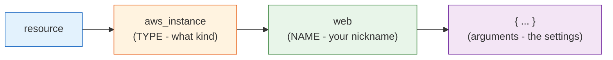
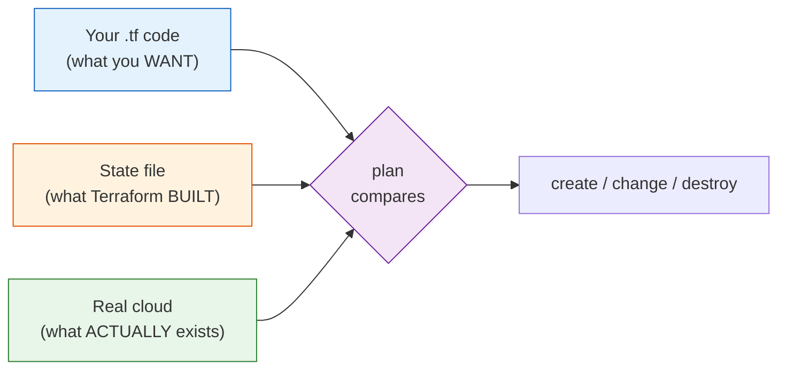

# Terraform - Day 2: Providers, Resources, State & Variables

> **Goal:** Understand the four building blocks you'll use every single day - **providers** (which cloud), **resources** (what to build), **state** (Terraform's memory), and **variables** (avoid repeating yourself) - and write cleaner, reusable code.

---

## What problem does this solve?

On Day 1 you launched a server by hardcoding everything into one file. That's fine for a demo, but real projects need to:

- Work across **different clouds** (AWS, Azure, Google) - that's **providers**.
- Build **many things** that relate to each other - that's **resources**.
- **Remember** what was already built so Terraform doesn't recreate it - that's **state**.
- Avoid copy-pasting the same value (region, instance size) everywhere - that's **variables**.

Day 2 turns your one-off script into something maintainable.

---

## Learning Objectives

By the end of Day 2 you will be able to:

- Explain what a **provider** is and configure one
- Define multiple **resources** and understand resource addresses
- Describe what the **state file** is and why it matters
- Use **input variables** (and `terraform.tfvars`) to remove hardcoded values
- Return useful info with **outputs**

---

## Providers - the adapter plug for each cloud

### Real-world analogy: the travel adapter plug

When you travel, your laptop charger doesn't fit foreign sockets - you need a **travel adapter** for each country (UK, EU, US). The adapter translates between your plug and the local socket.

A **provider** is Terraform's travel adapter. Terraform itself doesn't know how to talk to AWS, Azure, or Google. The **AWS provider** translates your `.tf` instructions into AWS API calls; the **Azure provider** does the same for Azure. Different cloud, different adapter - same Terraform underneath.

```hcl
terraform {
  required_providers {
    aws = {
      source  = "hashicorp/aws"   # where to download the adapter from
      version = "~> 5.0"          # use any 5.x version
    }
  }
}

provider "aws" {
  region = "us-east-1"            # configure the adapter
}
```

**In plain English:**
- `required_providers` - *"I need the AWS adapter, version 5-something."* `~> 5.0` means "5.0 and up, but not 6.0" (safe minor upgrades only).
- `provider "aws"` - *"Configure that adapter to operate in `us-east-1`."*

> You can use **multiple providers at once** (e.g. AWS + Cloudflare) in the same project. Each is its own adapter.

---

## Resources - the things you actually build

A **resource** is any real object Terraform manages: a server, a database, a network, a DNS record.

```hcl
resource "aws_instance" "web" {
  ami           = data.aws_ami.amazon_linux.id
  instance_type = "t2.micro"
  tags = { Name = "web-server" }
}

data "aws_ami" "amazon_linux" {
  most_recent = true
  owners      = ["amazon"]
  filter {
    name   = "name"
    values = ["al2023-ami-*-x86_64"]
  }
}
```

The syntax is always the same shape:



You refer to a resource elsewhere by its **address**: `aws_instance.web.id`, `aws_instance.web.public_ip`, etc. (You'll use this heavily on Day 3 for dependencies.)

> **Reminder from Day 1:** don't hardcode an AMI like `ami-0c55b159cbfafe1f0` - AMI IDs differ per region and get retired. The `data "aws_ami"` lookup above always grabs a fresh, region-correct image.

---

## State - Terraform's memory

### Real-world analogy: a shop's inventory list

A store keeps an **inventory list**: "We have 12 chairs, 4 tables, 1 desk." Before ordering more, the manager checks the list so they don't accidentally double-order.

Terraform keeps a similar list in a file called **`terraform.tfstate`**. It records *every resource Terraform has created and its current details*.

When you run `terraform plan`, Terraform compares **three things**:



That's how Terraform knows to do **nothing** when reality already matches your code - it remembers via state.

**Key state facts for beginners:**
- State lives in `terraform.tfstate` by default (local file).
- It can contain **secrets** (passwords, keys) in plain text, so **never commit it to Git**.
- On real teams, state is stored **remotely** (e.g. an S3 bucket) so everyone shares one source of truth - that's a Day 5 topic.
- **Never hand-edit the state file.** If you must change it, use `terraform state` commands.

---

## Variables - stop repeating yourself

### Real-world analogy: a recipe with adjustable servings

A good recipe says *"serves 4"* at the top, and the ingredients scale from that one number. Change `4` to `8` and everything adjusts. You don't rewrite the whole recipe.

**Variables** are that single adjustable number. Define a value once, use it everywhere.

**1. Declare the variable (`variables.tf`):**
```hcl
variable "region" {
  description = "AWS region to deploy into"
  type        = string
  default     = "us-east-1"
}

variable "instance_type" {
  description = "Size of the EC2 instance"
  type        = string
  default     = "t2.micro"
}
```

**2. Use it (`main.tf`):**
```hcl
provider "aws" {
  region = var.region
}

resource "aws_instance" "web" {
  ami           = data.aws_ami.amazon_linux.id
  instance_type = var.instance_type
}
```

**3. (Optional) Override defaults in `terraform.tfvars`:**
```hcl
region        = "eu-west-1"
instance_type = "t3.small"
```

Now switching region or size is a **one-line change** - no hunting through your code.

**How Terraform picks a variable's value** (highest priority wins, top of this list beats the ones below it):
1. `-var` / `-var-file` on the command line (e.g. `terraform apply -var="region=us-west-2"`) - beats everything
2. `*.auto.tfvars` files (loaded automatically, alphabetical order)
3. `terraform.tfvars` (the default auto-loaded file)
4. Environment variables (`TF_VAR_region=us-west-2`)
5. `default` in the `variable` block (the fallback)

If none of these supply a value and there is no `default`, Terraform prompts you interactively. You will go deeper on precedence on Day 4.

> Keep secret values out of `.tfvars` files committed to Git. Add `*.tfvars` to `.gitignore`.

---

## Outputs - show me the useful bits

After Terraform builds something, you usually want a value back (like the server's public IP). **Outputs** print these.

```hcl
output "public_ip" {
  description = "Public IP of the web server"
  value       = aws_instance.web.public_ip
}
```

After `apply`, Terraform prints:
```
public_ip = "54.221.10.5"
```
You can also fetch it anytime with `terraform output public_ip`.

---

## Common Mistakes

1. **Committing `terraform.tfstate` to Git.** It can hold secrets and causes nasty conflicts on teams. `.gitignore` it.
2. **Hand-editing the state file.** This corrupts Terraform's "memory." Use `terraform state` subcommands instead.
3. **Hardcoding values everywhere** instead of using variables - then changing region means editing 20 places.
4. **Putting secrets in `terraform.tfvars` and committing it.** Add `*.tfvars` to `.gitignore`; use a secrets manager for real secrets.
5. **Pinning no provider version** (`version = "~> 5.0"`). Without it, a future provider release can silently change behaviour and break your code.

---

## Hands-On Lab: refactor Day 1 with variables & outputs

```bash
mkdir tf-day2 && cd tf-day2
```

Create these files:

**`variables.tf`**
```hcl
variable "region" {
  type    = string
  default = "us-east-1"
}

variable "instance_type" {
  type    = string
  default = "t2.micro"
}
```

**`main.tf`**
```hcl
terraform {
  required_providers {
    aws = {
      source  = "hashicorp/aws"
      version = "~> 5.0"
    }
  }
}

provider "aws" {
  region = var.region
}

data "aws_ami" "amazon_linux" {
  most_recent = true
  owners      = ["amazon"]
  filter {
    name   = "name"
    values = ["al2023-ami-*-x86_64"]
  }
}

resource "aws_instance" "web" {
  ami           = data.aws_ami.amazon_linux.id
  instance_type = var.instance_type
  tags          = { Name = "day2-web" }
}
```

**`outputs.tf`**
```hcl
output "public_ip" { value = aws_instance.web.public_ip }
```

Then run the workflow:
```bash
terraform init
terraform plan
terraform apply        # type yes
terraform output       # see the public IP
terraform destroy      # type yes - clean up!
```

**Success check:** changing `instance_type` in `terraform.tfvars` and re-running `plan` shows Terraform wants to *change* (not recreate from scratch) - proof that state remembers your server.

---

## Quick Self-Check

1. Using the adapter-plug analogy, what is a **provider**?
2. What does the **state file** store, and why must it stay out of Git?
3. What three things does `terraform plan` compare?
4. Give one reason to use a **variable** instead of a hardcoded value.
5. What's the difference between a **`resource`** block and a **`data`** block?

<details>
<summary>Answers</summary>

1. The plugin that translates Terraform's instructions into a specific cloud's API calls (like a travel adapter per country).
2. It records every resource Terraform created and its details (sometimes including secrets); committing it leaks secrets and breaks teams.
3. Your code (desired), the state file (what it built), and the real cloud (what actually exists).
4. One-line changes, no copy-paste, reusable across environments - e.g. change region in one place.
5. `resource` **creates/manages** something; `data` only **reads/looks up** existing info (like a fresh AMI ID).
</details>

---

## Summary

- **Providers** = adapters that let Terraform talk to a specific cloud.
- **Resources** = the real things you build; reference them by address (`aws_instance.web.id`).
- **State** (`terraform.tfstate`) = Terraform's inventory/memory - keep it private, never hand-edit.
- **Variables** = one adjustable number reused everywhere; **outputs** = the useful values you get back.

**Next up ->** [Day 3: Practical Deploy, Dependencies & Professional File Structure](../day3/readme.md)
