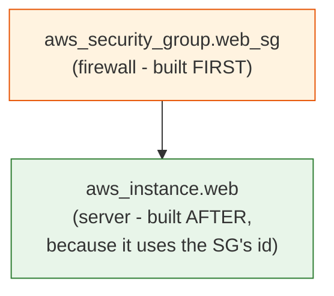
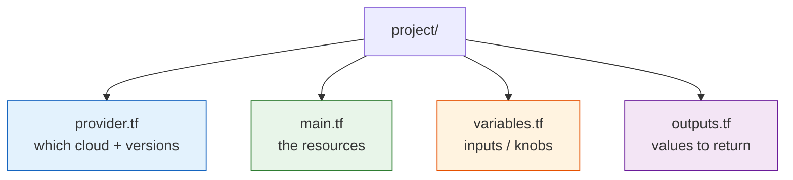

# Terraform - Day 3: Practical Deploy, Dependencies & Professional File Structure

> **Goal:** Deploy something *real* - a web server protected by a firewall (security group) - while learning how Terraform automatically figures out the **order** to build things, and how professionals **organise their files**.

---

## What problem does this solve?

So far you've built a single server. But real infrastructure is made of **pieces that depend on each other**: a server needs a firewall rule, a firewall rule belongs to a network, a database needs a subnet group, and so on.

How does Terraform know to build the firewall *before* attaching it to the server? And how do professionals keep their code readable when it grows to dozens of resources? Day 3 answers both - plus you'll meet `terraform console`, a handy "calculator" for testing expressions.

---

## Learning Objectives

By the end of Day 3 you will be able to:

- Reference one resource from another (**resource references**)
- Understand **implicit dependencies** and the build-order graph
- Deploy an EC2 instance + a **security group** (firewall) together
- Split code into the professional layout: **`provider.tf` / `main.tf` / `variables.tf` / `outputs.tf`**
- Use **`terraform console`** to test expressions interactively

---

## Resource references & dependencies

### Real-world analogy: building a house in the right order

You can't hang a door before the wall frame exists, and you can't put up walls before the foundation is poured. The order is forced by **what depends on what**. A builder doesn't need a separate schedule - the dependencies *imply* the order.

Terraform works the same way. When **Resource A uses a value from Resource B**, Terraform automatically knows *B must be built first*. You never write the order manually - Terraform reads the references and builds a **dependency graph**.

### How a reference creates a dependency

```hcl
resource "aws_security_group" "web_sg" {
  name = "web-sg"
  ingress {
    from_port   = 80
    to_port     = 80
    protocol    = "tcp"
    cidr_blocks = ["0.0.0.0/0"]   # allow web traffic from anywhere
  }
  egress {
    from_port   = 0
    to_port     = 0
    protocol    = "-1"            # allow all outbound
    cidr_blocks = ["0.0.0.0/0"]
  }
}

resource "aws_instance" "web" {
  ami                    = data.aws_ami.amazon_linux.id
  instance_type          = var.instance_type
  vpc_security_group_ids = [aws_security_group.web_sg.id]   #  the reference!
  tags                   = { Name = "web-server" }
}
```

The line `vpc_security_group_ids = [aws_security_group.web_sg.id]` means *"attach the security group's ID to this server."* Because the server **references** the security group, Terraform builds them in the correct order automatically:



This is an **implicit dependency** - created just by referencing a value. (There's also `depends_on` for rare cases where there's no value to reference, but prefer implicit dependencies.)

> **Still don't hardcode the AMI!** Notice `ami = data.aws_ami.amazon_linux.id` - the same `data` lookup from earlier days. A literal like `ami-0c55b159cbfafe1f0` is region-specific and gets retired by Amazon, so it breaks over time. The lookup stays fresh in any region.

---

## Professional file structure

A beginner puts everything in one `main.tf`. That works, but as projects grow it becomes a wall of text. Professionals split code by **purpose** - Terraform reads *all* `.tf` files in a folder and merges them, so splitting is free and only helps readability.



| File | What goes in it | Analogy |
|------|------------------|---------|
| `provider.tf` | `terraform { required_providers }` + `provider` config | The "settings" page |
| `main.tf` | Your `resource` and `data` blocks | The actual build instructions |
| `variables.tf` | `variable` declarations (the adjustable knobs) | The recipe's "serves N" line |
| `outputs.tf` | `output` blocks (values you want back) | The receipt printed at the end |

> It's just convention - Terraform doesn't *require* these names. But following it means any teammate instantly knows where to look.

### The four files for our web server

**`provider.tf`**
```hcl
terraform {
  required_providers {
    aws = { source = "hashicorp/aws", version = "~> 5.0" }
  }
}

provider "aws" {
  region = var.region
}
```

**`variables.tf`**
```hcl
variable "region" {
  description = "AWS region"
  type        = string
  default     = "us-east-1"
}

variable "instance_type" {
  description = "EC2 instance size"
  type        = string
  default     = "t2.micro"
}
```

**`main.tf`**
```hcl
data "aws_ami" "amazon_linux" {
  most_recent = true
  owners      = ["amazon"]
  filter {
    name   = "name"
    values = ["al2023-ami-*-x86_64"]
  }
}

resource "aws_security_group" "web_sg" {
  name = "web-sg"
  ingress {
    from_port   = 80
    to_port     = 80
    protocol    = "tcp"
    cidr_blocks = ["0.0.0.0/0"]
  }
  egress {
    from_port   = 0
    to_port     = 0
    protocol    = "-1"
    cidr_blocks = ["0.0.0.0/0"]
  }
}

resource "aws_instance" "web" {
  ami                    = data.aws_ami.amazon_linux.id
  instance_type          = var.instance_type
  vpc_security_group_ids = [aws_security_group.web_sg.id]
  tags                   = { Name = "web-server" }
}
```

**`outputs.tf`**
```hcl
output "public_ip" {
  description = "Public IP to reach the web server"
  value       = aws_instance.web.public_ip
}

output "security_group_id" {
  value = aws_security_group.web_sg.id
}
```

---

## terraform console - your expression calculator

`terraform console` is an interactive sandbox where you can test expressions, inspect values, and try functions **without applying anything**. It's perfect for "what would this evaluate to?"

```bash
terraform console
```
Then type expressions:
```hcl
> var.region
"us-east-1"

> upper("hello")
"HELLO"

> aws_instance.web.public_ip        # works after apply (reads state)
"54.221.10.5"

> [for n in ["a","b"] : upper(n)]   # try list comprehensions
[ "A", "B" ]
```
Type `exit` (or Ctrl+D) to leave. Great for debugging variables and learning built-in functions safely.

---

## The workflow (same four commands, real deploy)

```bash
terraform fmt        # tidy all .tf files
terraform validate   # catch syntax errors early
terraform init       # download the AWS provider
terraform plan       # preview: should show SG + instance being created
terraform apply      # type yes - builds firewall, THEN server
terraform output     # grab the public IP
# ... visit http://<public_ip> if you installed a web server ...
terraform destroy    # type yes - tears down server, THEN firewall
```

Notice Terraform builds the security group **before** the instance, and destroys them in the **reverse** order - all worked out from the dependency graph, no manual ordering needed.

---

## Common Mistakes

1. **Manually managing build order** with lots of `depends_on`. Let references create dependencies automatically; only use `depends_on` when there's genuinely no value to reference.
2. **A security group that allows nothing.** Forgetting an `egress` rule (or the right `ingress` port) means your server can't be reached or can't reach out. Double-check ports.
3. **Opening `0.0.0.0/0` on sensitive ports** (like SSH 22) to the whole internet. Fine for port 80 demos; dangerous for admin access. Restrict to your IP in real life.
4. **Committing `.tfstate` / secrets to Git** (still the #1 mistake). `.gitignore` them.
5. **Hardcoding a stale AMI** like `ami-0c55b159cbfafe1f0` instead of a `data` lookup or variable.

---

## Hands-On Lab: deploy a firewalled web server

```bash
mkdir tf-day3 && cd tf-day3
# create the four files above: provider.tf, variables.tf, main.tf, outputs.tf

terraform fmt
terraform validate
terraform init
terraform plan        # confirm: 1 security group + 1 instance to add

terraform apply       # type yes

terraform output public_ip   # note the IP

# explore values without changing anything:
terraform console
> aws_security_group.web_sg.id
> aws_instance.web.private_ip
exit

terraform destroy     # type yes - clean up
```

**Success check:** the `plan` output lists the security group *and* the instance, and during `apply` the security group is created first. `terraform console` returns the SG id and IPs from state.

---

## Quick Self-Check

1. How does Terraform decide which resource to build first?
2. What is an **implicit dependency**, and how do you create one?
3. Which file conventionally holds your `provider` configuration?
4. Name one thing `terraform console` is useful for.
5. Why is `data "aws_ami"` better than writing `ami-0c55b159cbfafe1f0`?

<details>
<summary>Answers</summary>

1. It builds a dependency graph from resource references and creates things in the required order (and destroys in reverse).
2. A dependency created simply because one resource references another's value (e.g. the instance uses the security group's `id`).
3. `provider.tf` (by convention; Terraform merges all `.tf` files regardless).
4. Testing expressions/functions and inspecting variable or resource values without applying anything.
5. The `data` lookup always finds a fresh, region-correct image; a hardcoded AMI is region-specific and gets retired over time.
</details>

---

## Summary

- Terraform builds an automatic **dependency graph** from resource references - no manual ordering.
- A reference like `aws_security_group.web_sg.id` creates an **implicit dependency** (firewall -> server).
- Professionals split code into **`provider.tf` / `main.tf` / `variables.tf` / `outputs.tf`** for readability (Terraform merges them all).
- **`terraform console`** lets you test expressions and inspect values safely.

**Next up ->** [Day 4: Variables & Outputs (Deep Dive)](../day4-variables-outputs/notes.md)
