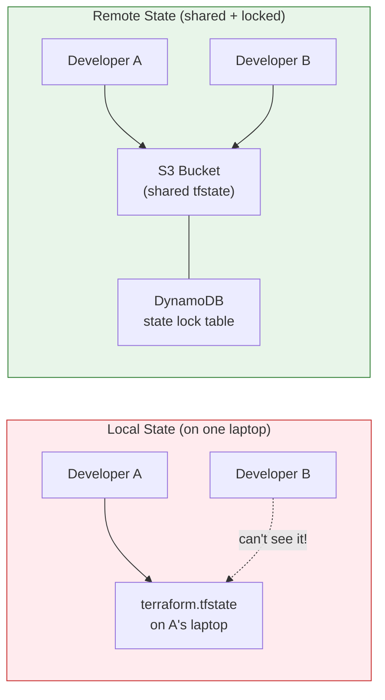
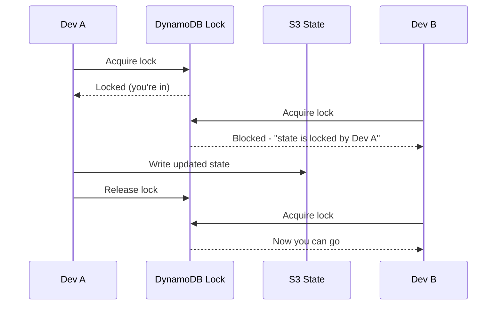

# Terraform - Day 5: State Management

> **Goal:** Understand how Terraform *remembers* what it has already built, why that memory (the **state file**) is so important, and how to store it safely and share it across a team using a **remote backend** with **locking**.

When you run `terraform apply`, Terraform creates real things in the cloud. But how does it know, next time, that those things already exist - so it doesn't create duplicates? The answer is the **state file**. It's Terraform's memory. Lose it or corrupt it, and Terraform forgets what it owns. Today we learn to protect that memory.

---

## Learning Objectives

By the end of this day, you will be able to:

- Explain what `terraform.tfstate` is and **why** it exists.
- Describe the danger of **local state** for teams.
- Set up a **remote backend** (AWS S3) for shared state.
- Add **state locking** with a **DynamoDB** table and explain why it matters.
- Use the core state commands: `list`, `show`, `mv`, `rm`, `import`.
- Avoid the classic state disasters that corrupt infrastructure.

---

## Real-World Analogy

Imagine Terraform is a **building manager** keeping a **logbook** of every room they've built.

| Concept | Logbook analogy |
|---|---|
| **State file** | The **logbook** listing every room, its number, and its current condition. |
| **`terraform plan`** | The manager **compares** the logbook to your new blueprint and says "I'll add 2 rooms, repaint 1". |
| **Local state** | The logbook lives **in one person's desk drawer**. If they're on holiday (or it burns), nobody else can manage the building. |
| **Remote state (S3)** | The logbook is kept in a **shared, fireproof office** everyone can access. |
| **State locking (DynamoDB)** | A **"Room Occupied / Do Not Disturb" sign** hung on the logbook while someone edits it - so two managers don't scribble over each other at the same time. |

The whole point of Day 5: move the logbook out of the desk drawer, into the shared office, and put a "do not disturb" sign on it during edits.

---

## What is the State File?

Every time Terraform runs, it writes/updates `terraform.tfstate` (a JSON file). It maps:

```
your code  ───  real-world resource IDs
"aws_instance.web"  ───  "i-0abc123def456"
```

Without it, Terraform would have no idea that `aws_instance.web` already exists as `i-0abc123def456`, and might try to create a second one.

```bash
# After an apply, the state file appears locally:
terraform.tfstate            # current state
terraform.tfstate.backup     # the previous version (auto-saved)
```

> The state file often contains **secrets in plain text** (passwords, keys, even `sensitive` values). Treat it like a password file.

---

## Local State vs Remote State



**Why local state breaks teams:**

- Only **one person** has the file. Others can't run plan/apply correctly.
- If two people run apply at once, they **corrupt** each other's changes.
- If the laptop dies, the **memory is gone**.

**Remote state fixes all three:** the file lives in shared storage (S3), and a lock (DynamoDB) ensures only one apply runs at a time.

---

## Remote Backend: S3 + DynamoDB Locking

This is the most common production setup on AWS. **S3 stores** the state; **DynamoDB locks** it.

```hcl
# backend.tf
terraform {
  backend "s3" {
    bucket         = "my-company-terraform-state"   # S3 bucket to hold the file
    key            = "prod/network/terraform.tfstate" # path inside the bucket
    region         = "us-east-1"
    dynamodb_table = "terraform-state-locks"        #  enables locking
    encrypt        = true                           # encrypt state at rest
  }
}
```

The bucket and table must exist **first**. Create them once (often in a separate "bootstrap" config):

```hcl
resource "aws_s3_bucket" "state" {
  bucket = "my-company-terraform-state"
}

# Keep old versions so you can recover from a bad apply
resource "aws_s3_bucket_versioning" "state" {
  bucket = aws_s3_bucket.state.id
  versioning_configuration {
    status = "Enabled"
  }
}

resource "aws_dynamodb_table" "locks" {
  name         = "terraform-state-locks"
  billing_mode = "PAY_PER_REQUEST"
  hash_key     = "LockID"        # MUST be named exactly "LockID"

  attribute {
    name = "LockID"
    type = "S"
  }
}
```

```bash
terraform init     # migrates local state to the S3 backend (asks for confirmation)
```

### Why locking matters

Without a lock, picture two engineers running `terraform apply` at the same moment:



DynamoDB acts as the **"Do Not Disturb" sign**. The second apply waits instead of writing on top of the first - preventing a corrupted, half-written state file.

---

## State Commands

Use these to inspect and surgically edit what Terraform tracks. **Read** commands are safe; **write** commands (`mv`, `rm`, `import`) change the logbook - use carefully.

```bash
#  List every resource Terraform tracks
terraform state list

#  Show full details of one resource (IDs, attributes)
terraform state show aws_instance.web

#  Rename / move a resource in state (e.g. after refactoring code)
terraform state mv aws_instance.web aws_instance.frontend

#  Forget a resource WITHOUT destroying the real thing
terraform state rm aws_instance.web

#  Adopt an existing real resource into Terraform's management
terraform import aws_instance.web i-0abc123def456
```

| Command | What it does | Destroys real resource? |
|---|---|---|
| `state list` | Lists tracked resources | No |
| `state show` | Shows one resource's details | No |
| `state mv` | Renames/moves in state | No |
| `state rm` | Removes from state only (Terraform "forgets" it) | **No** (the cloud resource keeps running) |
| `import` | Brings an existing cloud resource under management | No |

> **`import` vs `rm`:** `import` *adopts* something that already exists in the cloud so Terraform starts managing it. `rm` does the opposite - Terraform stops tracking it, but the resource keeps running unmanaged.

---

## Common Mistakes

1. **Editing `terraform.tfstate` by hand.** It's JSON, so it's tempting - but one wrong bracket or stale ID and Terraform will try to recreate or destroy live resources. Use `state mv`/`rm`/`import` instead, never a text editor.
2. **No locking, so corruption.** Without DynamoDB locking, two simultaneous applies can write over each other and leave the state half-finished. Always configure `dynamodb_table`.
3. **Committing state to git.** State contains secrets in plain text and is constantly changing. Add `*.tfstate*` to `.gitignore` and use a remote backend. Never push it to a repo.
4. **No versioning on the S3 bucket.** If a bad apply mangles state, versioning lets you roll back. Without it, recovery is painful.
5. **Using `terraform state rm` thinking it deletes the resource.** It only removes the bookkeeping entry - the cloud resource (and its bill) keeps running.

---

## Hands-On Lab

**Goal:** Move from local state to a locked remote backend.

1. Start with a simple config (one S3 bucket or EC2 instance) using **local** state. Run `terraform apply` and open `terraform.tfstate` - see your resource recorded inside.
2. Create a state bucket (with versioning) and a DynamoDB table with `LockID` hash key (use the HCL above).
3. Add a `backend "s3"` block pointing at them, then run `terraform init` and confirm the migration prompt.
4. Run `terraform state list` and `terraform state show <resource>` to inspect remote state.
5. **Test locking:** start `terraform apply` and, while it waits, open a second terminal and run another `terraform plan`/`apply` - observe the **"state is locked"** message.
6. Practice `terraform state mv` to rename a resource after editing its name in code (so Terraform doesn't destroy + recreate it).
7. Try `terraform import` to adopt a manually-created resource.

---

## Quick Self-Check

1. In one sentence, what is the purpose of the state file?
2. Name two reasons local state is dangerous for a team.
3. What role does **S3** play in the remote backend, and what role does **DynamoDB** play?
4. What actually happens to a real EC2 instance when you run `terraform state rm` on it?
5. Why should you never edit `terraform.tfstate` with a text editor?

<details>
<summary>Answers</summary>

1. It is Terraform's memory: it maps the resources in your code to the real cloud resource IDs so Terraform knows what already exists.
2. Only one person has the file (others cannot run plan/apply correctly); two simultaneous applies corrupt each other; and if the laptop dies the state is lost.
3. **S3** stores the shared state file so the whole team uses one source of truth; **DynamoDB** holds the lock (the "do not disturb" sign) so only one apply writes at a time.
4. Nothing happens to the instance - it keeps running (and billing). `state rm` only removes the bookkeeping entry, so Terraform stops tracking it.
5. One wrong bracket or a stale ID can make Terraform try to destroy or recreate live resources. Use `state mv`/`rm`/`import` instead.
</details>

---

## Summary

- The **state file** is Terraform's memory, mapping your code to real cloud resource IDs.
- **Local state** is fine solo but breaks teams - no sharing, no safety, single point of failure.
- A **remote backend (S3)** shares the state; a **DynamoDB lock table** prevents two people writing at once (the "do not disturb" sign).
- Enable **encryption** and **versioning** on the state bucket.
- Use `state list`/`show` to inspect, and `mv`/`rm`/`import` to surgically manage state - never a text editor.
- Never commit state to git; treat it as secret.

**Next up -> [Day 6: Meta-Arguments & Lifecycle](../day6/readme.md)** - how to create many resources at once and control how Terraform creates, replaces, and protects them.
