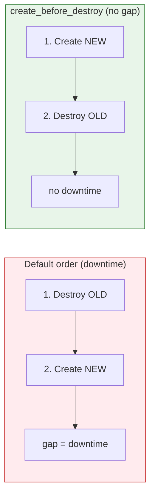

# Terraform - Lifecycle Rules (Deep Dive)

> **Goal:** Go deeper than the Day 6 overview into the `lifecycle` block - exactly *when* each rule fires, what order Terraform does things in, and the traps to avoid. This is a companion to **[Day 6: Meta-Arguments & Lifecycle](./notes.md)**.

By default, Terraform makes sensible decisions about creating, updating, replacing, and destroying resources. But sometimes its defaults aren't what you want - you need zero-downtime swaps, a guard on a production database, or you need it to stop fighting an external tool. The `lifecycle` block lets you override those defaults.

---

## Learning Objectives

By the end of this note, you will be able to:

- Explain Terraform's **default** create/update/replace/destroy behavior.
- Use **`create_before_destroy`** for zero-downtime replacement and understand its ordering.
- Use **`prevent_destroy`** to guard critical resources.
- Use **`ignore_changes`** to coexist with external tools and drift.
- Combine rules safely and avoid the common traps.

---

## Real-World Analogy

Think of a building manager replacing a critical piece of equipment.

| Lifecycle rule | Analogy |
|---|---|
| **(default) destroy-then-create** | Switch off and remove the old generator, *then* install the new one - **the lights go out** in between. |
| **`create_before_destroy`** | Install and start the new generator **first**, then remove the old one - **lights never flicker**. |
| **`prevent_destroy`** | A **padlock + "DO NOT REMOVE"** sign on the main server rack. |
| **`ignore_changes`** | A note saying **"the cleaning crew adjusts this thermostat - don't reset it back"** . |

---

## Terraform's Default Behavior (what you're overriding)

When you change a resource's code, Terraform decides one of:

1. **Update in place** - the attribute can be changed without recreating (e.g. a tag).
2. **Replace (destroy + create)** - the attribute is immutable, so the resource must be rebuilt. **By default the OLD is destroyed first, then the NEW is created.**
3. **No change** - nothing to do.

A "replace" is shown in plans as `-/+` ("destroy and then create replacement"). The lifecycle block lets you change rule #2's *order*, or block destroys entirely.

---

## `create_before_destroy`

Flips the replacement order: **create the new resource first, then destroy the old one.**

```hcl
resource "aws_instance" "web" {
  ami           = var.ami_id
  instance_type = "t2.micro"

  lifecycle {
    create_before_destroy = true
  }
}
```



**When to use it:** resources behind a load balancer, anything where a moment of "not existing" causes an outage.

**Watch out for:**
- **Name/ID clashes.** If the resource has a unique name, the new and old can't coexist (e.g. a fixed `name = "web"`). Use names Terraform can vary, or let it auto-generate.
- It can **temporarily double** your resource count (and cost) during the swap.

---

## `prevent_destroy`

A hard guard. If any plan would destroy this resource, Terraform **errors and refuses** to continue.

```hcl
resource "aws_db_instance" "prod" {
  identifier     = "prod-database"
  engine         = "postgres"
  instance_class = "db.t3.medium"

  lifecycle {
    prevent_destroy = true
  }
}
```

Trying `terraform destroy` (or any change that forces replacement) gives:

```
Error: Instance cannot be destroyed
  Resource aws_db_instance.prod has lifecycle.prevent_destroy set, but the plan
  calls for this resource to be destroyed.
```

**Key points:**
- It protects against **accidental** deletion - a deliberate speed bump for production data stores.
- To genuinely delete it, you must **remove the rule first**, then apply. (That extra step is the whole point.)
- It does **not** prevent *updates*, only *destroys*. And note a forced **replacement** counts as a destroy, so it'll block those too.

> `prevent_destroy` only works while the resource is in your config. If you delete the whole resource block, Terraform plans a destroy *before* it reads the lifecycle rule - so don't rely on it as your only safety net. Pair it with S3 state versioning (Day 5) and backups.

---

## `ignore_changes`

Tells Terraform to **stop reacting** to changes on specific attributes - usually because something *outside* Terraform manages them.

```hcl
resource "aws_instance" "web" {
  ami           = var.ami_id
  instance_type = "t2.micro"

  tags = {
    Name = "web"
  }

  lifecycle {
    ignore_changes = [
      tags["LastScanned"],   # a security tool stamps this - leave it alone
      ami,                   # don't replace just because a newer AMI appears
    ]
  }
}
```

```hcl
# Ignore EVERYTHING after creation (use sparingly):
lifecycle {
  ignore_changes = all
}
```

**Common real scenarios:**
- An **autoscaling group** changes `desired_capacity` - you don't want Terraform resetting it every apply.
- An external **tagging/compliance tool** adds tags.
- A managed service rotates a value you don't control.

**Watch out for:**
- `ignore_changes = all` means Terraform stops managing *those attributes entirely* - real, intended changes are silenced too. Always prefer a **specific list**.
- You can target nested keys like `tags["Owner"]`.

---

## Combining Rules

You can set multiple rules in one block:

```hcl
resource "aws_instance" "app" {
  ami           = var.ami_id
  instance_type = "t3.small"

  lifecycle {
    create_before_destroy = true
    prevent_destroy       = false       # can't be true if you expect replacements
    ignore_changes        = [tags]
  }
}
```

> `prevent_destroy = true` and routine replacement are in tension - if a change forces a replace, `prevent_destroy` will block it. Use `prevent_destroy` for things that should essentially never be rebuilt (databases, state buckets), not for frequently-changing compute.

---

## Common Mistakes

1. **`create_before_destroy` with a hard-coded unique name** - new and old can't coexist, so the apply fails. Let names vary or use `name_prefix`-style attributes.
2. **Relying on `prevent_destroy` after deleting the resource block** - it can't protect what's no longer in your config. Keep backups + state versioning.
3. **`ignore_changes = all` everywhere** - you lose drift detection and Terraform effectively stops managing the resource's attributes.
4. **Expecting `lifecycle` values to be dynamic** - these are mostly **literal** settings (you can't compute `prevent_destroy` from a variable in older Terraform). Keep them simple and explicit.
5. **Forgetting a forced replacement triggers `prevent_destroy`** - changing an immutable field on a protected resource will error, not silently update.

---

## Hands-On Lab

1. Add `create_before_destroy = true` to an instance, change its `ami`, run `terraform plan`, and confirm the plan shows **create then destroy** (not destroy then create).
2. Add `prevent_destroy = true` to a "database" resource and run `terraform destroy` - read the exact error message.
3. Remove the `prevent_destroy` rule and confirm the destroy now succeeds (proving it's an intentional two-step).
4. Add `ignore_changes = [tags]`, change a tag manually in the cloud console, and verify `terraform plan` reports **no changes**.
5. Switch to `ignore_changes = all`, change `instance_type` in code, and observe that Terraform now **ignores** even that intentional change - then revert (this shows why `all` is dangerous).

---

## Quick Self-Check

1. In a default replacement, which happens first - destroy or create? How does `create_before_destroy` change that?
2. Why might `create_before_destroy` fail for a resource with a fixed unique name?
3. What does Terraform do when a plan would destroy a `prevent_destroy = true` resource?
4. Why is `ignore_changes = all` discouraged compared to a specific list?
5. Does `prevent_destroy` protect a resource if you delete its entire block from the config? Why or why not?

---

## Summary

- **Default replacement** = destroy old, then create new (a downtime gap).
- **`create_before_destroy`** flips that order for zero-downtime swaps - mind name clashes and temporary double cost.
- **`prevent_destroy`** is a hard guard against accidental deletion of critical resources; remove it deliberately to delete.
- **`ignore_changes`** lets Terraform coexist with external tools/drift - be specific, avoid `all`.
- Combine rules thoughtfully; `prevent_destroy` conflicts with frequent replacements.

**Back to [Day 6: Meta-Arguments & Lifecycle](./notes.md)** | **Next up -> [Day 7: Modules](../day7-modules/notes.md)**
