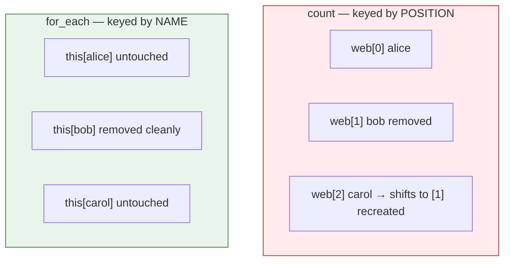
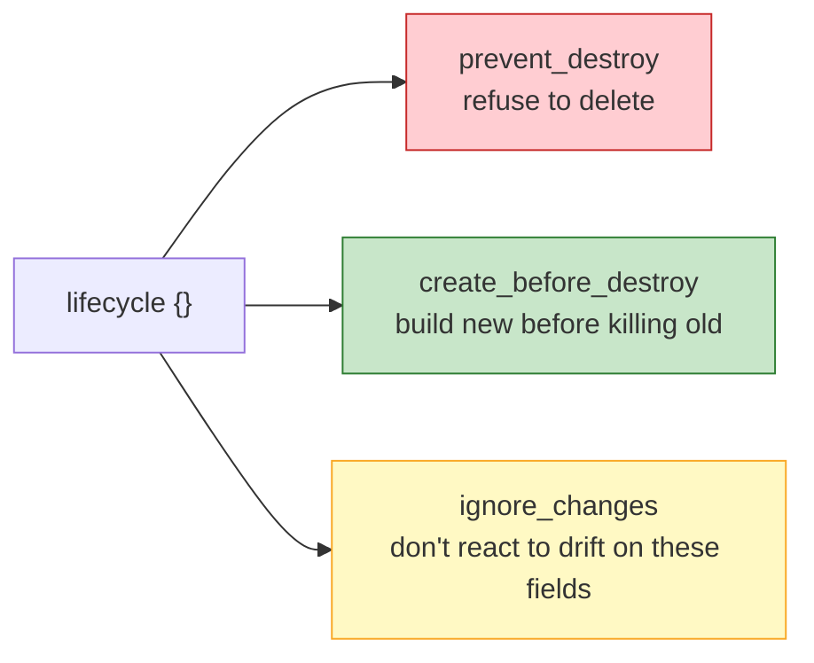

# Terraform - Day 6: Meta-Arguments & Lifecycle

> **Goal:** Learn how to create **many** resources without copy-pasting (`count`, `for_each`), and how to **control** the way Terraform creates, replaces, and protects them with the **`lifecycle`** block.

So far, every resource block has created **one** thing. But real infrastructure has 3 web servers, 5 users, 10 buckets. Copy-pasting blocks is error-prone and ugly. **Meta-arguments** let one block create many resources. And the **lifecycle** block lets you override Terraform's default "destroy and recreate" behavior - including putting a "do not delete" guard on your production database.

---

## Learning Objectives

By the end of this day, you will be able to:

- Use **`count`** to create N identical copies of a resource.
- Use **`for_each`** to create a labelled set of resources from a map or set.
- Choose correctly between `count` and `for_each`.
- Use the **`lifecycle`** block: `prevent_destroy`, `create_before_destroy`, `ignore_changes`.
- Avoid the classic pitfalls of index-based resources.

---

## Real-World Analogy

Think about making copies of a document.

| Concept | Analogy |
|---|---|
| **`count`** | A **photocopier** set to "make 3 copies". You get copy #0, #1, #2 - identical, identified only by position/number. |
| **`for_each`** | A set of **labelled folders** - "HR", "Finance", "Legal". Each is identified by its **name**, not a number. Remove "Finance" and the others stay exactly where they are. |
| **`prevent_destroy`** | A **"DO NOT DELETE" sticker** on the production database. Terraform refuses to destroy it, even if you ask. |
| **`create_before_destroy`** | When replacing a tyre, you **fit the new one before removing the old** - no downtime / no gap. |
| **`ignore_changes`** | A **"hands off this field" note** - e.g. "don't touch the tags an external tool keeps editing." |

---

## `count` - make N identical copies

Add `count = N` and Terraform creates N instances. Each gets an index via `count.index` (starts at 0).

```hcl
resource "aws_instance" "web" {
  count         = 3                      # creates 3 servers
  ami           = "ami-0c55b159cbfafe1f0"
  instance_type = "t2.micro"

  tags = {
    Name = "web-server-${count.index}"   # web-server-0, web-server-1, web-server-2
  }
}
```

Reference them as a list: `aws_instance.web[0]`, `aws_instance.web[1]`, etc.

```hcl
output "first_server_ip" {
  value = aws_instance.web[0].public_ip
}

output "all_server_ips" {
  value = aws_instance.web[*].public_ip   # [*] = "all of them"
}
```

**Conditional creation** - a common `count` trick (create 0 or 1):

```hcl
resource "aws_instance" "bastion" {
  count = var.enable_bastion ? 1 : 0     # only created if the flag is true
  ami           = "ami-0c55b159cbfafe1f0"
  instance_type = "t2.micro"
}
```

### The `count` gotcha

`count` resources are tracked by **position**. If you have 3 and remove the **middle** one, indexes shift - Terraform sees #1 and #2 as "changed" and may destroy/recreate them. That's why `for_each` is often safer.

---

## `for_each` - a labelled set

`for_each` iterates over a **map** or **set**, identifying each resource by a stable **key** instead of a number.

```hcl
resource "aws_iam_user" "team" {
  for_each = toset(["alice", "bob", "carol"])
  name     = each.key                  # each.key = "alice", "bob", ...
}
```

With a **map**, you get both `each.key` and `each.value`:

```hcl
variable "buckets" {
  type = map(string)
  default = {
    logs    = "us-east-1"
    backups = "us-west-2"
  }
}

resource "aws_s3_bucket" "this" {
  for_each = var.buckets
  bucket   = "myapp-${each.key}"       # myapp-logs, myapp-backups
  region   = each.value                # the value for that key
}
```

Reference them by key: `aws_s3_bucket.this["logs"]`.

### Why `for_each` beats `count` for changing sets

Remove `"bob"` from the set and **only Bob** is destroyed - alice and carol are untouched, because they're keyed by name, not position.



### `count` vs `for_each` - when to use which

| Use **`count`** when... | Use **`for_each`** when... |
|---|---|
| Resources are **identical** | Resources differ by **name/key** |
| You just need **N copies** | You have a **map/set** of distinct items |
| Conditional create (`? 1 : 0`) | The set may **change over time** |
| Order doesn't matter | You want **stable, non-shifting** identities |

> **Rule of thumb:** if you ever might add/remove items from the middle, prefer `for_each`.

---

## The `lifecycle` Block

The `lifecycle` block lives **inside** a resource and changes how Terraform handles create/replace/destroy.



### `prevent_destroy` - the "do not delete" sticker

```hcl
resource "aws_db_instance" "prod" {
  identifier     = "prod-database"
  engine         = "postgres"
  instance_class = "db.t3.medium"

  lifecycle {
    prevent_destroy = true     # Terraform will ERROR if anything tries to destroy this
  }
}
```

If you (or a colleague) accidentally run `terraform destroy`, Terraform **refuses** and errors out for this resource. A lifesaver for production databases. (To actually delete it, you must remove the rule first - an intentional speed bump.)

### `create_before_destroy` - zero-downtime replacement

By default, when a change forces replacement, Terraform **destroys the old resource first, then creates the new** - leaving a gap of downtime. Flip the order:

```hcl
resource "aws_instance" "web" {
  ami           = var.ami_id
  instance_type = "t2.micro"

  lifecycle {
    create_before_destroy = true   # new one is ready BEFORE old is removed
  }
}
```

Great for resources behind a load balancer where you can't afford a gap.

### `ignore_changes` - hands off these fields

Sometimes an external process (an autoscaler, a tagging tool) modifies a resource after Terraform creates it. Without this, every `plan` would try to "fix" it back. Tell Terraform to ignore those fields:

```hcl
resource "aws_instance" "web" {
  ami           = var.ami_id
  instance_type = "t2.micro"

  tags = {
    Name = "web"
  }

  lifecycle {
    ignore_changes = [
      tags,            # ignore tag changes made outside Terraform
      ami,             # don't replace just because a newer AMI exists
    ]
  }
}

# Or ignore EVERYTHING after creation:
# lifecycle { ignore_changes = all }
```

> There's a deeper companion note on these rules: **[lifecycle_rules.md](./lifecycle_rules.md)**.

---

## Common Mistakes

1. **Using `count` for a set that changes.** Removing a middle item shifts indexes and recreates unrelated resources. Use `for_each` instead.
2. **`for_each` over a plain `list`.** `for_each` needs a **map** or a **set** - wrap lists with `toset(...)`, or you'll get a type error.
3. **Forgetting `prevent_destroy` is a hard wall.** You literally cannot `terraform destroy` it until you remove the rule. That's by design, but it surprises people during teardown.
4. **Overusing `ignore_changes = all`.** It silences *real* drift too, so Terraform stops managing those attributes. Be specific about which fields to ignore.
5. **Mixing `count` and `for_each` in the same resource.** You can use only **one** meta-argument per resource block.

---

## Hands-On Lab

**Goal:** Create multiple resources and control their lifecycle.

1. Create 3 EC2 instances with `count` and tag each `web-server-${count.index}`. Run `plan`, then change `count` to 2 and observe which one is removed.
2. Recreate the same idea with `for_each` over `toset(["a", "b", "c"])`. Remove `"b"` and confirm `a` and `c` are **untouched** in the plan.
3. Add a conditional resource: `count = var.enable_bastion ? 1 : 0`. Toggle the variable and watch it appear/disappear.
4. Add `prevent_destroy = true` to a "database" resource, then try `terraform destroy` and read the error.
5. Add `create_before_destroy = true` to an instance, change its `ami`, and note the new order in the plan (create then destroy).
6. Add `ignore_changes = [tags]`, manually change a tag in the console, and confirm `plan` shows **no change**.

---

## Quick Self-Check

1. What is the key difference in how `count` and `for_each` **identify** their resources?
2. Why can removing a middle item be safer with `for_each` than `count`?
3. What type must you pass to `for_each` (and what do you do with a list)?
4. What happens if you run `terraform destroy` on a resource with `prevent_destroy = true`?
5. Give a real scenario where `ignore_changes` is the right tool.

---

## Summary

- **`count`** = N identical copies, indexed by **number** (`count.index`). Great for "give me 3" and conditional `? 1 : 0`.
- **`for_each`** = a labelled set from a **map/set**, keyed by **name** (`each.key`/`each.value`). Safer when the set changes.
- **`lifecycle`** controls create/replace/destroy:
  - **`prevent_destroy`** = "do not delete" guard.
  - **`create_before_destroy`** = build new before killing old (no downtime).
  - **`ignore_changes`** = hands off specific fields edited outside Terraform.
- Use only **one** meta-argument (`count` *or* `for_each`) per resource.

**Next up → [Day 7: Modules](../day7/readme.md)** - package your reusable infrastructure into shareable building blocks.
