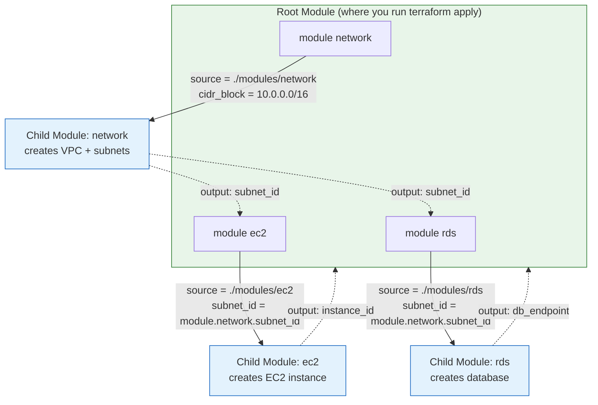

# Terraform - Day 7: Modules

> **Goal:** Stop copy-pasting Terraform code. Learn to package infrastructure into reusable **modules** you can call again and again - like functions in programming.

---

By Day 7 you can write Terraform that builds a VPC, an EC2 instance, a database. But if you needed that *same* setup for `dev`, `qa`, and `prod`, would you copy the files three times? That is a maintenance nightmare. **Modules** let you write the code **once** and reuse it everywhere with different inputs.

---

## Learning Objectives

By the end of Day 7 you will be able to:

- Explain what a **module** is and why it matters
- Tell the difference between a **root module** and a **child module**
- Pass **input variables** into a module and read its **outputs**
- Lay out a clean **module folder structure**
- Call a **local module** and a **Terraform Registry module**
- **Pin module versions** so upgrades never surprise you

---

## Real-World Analogy

Think of a module like a **LEGO kit** :

- A LEGO "race car kit" is a sealed box of pieces that always builds the same car. You can build it as many times as you want.
- You can build it in **red** or **blue** - same kit, different *input* (the colour).
- The finished car has things you can use elsewhere (its wheels) - those are the *outputs*.

Or think of a module like a **function in code**:

```text
result = make_server(size = "t3.micro", name = "web")
                                              
           module      input variable      input variable
```

You **call** the function with arguments (inputs), it does its work, and it **returns** values (outputs). A Terraform module is exactly that, but for cloud infrastructure.

---

## Root Module vs Child Module

This is the single most important idea today.

| Term | What it is | Analogy |
| ---- | ---------- | ------- |
| **Root module** | The folder where you run `terraform apply`. The "main" file. | The **main recipe** |
| **Child module** | A reusable folder the root *calls* to do part of the job. | A **sub-recipe** ("make the sauce") |
| **Registry module** | A child module someone else published online that you reuse. | A **store-bought sauce** |

> **Key insight:** Every Terraform project has *exactly one* root module (where you run commands) and *zero or more* child modules that it calls.



**Read the diagram top-to-bottom:** the root module passes **variables down** (solid arrows) and the child modules pass **outputs back up** (dotted arrows). Notice the EC2 and RDS modules *consume* the network module's output - that is how modules connect.

---

## Module Folder Structure

A child module is just a folder with `.tf` files. The convention is **three files**:

```text
modules/ec2/
│
├── main.tf        # the resources this module creates
├── variables.tf   # the INPUTS the module accepts
└── outputs.tf     # the values the module RETURNS
```

A full project looks like this:

```text
my-infra/
│
├── main.tf              # ROOT module - calls the child modules
├── variables.tf         # root-level inputs
├── outputs.tf           # root-level outputs
├── terraform.tfvars     # actual values
│
└── modules/             # reusable CHILD modules
    ├── network/
    │   ├── main.tf
    │   ├── variables.tf
    │   └── outputs.tf
    └── ec2/
        ├── main.tf
        ├── variables.tf
        └── outputs.tf
```

> Rule of thumb: **one module = one responsibility.** A "network" module, an "ec2" module, a "database" module. Don't build a giant do-everything module.

---

## Writing a Child Module

Let's build a small `ec2` child module. These three files live in `modules/ec2/`.

### 1 `modules/ec2/variables.tf` - the inputs

```hcl
variable "instance_type" {
  description = "EC2 size, e.g. t3.micro"
  type        = string
  default     = "t3.micro"
}

variable "ami_id" {
  description = "The AMI image ID to launch"
  type        = string
}

variable "name" {
  description = "A name tag for the instance"
  type        = string
}
```

### 2 `modules/ec2/main.tf` - the resources

```hcl
resource "aws_instance" "this" {
  ami           = var.ami_id          # value comes from the input variable
  instance_type = var.instance_type   # value comes from the input variable

  tags = {
    Name = var.name
  }
}
```

> Notice the module **never hardcodes** values - it reads everything from `var.*`. That is what makes it reusable.

### 3 `modules/ec2/outputs.tf` - the return values

```hcl
output "instance_id" {
  description = "The ID of the created EC2 instance"
  value       = aws_instance.this.id
}

output "private_ip" {
  description = "The private IP of the instance"
  value       = aws_instance.this.private_ip
}
```

---

## Calling a Module (the part you must know)

Now in the **root** `main.tf` we *call* that child module with a `module` block:

```hcl
module "web_server" {
  source = "./modules/ec2"   # WHERE the module lives

  # the INPUT variables we pass DOWN into the module
  ami_id        = "ami-0abcdef1234567890"
  instance_type = "t3.micro"
  name          = "web-server-1"
}
```

Breaking that down:

- `module "web_server"` - `web_server` is the **local name** you choose. You'll reference outputs through it.
- `source` - **required.** Tells Terraform where to find the module code.
- The other lines are the **inputs**, which match the `variable` blocks inside the module.

### Using a module's output

After the module runs, read its outputs with `module.<name>.<output>`:

```hcl
output "server_id" {
  value = module.web_server.instance_id   # module.<local name>.<output name>
}
```

You can also **wire one module's output into another module's input** - this is how real infrastructure connects:

```hcl
module "network" {
  source     = "./modules/network"
  cidr_block = "10.0.0.0/16"
}

module "web_server" {
  source        = "./modules/ec2"
  ami_id        = "ami-0abcdef1234567890"
  instance_type = "t3.micro"
  name          = "web-server-1"

  subnet_id = module.network.public_subnet_id   # output of one module feeds another module's input
}
```

> After adding or changing a `module` block you **must run `terraform init` again** so Terraform downloads/registers the module.

---

## Module Source Types

The `source` argument supports several locations:

### Local path (most common while learning)

```hcl
source = "./modules/vpc"
```

### Git repository

```hcl
source = "git::https://github.com/my-org/terraform-vpc.git//modules/vpc?ref=v1.2.0"
```

### Terraform Registry (community / official modules)

```hcl
module "vpc" {
  source  = "terraform-aws-modules/vpc/aws"
  version = "5.8.1"

  name = "my-vpc"
  cidr = "10.0.0.0/16"
}
```

---

## Module Versioning (Very Important)

When you use a **Registry** or **Git** module, always **pin a version**:

```hcl
module "vpc" {
  source  = "terraform-aws-modules/vpc/aws"
  version = "5.8.1"   # locked version
}
```

Why pin?

- **No surprise breakage** - the module author can publish a new version that changes behaviour. Pinning protects you.
- **Reproducible builds** - your teammate gets the exact same module you used.
- **Controlled upgrades** - *you* decide when to bump `5.8.1` to `5.9.0`, after testing.

> Leaving `version` off means "give me the latest" - which can break your `apply` overnight without you changing a single line.

You can also pin ranges:

```hcl
version = "~> 5.8"    # any 5.8.x, but not 5.9 or 6.0  (safe minor updates)
```

---

## Common Mistakes

1. **Writing all infrastructure in the root module.** Works for a demo, becomes unmaintainable fast. Break it into modules.
2. **Hardcoding values inside a child module** (e.g. a fixed AMI or subnet). Use `variable` blocks so the module is reusable.
3. **Forgetting `terraform init` after adding a module.** Terraform won't know the new module exists and `plan` will error.
4. **Not creating `outputs.tf`.** Without outputs, other modules can't consume your module's results - they're isolated and useless.
5. **No version pin on Registry/Git modules.** A new upstream release can silently break production.

---

## Hands-On Lab

**Goal:** Build a reusable EC2 module and call it twice.

1. Create the folder structure:
   ```text
   lab7/
   ├── main.tf
   └── modules/ec2/{main.tf, variables.tf, outputs.tf}
   ```
2. Fill `modules/ec2/` with the three files from the **Writing a Child Module** section above.
3. In root `main.tf`, call the module **twice** with different names:
   ```hcl
   module "web" {
     source = "./modules/ec2"
     ami_id = "ami-0abcdef1234567890"
     name   = "web"
   }

   module "worker" {
     source        = "./modules/ec2"
     ami_id        = "ami-0abcdef1234567890"
     name          = "worker"
     instance_type = "t3.small"
   }
   ```
4. Run `terraform init`, then `terraform plan`.
5. **Observe:** one module, two instances, zero copy-paste.
6. Add a root `output` that prints `module.web.instance_id`.

> No AWS account? Run `terraform validate` and `terraform plan` - you'll still see Terraform recognise both module instances.

---

## Quick Self-Check

1. What is the difference between a **root module** and a **child module**?
2. Which **two** files in a module define its inputs and its return values?
3. How do you read an output called `instance_id` from a module named `web`?
4. What command must you run after adding a new `module` block, and why?
5. Why should you always set `version` on a Registry module?

<details>
<summary>Answers</summary>

1. The **root** is the folder where you run `terraform apply`; a **child** is a reusable module the root *calls* via a `module` block.
2. `variables.tf` (inputs) and `outputs.tf` (return values).
3. `module.web.instance_id`.
4. `terraform init` - so Terraform downloads/registers the new module.
5. To prevent surprise breaking changes and keep builds reproducible.

</details>

---

## Summary

- A **module** = reusable Terraform code, like a LEGO kit or a function you call with arguments.
- **Root module** = where you run commands; **child module** = reusable folder it calls.
- Pass **inputs** with `variable` blocks, return values with `output` blocks.
- Call a module with `module "name" { source = "..." ... }` and read results via `module.name.output_name`.
- Use **local**, **Git**, or **Registry** sources - and **always pin versions** on remote modules.

**Next up →** [Day 8: Environments, Security & Best Practices](../day8-environments-security/notes.md) - now that you can reuse modules, learn how to safely run them across `dev` and `prod`.
