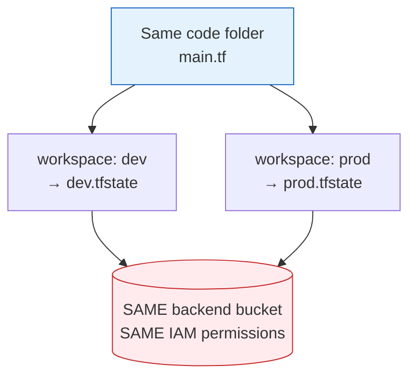
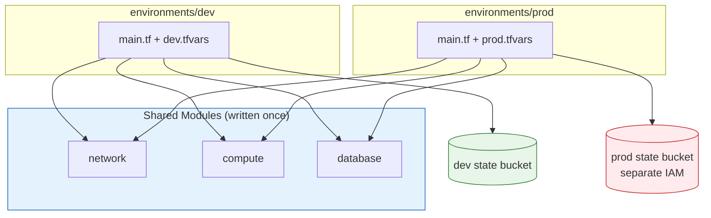

# Terraform - Day 8: Environments, Security & Best Practices

> **Goal:** Move from "Terraform user" to "production Terraform engineer." Learn to safely run the same code across `dev` and `prod`, keep secrets out of your code, and avoid the traps that wreck real teams.

---

So far you've built infrastructure and packaged it into modules. But real companies don't have just one environment - they have `dev`, `qa`, `staging`, and `prod`. You never test changes on production. Day 8 is about doing Terraform **safely and professionally**: isolating environments, protecting state, handling secrets, and knowing the anti-patterns to avoid.

---

## Learning Objectives

By the end of Day 8 you will be able to:

- Explain why **environment isolation** matters
- Use the **folder-per-environment** pattern (the industry standard)
- Understand **Terraform workspaces** - and honestly, their **limitations**
- Pass **environment-specific values** with `tfvars`
- **Handle secrets** correctly (and never commit them)
- Recognise common **anti-patterns** and why **provisioners** are discouraged

---

## Real-World Analogy

Think of environments like **kitchens in a restaurant** :

- The **test kitchen** (`dev`) is where chefs experiment. Burn a dish? No customer cares.
- The **main kitchen** (`prod`) serves paying customers. You only cook recipes that already passed the test kitchen.

And think of **workspaces** like **save-game slots** in a video game :

- You have one game (one set of code), but separate save files (`dev` save, `prod` save).
- The catch: all saves use the **same game disc and same settings**. If you tweak the disc, *every* save is affected. That shared-disc problem is exactly why workspaces are risky for production (more below).

---

## Part 1 - Why Environments Matter

An **environment** is a deployment stage:

```text
dev  →  qa  →  staging  →  prod
```

Environments differ in:

| Aspect | dev | prod |
| ------ | --- | ---- |
| Instance size | `t3.micro` (cheap) | `t3.large` (powerful) |
| Replicas | 1 | 3+ |
| Risk if broken | Low | Critical |
| Who can deploy | Any dev | Restricted / via pipeline |

The golden rule: **you never deploy straight to production.** You promote changes:

```text
Test in dev  →  Validate in qa  →  Deploy to prod
```

The big question: *how do you run the same Terraform code in multiple environments without them colliding?* There are two answers - workspaces (limited) and folders (recommended).

---

## Part 2 - Workspaces (and Their Limits)

### What are workspaces?

Workspaces let you keep **multiple state files in the same directory**, using the **same code**:

```bash
terraform workspace new dev
terraform workspace new prod
terraform workspace select dev
terraform apply
```

Terraform keeps a separate state per workspace, so `dev` resources and `prod` resources don't overwrite each other in state.



### Why workspaces are limited for production

Look at the diagram: both workspaces share **one backend and one set of permissions**. That's the problem.

- **Easy human error.** Forget to run `terraform workspace select dev` and you just applied test changes to **production**. One typo = outage.
- **Shared backend & IAM.** All workspaces use the same bucket and the same credentials. There's no *real* security boundary between `dev` and `prod`.
- **Awkward in CI/CD.** Pipelines must remember to switch workspaces - more state to track, more ways to get it wrong.
- **No per-env configuration of the backend itself.** You can't easily give prod a different bucket/region.

> **Use workspaces for:** learning, sandboxes, quick throwaway testing.
> **Avoid workspaces for:** production and enterprise setups. Use folders instead

---

## Part 3 - Folder-Per-Environment (Industry Standard)

The professional pattern: **one folder per environment**, each with its **own backend, state, and tfvars**, all reusing the **same modules**.

```text
terraform/
│
├── modules/                 #  shared, reusable building blocks
│   ├── network/
│   ├── compute/
│   └── database/
│
└── environments/
    ├── dev/
    │   ├── main.tf          # calls modules
    │   ├── backend.tf       # dev's OWN state bucket
    │   └── dev.tfvars       # dev values (small, cheap)
    │
    └── prod/
        ├── main.tf          # calls the SAME modules
        ├── backend.tf       # prod's OWN, SEPARATE state bucket
        └── prod.tfvars      # prod values (large, HA)
```



### How you deploy

```bash
# Deploy dev
cd environments/dev
terraform init
terraform apply -var-file="dev.tfvars"

# Deploy prod (completely separate state & permissions)
cd environments/prod
terraform init
terraform apply -var-file="prod.tfvars"
```

### Why this beats workspaces

| Feature | Benefit |
| ------- | ------- |
| **Separate state** per env | A `dev` mistake can't touch `prod` state |
| **Separate backend & IAM** | Real security boundary; prod creds aren't in dev |
| **Separate tfvars** | Clear, version-controlled config per env |
| **CI/CD friendly** | Each env is just a folder - easy, explicit pipelines |

---

## Part 4 - Environment-Specific tfvars

`tfvars` files let the **same code** produce **different infrastructure** per environment.

### `dev.tfvars`

```hcl
instance_type = "t3.micro"
replicas      = 1
environment   = "dev"
```

### `prod.tfvars`

```hcl
instance_type = "t3.large"
replicas      = 3
environment   = "prod"
```

Apply with the matching file:

```bash
terraform apply -var-file="dev.tfvars"
terraform apply -var-file="prod.tfvars"
```

> The `.tf` code never changes - only the **values** do. This is the heart of clean multi-environment Terraform.

---

## Part 5 - Secrets Handling

This is where beginners get burned. **Secrets must never live in your code or Git history.**

### What NOT to do

```hcl
#  NEVER DO THIS
resource "aws_db_instance" "db" {
  username = "admin"
  password = "SuperSecret123!"   #  now it's in Git forever
}
```

Even putting it in `prod.tfvars` is risky - `tfvars` files get committed by accident all the time.

> **Also remember:** any secret used by Terraform ends up in the **state file**. That's another reason your state backend must be **encrypted and access-controlled** (Day 5).

### What to do instead

**Option A - Inject at runtime via environment variables** (never hits disk in your repo):

```bash
export TF_VAR_db_password="$(read-from-secure-place)"
terraform apply
```

```hcl
variable "db_password" {
  type      = string
  sensitive = true   #  hides it from CLI output
}
```

**Option B - Pull from a secrets manager** (best for production):

```hcl
data "aws_secretsmanager_secret_version" "db" {
  secret_id = "prod/db/password"
}

resource "aws_db_instance" "db" {
  password = data.aws_secretsmanager_secret_version.db.secret_string
}
```

Recommended secret stores:

- **AWS Secrets Manager** / **SSM Parameter Store**
- **Azure Key Vault**
- **HashiCorp Vault**

And always add a `.gitignore`:

```text
*.tfvars
*.tfstate
*.tfstate.backup
.terraform/
```

### Protect critical resources

Stop accidental deletion of databases and storage:

```hcl
resource "aws_db_instance" "db" {
  # ...
  lifecycle {
    prevent_destroy = true   #  terraform destroy will refuse to delete this
  }
}
```

---

## Part 6 - Anti-Patterns (What NOT To Do)

1. **Local state in production.** No locking, no sharing, easy to lose. → Use a remote backend (Day 5).
2. **Mixing environments in one state.** `dev` + `prod` in the same state file means a dev mistake can destroy prod. → Separate state per env.
3. **Hardcoding values** (AMI IDs, subnet IDs, passwords). → Use variables and `data` sources.
4. **Giant monolithic `.tf` files.** Unreadable, un-reviewable, merge-conflict heaven. → Use modules (Day 7).
5. **Sharing one IAM role for all environments.** → Least privilege; separate credentials for dev and prod.

---

## Part 7 - Provisioners (Why To Avoid)

**Provisioners** run scripts on a resource *after* Terraform creates it - e.g. SSH in and install packages.

```hcl
# Discouraged - shown so you recognise it
resource "aws_instance" "web" {
  # ...
  provisioner "remote-exec" {
    inline = ["sudo apt-get install -y nginx"]
  }
}
```

### Why they're discouraged

- **Not declarative.** Terraform describes *desired state*; provisioners are imperative step-by-step scripts - the opposite philosophy.
- **Unreliable.** They depend on SSH/WinRM, network, and credentials that fail in subtle ways.
- **Not idempotent.** Re-running can re-run the script and break a working server. Terraform can't "see" what a provisioner did.

### Use these instead

| Use case | Recommended tool |
| -------- | ---------------- |
| Boot-time setup | **cloud-init** / `user_data` |
| App configuration | **Ansible** |
| Pre-baked images | **Packer** |
| Secrets | **Secret managers** |

> HashiCorp itself calls provisioners a **last resort**. Reach for them only when nothing else works.

---

## Common Mistakes

1. **Hardcoding secrets** in `.tf` or `.tfvars` - they live forever in Git and in state. Use env vars or a secrets manager.
2. **No state isolation between environments** - sharing one state (or relying on workspaces) lets a `dev` change wreck `prod`. Use folder-per-env with separate backends.
3. **Committing `.tfstate` or `.tfvars`** to Git. Always `.gitignore` them.
4. **Leaning on workspaces for production** because they're easy - the shared backend gives no real safety boundary.
5. **Using provisioners** for config that cloud-init/Ansible should handle.

---

## Hands-On Lab

**Goal:** Build a folder-per-environment setup and prove the environments are isolated.

1. Create the structure:
   ```text
   lab8/
   ├── modules/compute/{main.tf, variables.tf, outputs.tf}
   └── environments/
       ├── dev/{main.tf, dev.tfvars}
       └── prod/{main.tf, prod.tfvars}
   ```
2. In **both** `dev/main.tf` and `prod/main.tf`, call the *same* `../../modules/compute` module.
3. Give `dev.tfvars` a `t3.micro` and `prod.tfvars` a `t3.large`.
4. Run in each folder:
   ```bash
   cd environments/dev  && terraform init && terraform plan -var-file="dev.tfvars"
   cd ../prod           && terraform init && terraform plan -var-file="prod.tfvars"
   ```
5. **Observe:** same module, two different-sized servers, two separate state files.
6. Add `sensitive = true` to a `password` variable and confirm Terraform masks it in output.
7. Add `prevent_destroy = true` to a resource and try `terraform destroy` - watch it refuse.

---

## Quick Self-Check

1. Why do you never deploy changes directly to `prod`?
2. Name **two** reasons Terraform workspaces are a poor fit for production.
3. In the folder-per-environment pattern, what does each environment have its *own* of?
4. Where should a database password come from instead of `.tfvars`?
5. Give one reason provisioners are discouraged, and what to use instead.

<details>
<summary>Answers</summary>

1. To avoid breaking live systems; changes are tested in `dev`/`qa` first, then promoted.
2. They share one backend and one IAM (no real boundary); and it's easy to apply to the wrong env by forgetting to switch workspace.
3. Its own backend, state file, and tfvars (while reusing shared modules).
4. From environment variables (`TF_VAR_...`) or a secrets manager (AWS Secrets Manager, Vault, Key Vault).
5. They're imperative/unreliable/non-idempotent; use cloud-init, Ansible, or Packer instead.

</details>

---

## Summary

- **Isolate environments** with the **folder-per-environment** pattern - separate backend, state, and tfvars, shared modules.
- **Workspaces** are fine for learning but share a backend/IAM, so they're risky for production.
- Use **`-var-file`** to feed environment-specific values into the same code.
- **Never** put secrets in code or Git - use env vars or a secrets manager, encrypt your state, and `.gitignore` sensitive files.
- Avoid anti-patterns: local prod state, mixed-env state, hardcoding, monoliths, and **provisioners**.

**Next up →** [Day 9: Capstone Project](../day9/readme.md) - put everything together and build a complete VPC + EC2 + RDS infrastructure with modules, remote state, and dev/prod separation.
