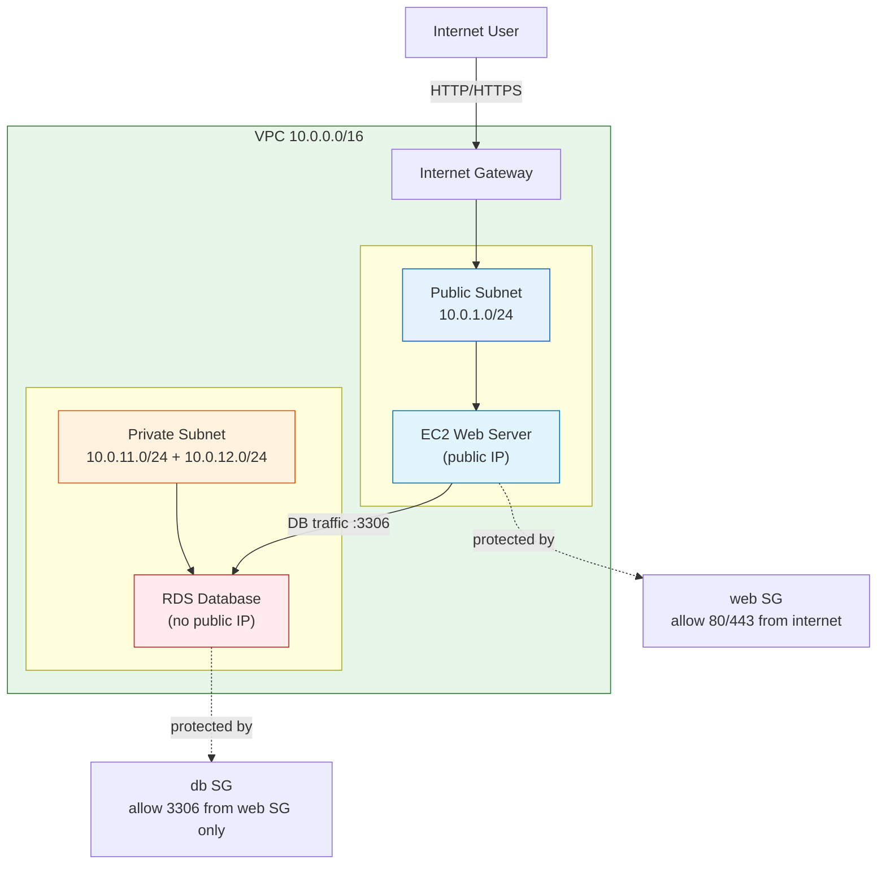
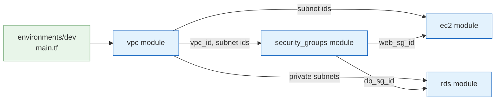

# Terraform - Day 9: Capstone Project

> **Goal:** Build a complete, real-world AWS environment from scratch - a **VPC with public/private subnets, security groups, an EC2 web server, and an RDS database** - using **modules, variables, outputs, remote state, and dev/prod separation.** This is everything from Days 1 - 8 in one project.

---

You've learned the pieces: variables, resources, state, modules, environments, security. Day 9 is where you assemble them into a working system, the way a real DevOps engineer would. By the end you'll have a reusable infrastructure project you can put on your résumé.

---

## Learning Objectives

By the end of this capstone you will be able to:

- Design a **multi-tier AWS architecture** (network → compute → database)
- Build **four reusable modules**: `vpc`, `security_groups`, `ec2`, `rds`
- **Wire modules together** using outputs → inputs
- Configure **remote state** with an S3 backend + DynamoDB locking
- Separate **dev and prod** with the folder-per-environment pattern
- Run the full **init → plan → apply → destroy** workflow

---

## Real-World Analogy

You've spent Days 1 - 8 building **prefab rooms** in a factory - a kitchen module, a bedroom module, a bathroom module.

Day 9 is **building the actual house** from those prefab rooms:

- The **VPC** is the plot of land with a fence around it.
- **Subnets** are the front yard (public) and the locked back rooms (private).
- **Security groups** are the doors and locks - who's allowed in where.
- The **EC2 instance** is the living room facing the street (the web server visitors see).
- The **RDS database** is the safe in the back room - valuable, locked away, no street access.

The capstone is assembling all of it into one home that actually works.

---

## Target Architecture



**Key security idea:** the web server is reachable from the internet, but the database is **not**. The DB only accepts traffic from the web server's security group. That is the foundation of a secure two-tier app.

---

## Project Structure

We use the **folder-per-environment** pattern from Day 8, with four shared modules from Day 7.

```text
project/
│
├── modules/
│   ├── vpc/
│   │   ├── main.tf
│   │   ├── variables.tf
│   │   └── outputs.tf
│   ├── security_groups/
│   │   ├── main.tf
│   │   ├── variables.tf
│   │   └── outputs.tf
│   ├── ec2/
│   │   ├── main.tf
│   │   ├── variables.tf
│   │   └── outputs.tf
│   └── rds/
│       ├── main.tf
│       ├── variables.tf
│       └── outputs.tf
│
└── environments/
    ├── dev/
    │   ├── main.tf          # calls all 4 modules, wires them together
    │   ├── backend.tf       # dev remote state
    │   ├── variables.tf
    │   ├── outputs.tf
    │   └── dev.tfvars       # small/cheap values
    │
    └── prod/
        ├── main.tf          # SAME modules, prod wiring
        ├── backend.tf       # SEPARATE prod remote state
        ├── variables.tf
        ├── outputs.tf
        └── prod.tfvars      # large/HA values
```



The dependency order is the heart of the project: **VPC first** (it produces subnet IDs), then **security groups** and **compute/database** consume those IDs.

---

## Step 1 - The VPC Module

`modules/vpc/` creates the network: a VPC, an internet gateway, one public subnet, two private subnets, and a public route table.

### `modules/vpc/variables.tf`

```hcl
variable "name" {
  description = "Name prefix for all network resources"
  type        = string
}

variable "vpc_cidr" {
  description = "CIDR block for the VPC"
  type        = string
  default     = "10.0.0.0/16"
}

variable "public_subnet_cidr" {
  description = "CIDR for the public subnet"
  type        = string
  default     = "10.0.1.0/24"
}

variable "private_subnet_cidrs" {
  description = "CIDRs for the private subnets (RDS needs two AZs)"
  type        = list(string)
  default     = ["10.0.11.0/24", "10.0.12.0/24"]
}

variable "azs" {
  description = "Availability zones to spread subnets across"
  type        = list(string)
  default     = ["us-east-1a", "us-east-1b"]
}
```

### `modules/vpc/main.tf`

```hcl
resource "aws_vpc" "this" {
  cidr_block           = var.vpc_cidr
  enable_dns_support   = true
  enable_dns_hostnames = true
  tags = { Name = "${var.name}-vpc" }
}

resource "aws_internet_gateway" "this" {
  vpc_id = aws_vpc.this.id
  tags   = { Name = "${var.name}-igw" }
}

# Public subnet - gets a public IP, routes to the internet
resource "aws_subnet" "public" {
  vpc_id                  = aws_vpc.this.id
  cidr_block              = var.public_subnet_cidr
  availability_zone       = var.azs[0]
  map_public_ip_on_launch = true
  tags = { Name = "${var.name}-public" }
}

# Private subnets - no public IP, for the database
resource "aws_subnet" "private" {
  count             = length(var.private_subnet_cidrs)
  vpc_id            = aws_vpc.this.id
  cidr_block        = var.private_subnet_cidrs[count.index]
  availability_zone = var.azs[count.index]
  tags = { Name = "${var.name}-private-${count.index + 1}" }
}

# Route table sending public subnet traffic to the internet gateway
resource "aws_route_table" "public" {
  vpc_id = aws_vpc.this.id
  route {
    cidr_block = "0.0.0.0/0"
    gateway_id = aws_internet_gateway.this.id
  }
  tags = { Name = "${var.name}-public-rt" }
}

resource "aws_route_table_association" "public" {
  subnet_id      = aws_subnet.public.id
  route_table_id = aws_route_table.public.id
}
```

### `modules/vpc/outputs.tf`

```hcl
output "vpc_id" {
  value = aws_vpc.this.id
}

output "public_subnet_id" {
  value = aws_subnet.public.id
}

output "private_subnet_ids" {
  value = aws_subnet.private[*].id
}
```

---

## Step 2 - The Security Groups Module

`modules/security_groups/` creates two firewalls: one for the web server (open to the internet) and one for the database (open **only** to the web server).

### `modules/security_groups/variables.tf`

```hcl
variable "name" {
  type = string
}

variable "vpc_id" {
  description = "VPC the security groups belong to (from the vpc module)"
  type        = string
}
```

### `modules/security_groups/main.tf`

```hcl
# Web server firewall: allow HTTP/HTTPS from anyone
resource "aws_security_group" "web" {
  name        = "${var.name}-web-sg"
  description = "Allow web traffic"
  vpc_id      = var.vpc_id

  ingress {
    description = "HTTP"
    from_port   = 80
    to_port     = 80
    protocol    = "tcp"
    cidr_blocks = ["0.0.0.0/0"]
  }

  ingress {
    description = "HTTPS"
    from_port   = 443
    to_port     = 443
    protocol    = "tcp"
    cidr_blocks = ["0.0.0.0/0"]
  }

  egress {
    from_port   = 0
    to_port     = 0
    protocol    = "-1"
    cidr_blocks = ["0.0.0.0/0"]
  }

  tags = { Name = "${var.name}-web-sg" }
}

# Database firewall: allow MySQL ONLY from the web security group
resource "aws_security_group" "db" {
  name        = "${var.name}-db-sg"
  description = "Allow DB traffic from web tier only"
  vpc_id      = var.vpc_id

  ingress {
    description     = "MySQL from web tier"
    from_port       = 3306
    to_port         = 3306
    protocol        = "tcp"
    security_groups = [aws_security_group.web.id]   # not a CIDR - the web SG itself
  }

  egress {
    from_port   = 0
    to_port     = 0
    protocol    = "-1"
    cidr_blocks = ["0.0.0.0/0"]
  }

  tags = { Name = "${var.name}-db-sg" }
}
```

### `modules/security_groups/outputs.tf`

```hcl
output "web_sg_id" {
  value = aws_security_group.web.id
}

output "db_sg_id" {
  value = aws_security_group.db.id
}
```

---

## Step 3 - The EC2 Module

`modules/ec2/` launches the web server in the public subnet, attached to the web security group.

### `modules/ec2/variables.tf`

```hcl
variable "name"          { type = string }
variable "ami_id"        { type = string }
variable "instance_type" {
  type    = string
  default = "t3.micro"
}
variable "subnet_id"        { type = string }   # from vpc module
variable "security_group_id" { type = string }  # from security_groups module
```

### `modules/ec2/main.tf`

```hcl
resource "aws_instance" "web" {
  ami                    = var.ami_id
  instance_type          = var.instance_type
  subnet_id              = var.subnet_id
  vpc_security_group_ids = [var.security_group_id]

  # Boot-time setup the CORRECT way (no provisioners - see Day 8)
  user_data = <<-EOF
    #!/bin/bash
    yum install -y httpd
    systemctl enable --now httpd
    echo "Hello from ${var.name}" > /var/www/html/index.html
  EOF

  tags = { Name = "${var.name}-web" }
}
```

### `modules/ec2/outputs.tf`

```hcl
output "instance_id" { value = aws_instance.web.id }
output "public_ip"   { value = aws_instance.web.public_ip }
```

---

## Step 4 - The RDS Module

`modules/rds/` creates a MySQL database in the **private** subnets, attached to the db security group.

### `modules/rds/variables.tf`

```hcl
variable "name"               { type = string }
variable "private_subnet_ids" { type = list(string) }   # from vpc module
variable "security_group_id"  { type = string }         # from security_groups module
variable "instance_class" {
  type    = string
  default = "db.t3.micro"
}
variable "db_username" { type = string }
variable "db_password" {
  type      = string
  sensitive = true   # never printed in plan/apply output
}
```

### `modules/rds/main.tf`

```hcl
# RDS needs a subnet group spanning at least two AZs
resource "aws_db_subnet_group" "this" {
  name       = "${var.name}-db-subnets"
  subnet_ids = var.private_subnet_ids
  tags       = { Name = "${var.name}-db-subnets" }
}

resource "aws_db_instance" "this" {
  identifier             = "${var.name}-db"
  engine                 = "mysql"
  engine_version         = "8.0"
  instance_class         = var.instance_class
  allocated_storage      = 20
  db_name                = "appdb"
  username               = var.db_username
  password               = var.db_password
  db_subnet_group_name   = aws_db_subnet_group.this.name
  vpc_security_group_ids = [var.security_group_id]
  skip_final_snapshot    = true        # ok for dev; set false in prod
  publicly_accessible    = false       # private only

  lifecycle {
    prevent_destroy = false   # set true in prod to protect data
  }
}
```

### `modules/rds/outputs.tf`

```hcl
output "db_endpoint" {
  value = aws_db_instance.this.endpoint
}
```

---

## Step 5 - Wiring It All Together (the `dev` environment)

This is where the magic happens: `environments/dev/main.tf` calls all four modules and **feeds each module's outputs into the next module's inputs.**

### `environments/dev/backend.tf` - remote state

```hcl
terraform {
  backend "s3" {
    bucket         = "my-company-tfstate-dev"   # dev's OWN bucket
    key            = "capstone/dev/terraform.tfstate"
    region         = "us-east-1"
    dynamodb_table = "terraform-locks"          # state locking
    encrypt        = true
  }
}

provider "aws" {
  region = "us-east-1"
}
```

### `environments/dev/main.tf`

```hcl
module "vpc" {
  source = "../../modules/vpc"
  name   = "capstone-dev"
}

module "security_groups" {
  source = "../../modules/security_groups"
  name   = "capstone-dev"
  vpc_id = module.vpc.vpc_id            # VPC output feeds the SG input
}

module "ec2" {
  source            = "../../modules/ec2"
  name              = "capstone-dev"
  ami_id            = var.ami_id
  instance_type     = var.instance_type
  subnet_id         = module.vpc.public_subnet_id      # from VPC module
  security_group_id = module.security_groups.web_sg_id # from security_groups module
}

module "rds" {
  source             = "../../modules/rds"
  name               = "capstone-dev"
  instance_class     = var.db_instance_class
  private_subnet_ids = module.vpc.private_subnet_ids   # from VPC module
  security_group_id  = module.security_groups.db_sg_id # from security_groups module
  db_username        = var.db_username
  db_password        = var.db_password                 # injected, never hardcoded
}
```

### `environments/dev/variables.tf`

```hcl
variable "ami_id"            { type = string }
variable "instance_type"     { type = string  default = "t3.micro" }
variable "db_instance_class" { type = string  default = "db.t3.micro" }
variable "db_username"       { type = string }
variable "db_password" {
  type      = string
  sensitive = true
}
```

### `environments/dev/outputs.tf`

```hcl
output "web_public_ip" {
  description = "Visit this IP in a browser"
  value       = module.ec2.public_ip
}

output "db_endpoint" {
  value     = module.rds.db_endpoint
  sensitive = true
}
```

### `environments/dev/dev.tfvars`

```hcl
ami_id            = "ami-0abcdef1234567890"   # an Amazon Linux AMI in your region
instance_type     = "t3.micro"
db_instance_class = "db.t3.micro"
db_username       = "appadmin"
# db_password is NOT here - injected via TF_VAR_db_password (see workflow)
```

> The `prod` folder is **identical in shape** but uses a separate `backend.tf` bucket and a `prod.tfvars` with bigger sizes (`t3.large`, `db.t3.medium`, `prevent_destroy = true`). Same modules, different values - exactly the Day 8 pattern.

---

## Step 6 - The Apply Workflow

```bash
# 1. Move into the environment you want to deploy
cd environments/dev

# 2. Inject the secret at runtime (never in tfvars/git)
export TF_VAR_db_password="$(your-secret-source)"

# 3. Initialise - downloads the AWS provider AND registers the 4 modules + backend
terraform init

# 4. Format & validate
terraform fmt -recursive
terraform validate

# 5. Preview exactly what will be created
terraform plan -var-file="dev.tfvars"

# 6. Build it
terraform apply -var-file="dev.tfvars"

# 7. Read the outputs (e.g. the web server IP)
terraform output web_public_ip

# 8. When finished, tear it down to avoid charges
terraform destroy -var-file="dev.tfvars"
```

To deploy production later, you do the **exact same steps** in `environments/prod` with `prod.tfvars`. Separate state, separate blast radius.

---

## Common Mistakes

1. **Wrong module order / missing wiring.** If you forget `vpc_id = module.vpc.vpc_id`, the security group won't know which VPC it's in. Always pass outputs → inputs.
2. **Putting RDS in the public subnet or `publicly_accessible = true`.** The database must stay private - only the web SG should reach it.
3. **Hardcoding `db_password` in `dev.tfvars`** and committing it. Inject via `TF_VAR_db_password` or a secrets manager.
4. **Sharing one state bucket for dev and prod.** Give each environment its own backend `key`/`bucket` so they're isolated.
5. **Forgetting `terraform destroy`** on a lab - RDS and EC2 run up real charges. Tear down when done.

---

## Hands-On Lab (this project IS the lab)

Complete the capstone end-to-end:

1. **Scaffold** the folder structure exactly as shown above (`modules/` + `environments/dev`).
2. **Write the four modules** (`vpc`, `security_groups`, `ec2`, `rds`) using the HCL above.
3. **Wire them** in `environments/dev/main.tf`, passing each module's outputs into the next.
4. **Set up remote state** in `backend.tf` (create the S3 bucket + DynamoDB table first, or comment out the backend block to use local state for a dry run).
5. Run `terraform init`, `terraform fmt`, `terraform validate`.
6. Run `terraform plan -var-file="dev.tfvars"` and **read the plan** - confirm it creates the VPC, subnets, 2 security groups, 1 EC2, 1 RDS.
7. (Optional, costs money) `terraform apply`, browse to `web_public_ip`, then `terraform destroy`.
8. **Stretch goal:** copy `dev` → `prod`, change the tfvars to larger sizes, add `prevent_destroy = true` to RDS, and use a separate backend `key`.

> **Success criteria:** `terraform validate` passes and `terraform plan` shows the full architecture with no errors - using only modules, variables, outputs, and remote state.

---

## Quick Self-Check

1. Why does the **VPC module run before** the security groups and EC2 modules?
2. How does the database security group allow the web server in **without** opening to the whole internet?
3. Which module output feeds the EC2 module's `subnet_id`?
4. Why is the RDS instance placed in **private** subnets with `publicly_accessible = false`?
5. How is the `db_password` supplied so it never lands in Git?

<details>
<summary>Answers</summary>

1. Because the VPC produces the `vpc_id` and subnet IDs that the other modules consume as inputs.
2. Its ingress rule uses `security_groups = [web_sg_id]` instead of a CIDR - only members of the web SG can reach port 3306.
3. `module.vpc.public_subnet_id`.
4. So the database isn't reachable from the internet - only the web tier can talk to it, which is the secure two-tier design.
5. Via the `TF_VAR_db_password` environment variable (or a secrets manager), marked `sensitive = true`, never in tfvars/Git.

</details>

---

## Summary

In this capstone you built a **complete, production-shaped AWS environment**:

- A **VPC** with public and private subnets and an internet gateway.
- **Security groups** enforcing a secure two-tier design (web open, DB locked to web only).
- An **EC2 web server** in the public tier and an **RDS database** in the private tier.
- Everything as **reusable modules**, wired together via **outputs → inputs**.
- **Remote state** with locking, and **dev/prod separation** via folder-per-environment.

You combined every skill from Days 1 - 8 into one real project.

---

## Congratulations - You've Finished Terraform!

You started by writing your first `resource` block, and you've finished by architecting and deploying a full multi-tier, multi-environment system with modules and remote state. That's the exact skill set companies hire DevOps engineers for.

**Where to go from here:**

- Add a **load balancer + auto-scaling** to the EC2 tier.
- Build a **CI/CD pipeline** that runs `plan` on every pull request.
- Explore **Terraform Cloud** or **Atlantis** for team workflows.

**Back to the start →** [Terraform Course README](../README.md) - revisit any day, or share the course with someone who's just beginning. Well done!
